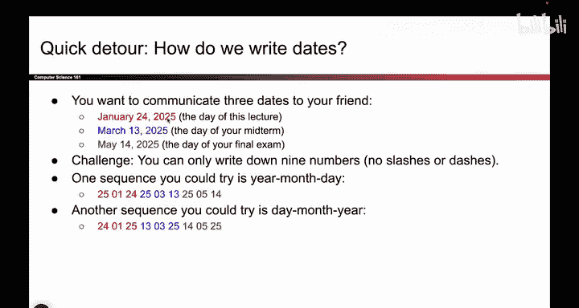
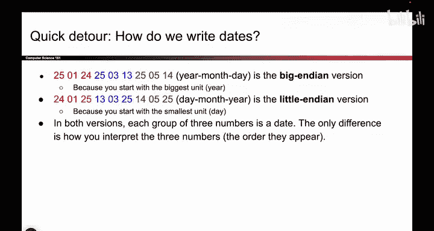

# 017：字节序

在本节课中，我们将要学习一个在深入理解函数调用机制前必须掌握的重要概念：**字节序**。这是一个容易让人困惑但至关重要的主题，它决定了计算机如何解释存储在内存中的多字节数据。

## 内存布局回顾

上一节我们介绍了内存可以被视为一个巨大的二维网格，其中每一行可以容纳4个字节。每个字节在内存中都有一个唯一的地址。

例如，地址 `0` 存储一个字节，地址 `1` 存储下一个字节，地址 `4` 存储再下一个字节，依此类推。

然而，有时我们需要表示一个无法用单个字节表示的数据，例如一个整数。这就需要将多个字节组合起来，作为一个整体单元来读取，比如一次读取4个字节。这就引出了一个核心问题：**我们应该以何种顺序来读取这些字节？**

## 字节序的类比

为了回答这个问题，我们先来看一个类比。假设你需要通过只发送数字的方式，告诉朋友三个日期：今天的日期、期中考试日期和期末考试日期。

以下是两种可能的发送方式：

*   **方式一：年-月-日**
    你可以先发送年份，然后是月份，最后是日期。例如，发送 `25, 01, 24` 来表示 2025年1月24日。

*   **方式二：日-月-年**
    你也可以先发送日期，然后是月份，最后是年份。例如，发送 `24, 01, 25` 来表示同一天。

哪种方式更好？实际上，这并不重要。**关键在于你和你的朋友必须事先约定好使用同一种格式**。只要双方一致，通信就能成功。

这个日期格式的约定问题，正是我们面临的字节序问题。当我们将内存中的多个字节（比如4个字节）组合起来解释为一个更复杂的数据（如一个整数）时，我们必须约定这些字节的读取顺序。

## 大端序与小端序

回到内存读取的问题。当我们有四个连续的字节（例如，地址从低到高存储着 `0x11`, `0x22`, `0x33`, `0x44`）时，有两种主要的解释顺序：

*   **大端序**：从**最高有效字节**（即数值中权重最大的部分）开始读取，也就是从**高地址**向低地址读取。组合成的数字是 `0x44332211`。
*   **小端序**：从**最低有效字节**（即数值中权重最小的部分）开始读取，也就是从**低地址**向高地址读取。组合成的数字是 `0x11223344`。

两种方式本身没有优劣之分，但系统必须统一。**在本课程使用的 x86 架构中，采用的是小端序**。

这意味着，当你想将内存中的四个字节读取为一个整数时，你需要从最低地址的字节开始读取，然后依次读取更高地址的字节。这感觉像是在“倒着”读数字，但这是由系统架构决定的。

## 字节与字的访问

关于字节序，最后需要明确一点：你可以以两种不同的“粒度”访问内存。

*   **访问单个字节**：如果你请求地址 `0` 处的字节，你会直接得到存储在那里的原始值 `0x11`，无需考虑字节序。
*   **访问一个字（例如4字节整数）**：如果你请求从地址 `0` 开始的一个字（word），系统会按照小端序规则，将 `0x11`, `0x22`, `0x33`, `0x44` 组合解释为整数 `0x44332211`。

这两种访问方式都是有效的，具体取决于你是想获取原始字节数据，还是想获取由多个字节组合而成的有意义的值（如整数）。

## 一个常见的简化表示

有时，人们为了书写方便，会直接写出一个整数的值（如 `0x44332211`），并注明它存储在从地址 `0` 开始的内存中。

**请记住，在小端序系统中，这个值在内存中的实际存储顺序（从低地址到高地址）是：`0x11`, `0x22`, `0x33`, `0x44`。** 认识到这种表示法与实际存储之间的区别非常重要，可以避免混淆。

## 总结

本节课中，我们一起学习了**字节序**的概念。我们了解到：
1.  字节序定义了多字节数据（如整数）在内存中的存储和读取顺序。
2.  主要分为**大端序**和**小端序**，x86架构采用**小端序**。
3.  理解字节序的关键在于区分**按字节访问**和**按多字节单元（如字）访问**内存时的不同解释方式。
掌握字节序对于后续理解函数调用、参数传递和数据结构在内存中的布局至关重要。虽然它起初可能有些令人困惑，但通过练习你会逐渐熟悉它。