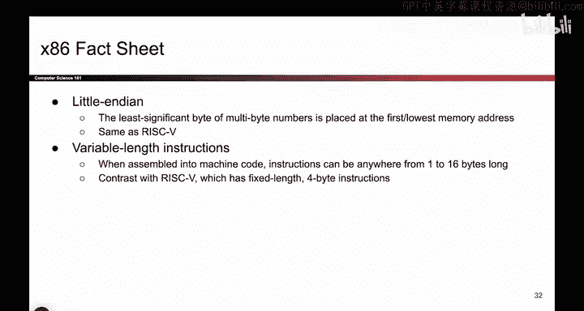
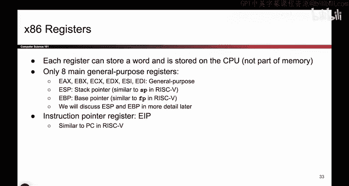
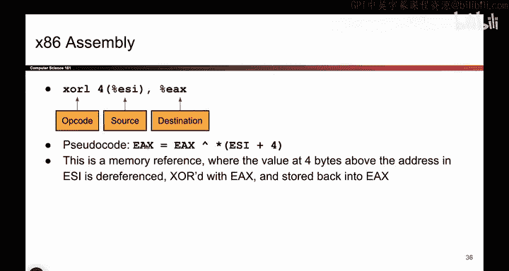

# 019：x86汇编简介

在本节课中，我们将学习x86汇编语言的基础知识。我们将了解其基本概念、语法和一些关键特性，以便能够阅读和理解简单的x86代码片段。

上一节我们介绍了内存的工作原理以及其中存储的内容。本节中，我们来看看x86汇编语言。

x86是目前最常用的汇编语言。虽然RISC-V等架构也很优秀，但在现实世界中，x86更为普遍。几乎我们所有的计算机都在运行x86，除了部分较新的Mac可能已转向其他架构。重要的是，本课程将使用x86汇编语言。请注意，这不是一门专门的x86课程，因此不会测试具体的语法细节。但我们的目标是，当看到一小段x86代码时，你至少能够阅读并大致理解其含义。

## 🧠 x86的基本特性

x86采用小端字节序。我们之前讨论过这个概念：当你读取一个4字节的数据块时，是从最高内存地址向最低内存地址读取的。RISC-V实际上也采用相同的方式。

x86与RISC-V的一个不同之处在于指令长度。在x86中，一条指令（如加法指令）被转换为机器码（0和1）后，其长度是可变的。有些指令可能只有1字节，而有些则可能长达16字节。这与RISC-V形成对比，在RISC-V中，每条指令翻译后都恰好是4字节。这个差异是x86的一个特点，你会在后续项目中遇到它。

## 💾 寄存器

如前所述，x86拥有一组寄存器。它们不在内存中，而是一个完全独立的、可以存储数据的地方。寄存器通过名称来标识。

以下是一些寄存器名称，我们稍后会详细讨论：
*   `EAX`
*   `EBX`
*   `ECX`
*   `EDX`
*   `ESI`
*   `EDI`
*   `EBP`
*   `ESP`

需要特别指出的是`EIP`寄存器。这是指令指针寄存器的一个别致名称，它指示了当前正在执行哪条指令。我们稍后也会看到它。

## 📝 语法简介

重申一次，这不是x86语法课，因此你无需死记硬背。但当你看到寄存器时，它们前面会有一个百分号`%`。至于为什么，这只是一个语法规定。

当书写立即数（即指令中的常量值）时，前面会加上美元符号`$`。例如，`$161`表示数字161，而不是变量。

如果你想解引用内存（即访问某个地址处的内容），需要使用圆括号`()`。例如，`(%ESI)`表示：`ESI`是一个寄存器，它里面存储着一个地址。圆括号的意思是“请前往这个地址，并告诉我那里存储着什么”。

## ➕ 指令格式

x86指令的书写格式通常如下所示：
`指令助记符 源操作数, 目的操作数`

首先写下指令是什么（例如`add`表示加法，`sub`表示减法，`mul`表示乘法等）。然后写下源操作数（即要参与运算的数据来源）和目的操作数（即运算结果存放的位置，并且它本身也参与运算）。

我们不必过分纠结具体的语法细节。以`add $8, %ebx`为例，这条指令的意思是：我想将数值8加到`EBX`寄存器中的值上。具体过程是：取出`EBX`中的值，加上8，然后将结果存回`EBX`寄存器。

## 🔄 另一个例子

让我们看另一个例子：`xor (%esi), %eax`。

我们看到`(%esi)`使用了圆括号，这意味着我必须前往`ESI`寄存器中存储的地址。这又是一个语法特点。基本逻辑是：`ESI`中存储着一个地址。我将把这个地址加上4（注意：指令中隐含了偏移量计算，这里`(%esi)`通常表示以`ESI`值为地址，但更复杂的寻址模式可能包含偏移，如`4(%esi)`。原描述可能省略了偏移细节，但核心是解引用）。圆括号表示：我要前往那个（计算后的）地址，也就是进入内存，取出该地址处的数据。

然后，指令执行`XOR`（异或）操作：将刚从内存取出的数据与`EAX`寄存器中的值进行异或运算。`%eax`这里没有括号，所以我不需要解引用它，直接使用其值。但`(%esi)`需要解引用。所以整体操作是：前往`ESI`指向的地址获取数据，然后与`EAX`中的值进行异或，最后将结果存回`EAX`。这就是圆括号所指示的操作。

本节课中，我们一起学习了x86汇编语言的基础知识，包括其普遍性、小端字节序、可变长度指令、寄存器组、基本语法和指令格式。重点是理解如何通过语法（特别是圆括号）来区分是直接操作寄存器值，还是解引用内存地址。掌握这些将帮助你阅读和理解后续课程中出现的x86代码片段。