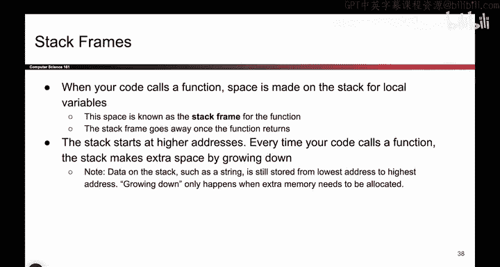
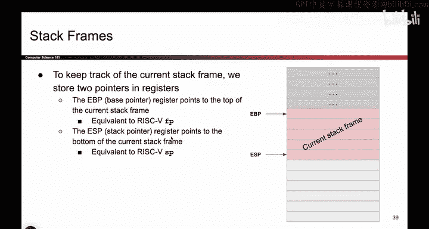
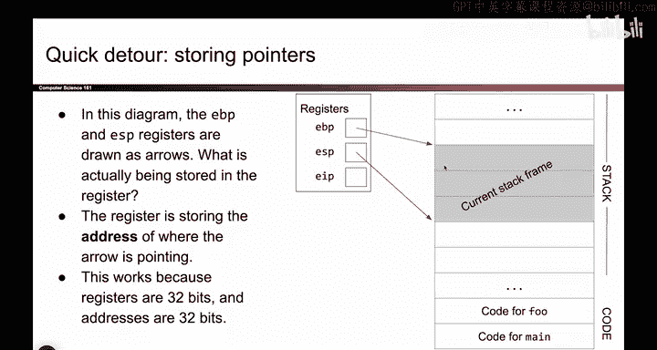
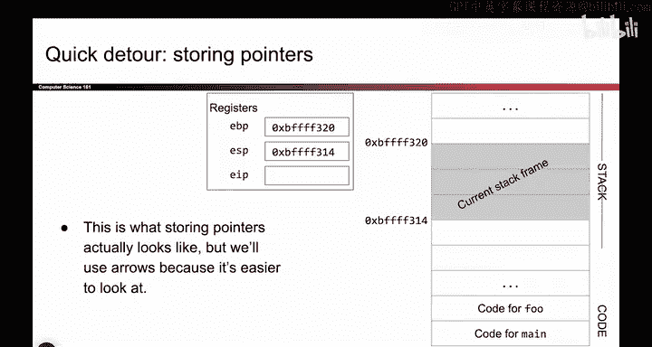
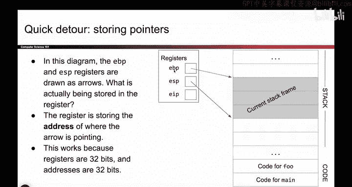
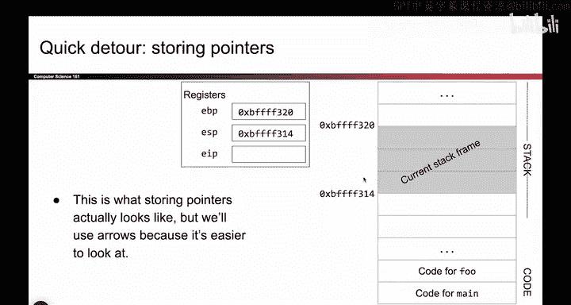
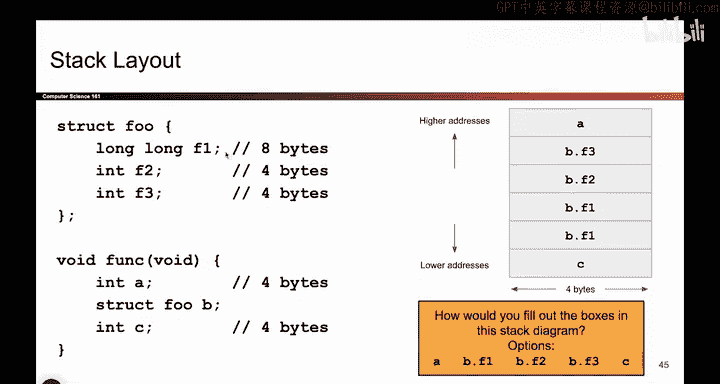

# 020：栈布局 🧱

在本节课中，我们将深入学习栈内存的布局方式，了解程序如何通过栈来管理函数调用和局部变量。我们将重点介绍栈帧的概念、用于追踪栈帧的寄存器，以及如何通过指令操作栈。

## 栈帧与栈增长 📈

上一节我们介绍了栈的基本概念。本节中我们来看看栈帧的具体布局和增长方向。

当你的代码调用一个函数时，必须在栈上为局部变量分配空间。当函数返回时，这个栈帧就会消失。每次调用函数时，它都会在栈上获得一些空间；当函数返回时，栈帧消失。如前所述，如果你调用很多函数，例如进行深度递归，那么你的栈会变得越来越大。我们通过向下增长来获取额外空间。

这里需要指出，人们常常因为“向下增长”这个说法而认为栈是“颠倒的世界”，甚至想把栈倒过来读，认为所有东西都是自底向上的。事实并非如此。“向下增长”只意味着一件事：如果我需要更多内存来存储东西，我将使用一个更低的地址。这就是“向下增长”的全部含义，不代表其他任何意思。字符串仍然是从最低地址读到最高地址。栈上的地址值仍然随着你向上移动而增加。一切都保持不变。“向下增长”仅仅意味着，当我需要更多空间时，额外的空间来自更低的地址。所以，当你参加考试或类似场合时，不要看到栈就想着把试卷倒过来看。那不是“向下增长”的意思。它只是意味着当我需要更多空间时，向栈的“下方”看，从更低的地址给我分配空间。

## 追踪当前栈帧 🔍

那么，如何知道当前的栈帧在哪里呢？请记住，尽管我们画得很漂亮，并且用红色为你标出了栈帧，但程序本身并不会看到这个漂亮的红色标记。我的电脑上没有任何东西会说“哦，这是红色的栈帧”。因此，我们必须使用寄存器来跟踪当前栈帧的位置。

请记住，你调用的每个函数都有一个与之关联的栈帧。我需要知道当前正在执行的函数的栈帧是什么。这意味着我需要用寄存器来跟踪这些信息。我的电脑不会拿起彩色铅笔开始把东西涂成红色。我需要寄存器来跟踪当前栈帧的开始和结束位置。

因此，我将使用两个寄存器。请记住，寄存器有名字。这两个寄存器将告诉我当前栈帧的位置。EBP（基址指针）是一个具有特殊名称的寄存器，它存储一个地址，这个地址是当前栈帧顶部的地址。ESP（栈指针）也是一个寄存器。如果你打开它并查看里面的值，它是一个地址，而这个地址恰好是你当前栈帧最低部分的地址。

这两个寄存器保存两个地址，它们告诉我当前栈帧从哪里开始，到哪里结束。两者之间的所有内容，就是我正在使用的当前栈帧。这些寄存器保存的是地址。顺便说一下，如果你看到这些箭头，可能会问这些箭头实际上代表什么。这是和之前一样的图，EBP指向这里，ESP指向这里。当我画这些箭头时，它们实际上意味着什么？如果你不喜欢箭头，实际上也可以这样画：EBP保存一个地址，这个地址就是内存中某个位置的地址。如果我访问内存中的那个地址，那个地址就是我当前栈帧顶部的地址。所以EBP保存着一个地址，它是内存中这一部分的地址。同样地，ESP也保存着一个地址，如果我访问那个地址，它就是我当前栈帧的底部。

但这很难阅读。我必须匹配所有这些数字，这很麻烦。所以，我没有写这种难以阅读的东西，而是画了箭头。箭头只是表示EBP是一个地址，如果我访问那里，就是当前栈帧的顶部。但请记住，这些箭头基本上等同于存储地址。我只是不想像这样画它们，因为很烦人。

## 操作栈空间：PUSH与POP ⬇️⬆️

现在我知道了当前栈帧是什么。但如果我想要更多空间怎么办？假设我有一个栈帧，这很好。但我想在栈上存储更多数据。如果你想这样做，可以使用PUSH和POP指令。这些指令允许你向栈添加东西和从栈移除东西。

假设你想向栈添加一些东西，你可以使用PUSH指令。PUSH指令做两件事。第一件事是它向栈写入数据。例如，如果我说 `PUSH EAX`，我会取出EAX寄存器中的值，把它放到栈上。但这还不够，因为如果我把它放在这里，我还应该减少ESP，让它现在指向我栈帧的底部。也许另一种说法是，EBP指向栈的底部。如果我在这里写了这个数据，我应该将ESP向下移动，以表明现在有更多你需要关心的东西。所以ESP向下移动，现在栈上有了更多数据。因此，PUSH指令做两件事：将数据放入栈中，并将ESP向下移动，以提醒自己这些数据现在也是“家族”的一部分，它是栈帧的一部分。

这是相反的操作：POP。那么POP做什么呢？它取出栈上的值并删除它。当我删除它时，我将ESP向上移动，以表示这个曾经是“家族”一部分的东西，现在不再是了。它已经被删除了。所以我向上移动ESP以表明它消失了。如果你愿意，还可以选择性地将该值放入一个寄存器。所以如果我说 `POP EAX`，意思就是取出这个值，将其从栈中移除，将ESP上移（我不再关心它了），然后把这个值放入EAX寄存器。所以POP是PUSH的反操作，我们将使用这两个指令。

## 关于x86架构的简化假设 📝

以下是一些假设。x86架构极其复杂，这不是一门x86课程。x86手册大约有3000页，我们不会去读它，尽管我想如果你非常无聊的话可以读。但x86的工作方式非常复杂。因此，我们将做一些假设来简化事情。我不会全部大声读出来，但随着课程的进行你会看到这些假设。

*   我们假设局部变量出现在栈上。你也可以把它们放在寄存器里，但我们将假设它们在栈上。
*   我们假设当你声明变量时，我们将按顺序排列它们，第一个变量在最高地址。
*   我们假设在结构体中，第一个成员在最低地址。
*   我们假设全局变量中，第一个变量在最低地址。

随着课程的进行，你会看到这些。所以你不必死记硬背。它们只是我们做出的假设，以便当我们绘制x86图表时，我们都使用相同的假设。

## 理解测验 ✅

如果你想测试对我们刚才所说假设的理解，可以试试这个小测验。如果你正在看视频，可以暂停一下想一想。

基本上，结论是：如果我有一个函数，假设我想声明A，然后B，然后C。A将出现在最高地址。然后我们会分配更多空间来存储B，再分配更多空间来存储C。所以，随着我声明更多变量，后续的变量会出现在栈上更低的位置。如果我声明一个结构体，结构体中的第一个成员F1出现在最低地址，然后是F2，然后是F3。F1是8字节，所以我给了它两行。

## 总结 📚

本节课中我们一起学习了栈内存的布局。我们明确了“栈向下增长”的确切含义，即新分配的空间使用更低的地址。我们认识了两个关键寄存器：**EBP（基址指针）**指向当前栈帧的顶部，**ESP（栈指针）**指向当前栈帧的底部，它们共同界定了一个栈帧的范围。我们还学习了操作栈的两种基本指令：**PUSH**指令将数据压入栈并减小ESP，**POP**指令将数据弹出栈并增大ESP。最后，我们了解了一些关于x86内存布局的简化假设，这些假设将帮助我们在后续课程中更清晰地分析问题。理解栈的布局是分析内存安全漏洞的基础。