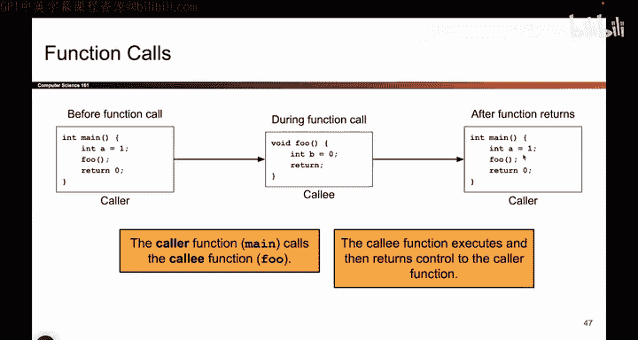

# 021：调用约定

在本节课中，我们将要学习函数调用在x86架构中是如何具体执行的。我们将了解调用约定，以及CPU的寄存器如何协同工作，以确保函数调用和返回时数据不会丢失或损坏。

---

上一节我们介绍了函数调用需要解决的问题，本节中我们来看看x86架构在调用函数时具体做了哪些事情。

当代码从`main`函数调用一个名为`foo`的函数时，需要完成以下步骤：
1.  跳转到`foo`函数的代码处开始执行。
2.  执行`foo`函数中的所有指令。
3.  在`foo`函数执行完毕后，返回到`main`函数并继续执行。

今天的所有内容都将围绕“如何实现这个过程”来展开。

---

这个过程有时被称为“调用约定”。其核心在于，我们需要设计一套规则，并且所有程序都遵循这套规则来调用函数。这样就能确保在函数调用和返回时，不会丢失或覆盖其他函数所依赖的数据。

这就像你从饼干罐里拿饼干，只要在用完后把所有东西放回原处，父母回家后就发现不了异常。调用约定的目标也是如此：函数调用结束后，一切恢复原状。

---

以下是函数调用过程中栈和寄存器状态的变化概览。

在函数调用发生之前，你正处在`main`函数中。此时：
*   **EBP** 寄存器指向`main`函数栈帧的顶部。
*   **ESP** 寄存器指向`main`函数栈帧的底部。
*   **EIP** 指令指针寄存器指向`main`函数中正在执行的代码地址。

现在你想要调用`foo`函数。调用发生时，必须发生以下几件事：
1.  必须为`foo`函数创建一个新的栈帧。这是`foo`函数用来存储局部变量、进行计算等操作的空间。
2.  创建新栈帧后，**EBP** 需要指向新栈帧的顶部，**ESP** 指向新栈帧的底部。
3.  **EIP** 指令指针原先指向调用者（`main`）的指令，现在必须切换，使其指向被调用函数（`foo`）的指令，因为接下来要执行`foo`中的代码。

因此，调用函数时，**EBP**和**ESP**这两个指针需要“下移”以创建新栈帧，而**EIP**需要“跳转”到新函数的代码位置。

---

最后，当`foo`函数执行完毕并返回时，我们需要将所有状态恢复原状。`foo`函数必须负责清理自己留下的“烂摊子”，这样当控制权回到`main`函数时，一切就像什么都没发生过一样。

具体来说，当`foo`返回时：
*   **EBP** 应恢复为指向`main`函数栈帧顶部的原值。
*   **ESP** 应恢复为指向`main`函数栈帧底部的原值。
*   **EIP** 应指回`main`函数中`call`指令之后的那条指令地址。

这样，所有寄存器都回到了原来的位置，`main`函数便可以继续正常运行。

---

本节课中我们一起学习了x86架构下的函数调用约定。我们了解了调用函数时需要为被调用函数创建新的栈帧，并更新**EBP**、**ESP**和**EIP**寄存器。更重要的是，我们明白了函数返回时必须恢复这些寄存器的原始值，以确保调用者能够无缝地继续执行。这套规则是程序正确运行的基础。