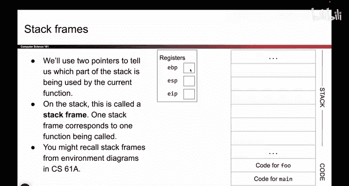
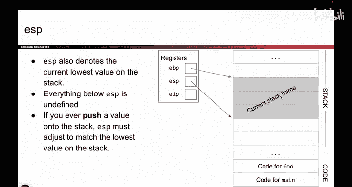
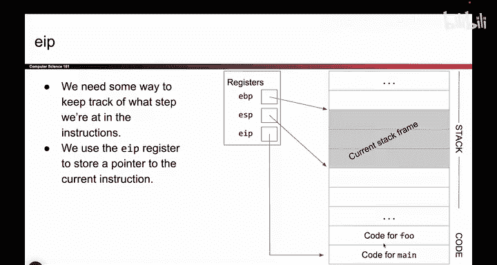
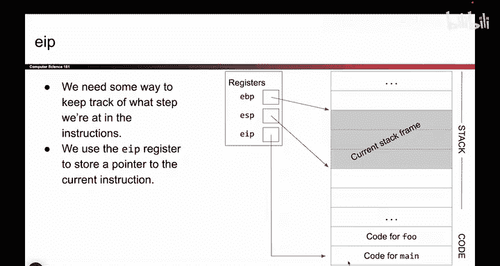
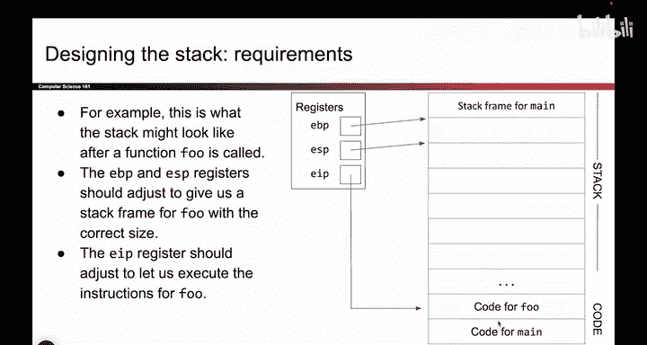
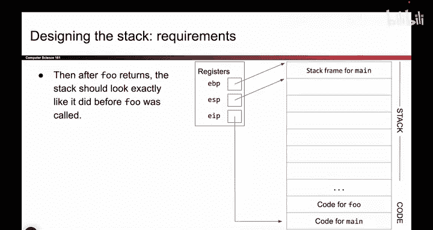

# 022：调用约定设计 🧠

在本节课中，我们将设计一个函数调用约定。我们将学习如何通过操作寄存器和栈，在调用函数时保存当前状态，并在函数返回后恢复原状，确保程序能正确运行。


---

上一节我们介绍了函数调用时栈和寄存器的基本概念。本节中，我们来看看如何具体设计调用约定，以实现从 `main` 函数到 `F` 函数的切换与返回。


首先，我们回顾一下相关的寄存器和栈布局。我们关心三个寄存器：**EBP**（基址指针）、**ESP**（栈指针）和 **EIP**（指令指针）。栈是向下增长的，这意味着需要更多空间时，会在栈的更低地址处分配。

以下是栈和代码的布局示意图。地址从图底部向顶部增加，每一行代表四个字节。


当程序运行 `main` 函数时，情况如下：
*   **EBP** 指向当前栈帧的顶部。
*   **ESP** 指向当前栈帧的底部（也是整个栈的底部）。
*   **EIP** 指向 `main` 函数的代码地址。








需要特别指出的是，**ESP** 实际上承担着双重职责。它不仅标记当前栈帧的底部，也标记着整个栈的底部。栈中低于 **ESP** 地址的内容是未定义的。因此，当我们向栈中压入（`push`）数据时，必须同时递减 **ESP** 的值，使其指向更低的地址，以“记住”我们压入的数据。如果不移动 **ESP**，写入操作就相当于写入了“虚空”，程序将无法保留该值。


---

现在，我们来看函数调用的核心过程。从 `main` 函数调用 `F` 函数时，状态需要发生转变。

**调用前**，状态属于 `main` 函数：**EBP** 和 **ESP** 界定出 `main` 的栈帧，**EIP** 指向 `main` 的代码。




**调用后**，状态应切换到 `F` 函数：**EBP** 和 **ESP** 需要向下移动，为 `F` 函数创建新的栈帧，同时 **EIP** 需要改为指向 `F` 函数的代码。





我们的目标是，当 `F` 函数执行完毕返回时，所有寄存器都能恢复到 `main` 函数调用前的状态。


---


实现上述目标的关键原则是：**在覆盖任何寄存器的值之前，必须保存其旧值**。

这就像在修改一份重要文件前先做备份。如果我们想改变 **EBP** 的值，使其指向新的位置，不能直接覆盖它。我们必须先把 **EBP** 原来的值存到某个地方（通常是栈上），然后再赋予它新值。这样，当函数返回时，我们可以从保存的地方取出旧值，放回 **EBP**，从而恢复原状。

以下是整个设计过程必须遵循的核心步骤：


1.  **保存返回地址**：调用函数时，首先需要将 **EIP** 的当前值（即 `call` 指令后的下一条指令地址）压入栈中保存。这是函数返回后应继续执行的位置。
    ```assembly
    push eip  ; 将下一条指令地址压栈（实际由 call 指令完成）
    ```


2.  **保存旧的基址指针**：然后，将 **EBP** 寄存器的当前值（即 `main` 函数的栈帧基址）压入栈中保存。
    ```assembly
    push ebp
    ```

3.  **建立新的栈帧**：将 **ESP** 的当前值（此时指向刚保存的旧 **EBP**）赋给 **EBP**。这样，**EBP** 就指向了新栈帧的顶部。
    ```assembly
    mov ebp, esp
    ```

4.  **分配局部变量空间**：如果需要为被调函数分配局部变量空间，则递减 **ESP** 的值。
    ```assembly
    sub esp, N  ; N 为所需字节数
    ```

5.  **函数返回与恢复**：函数执行完毕后，需要逆向操作。
    *   释放局部变量空间（如果需要）：`mov esp, ebp`
    *   恢复旧的 **EBP**：`pop ebp`
    *   跳转回返回地址：`ret` （该指令会从栈中弹出返回地址并赋值给 **EIP**）


**牢记**：我们今天所做的一切设计，核心目标都是“在过程中保存工作状态”。这是理解调用约定最关键的一点。

---


本节课中，我们一起学习了函数调用约定的基本设计思路。我们理解了在调用函数时，需要通过操作栈来保存返回地址和旧的栈帧基址（**EBP**），并更新 **EBP**、**ESP** 和 **EIP** 以切换到新函数的上下文。最重要的是，我们掌握了“覆盖前先保存”的核心原则，这是确保函数调用后能正确返回并恢复现场的基础。下一节，我们将基于此设计，深入查看具体的汇编指令实现。