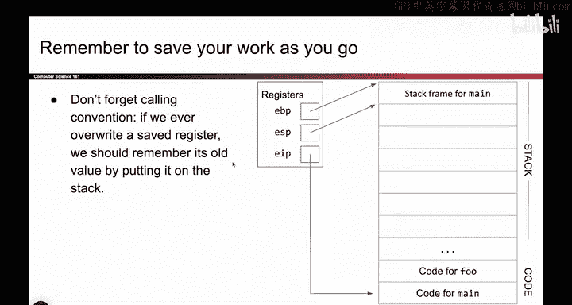
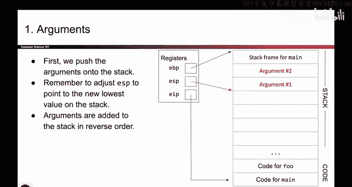
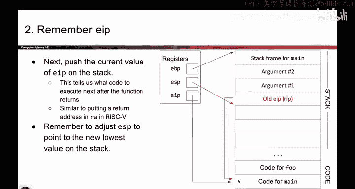
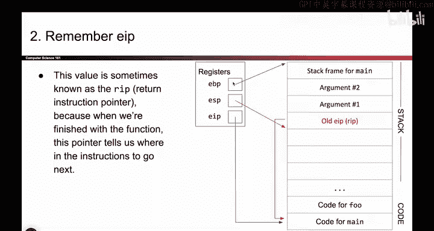
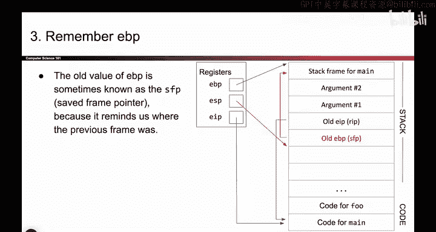
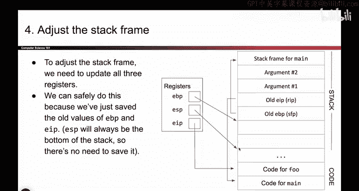
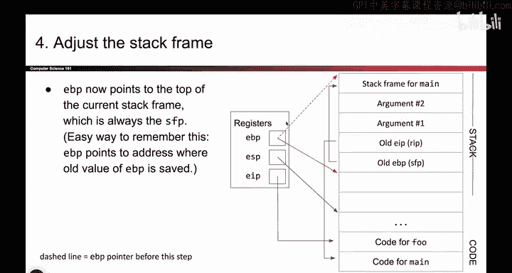
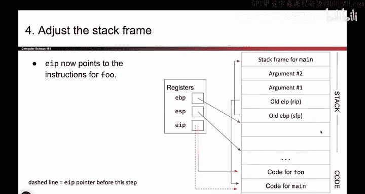
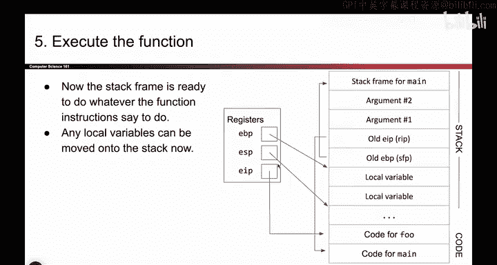
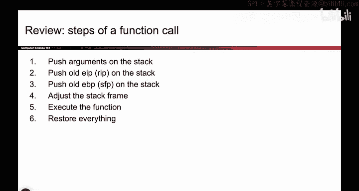

# 023：函数调用步骤（概述）👨‍💻

在本节课中，我们将学习当一个函数（例如 `main`）调用另一个函数（例如 `foo`）时，计算机内部发生的具体步骤。我们将重点关注栈内存的变化以及关键寄存器（如 `EIP`、`EBP`、`ESP`）是如何被保存和恢复的，以确保程序能正确执行并返回。

理解这些步骤是掌握程序底层运行机制和内存安全概念的基础。

---

## 第一步：将参数压入栈 📥

当 `main` 函数需要调用 `foo` 函数时，它必须将参数传递给 `foo`。在 x86 架构中，传递参数的常规方式是将它们压入栈中。

以下是具体操作：
*   假设 `main` 有两个参数要传给 `foo`，它会将这两个参数依次压入栈。
*   记住，当向栈中压入数据时，栈指针 `ESP` 的值会减小（向低地址移动）。
*   一个细节是，参数是按**逆序**压入栈的（这是 x86 的约定）。

至此，我们成功将参数放置在了栈上，为函数调用做好了准备。

---

## 第二步：保存返回地址（旧 EIP 值）💾

在开始修改任何寄存器之前，我们必须先保存它们的旧值，以便函数执行完毕后能恢复现场。

首先需要修改的是指令指针寄存器 `EIP`。当前 `EIP` 指向 `main` 函数的代码，我们需要让它指向 `foo` 函数的代码。但在覆盖 `EIP` 之前，必须保存其旧值。

保存位置就是栈。我们将 `EIP` 的当前值（即 `main` 函数中调用指令之后的下一条指令地址）复制并压入栈中。这个被保存的值通常被称为**返回地址**或 **RIP**。

和之前一样，压栈操作会使栈指针 `ESP` 下移。

现在，`EIP` 的旧值已安全保存在栈上，我们可以放心地修改 `EIP` 寄存器了。

---

## 第三步：保存旧的栈帧基址（旧 EBP 值）📝

接下来需要修改的寄存器是栈帧基址指针 `EBP`。我们计划为 `foo` 函数创建一个新的栈帧，这意味着需要移动 `EBP`。

同样，在修改 `EBP` 之前，必须保存其当前值（即 `main` 函数栈帧的顶部地址）。我们将这个值压入栈中保存。这个被保存的值有时被称为**保存的帧指针**或 **SFP**。

压栈操作再次使 `ESP` 下移。

至此，`EIP` 和 `EBP` 的旧值都已安全地保存在栈上。我们现在可以自由地更改这些寄存器的内容了。

---

## 第四步：建立新的栈帧（更新寄存器）🔄

所有必要的旧值都已保存，现在可以更新寄存器，为 `foo` 函数建立全新的执行环境。

以下是寄存器变化前后的对比：
*   **`EBP`**：之前指向 `main` 函数栈帧的顶部；现在指向为新函数 `foo` 创建的栈帧的顶部。
*   **`ESP`**：之前指向 `main` 函数栈帧的底部；现在指向 `foo` 函数栈帧的底部。
*   **`EIP`**：之前指向 `main` 函数的代码；现在指向 `foo` 函数的代码。

这三个寄存器的移动，共同为 `foo` 函数划定了一块专属的栈内存空间，即它的**栈帧**。

---

## 第五步：执行被调用函数 🏃‍♂️

新的栈帧已经建立。现在，`foo` 函数可以开始执行其代码。它可以自由地使用属于自己的栈空间，例如：
*   存放局部变量。
*   作为临时计算空间。
*   进行其他任何它需要的操作。

`foo` 函数在其栈帧内拥有完全的控制权。

---

## 第六步：恢复现场并返回 ↩️

当 `foo` 函数执行完毕，需要返回 `main` 函数时，我们必须将所有寄存器恢复到调用前的状态。

关键在于我们之前保存的旧值：
*   从栈中取出之前保存的 **SFP** 值，放回 `EBP` 寄存器，这样 `EBP` 就重新指向了 `main` 函数的栈帧。
*   从栈中取出之前保存的 **RIP** 值（返回地址），放回 `EIP` 寄存器，这样程序就会继续执行 `main` 函数中调用 `foo` 之后的下一条指令。
*   随着这些弹出操作，栈指针 `ESP` 也会自然上移，回到 `main` 函数栈帧的底部。

**核心原则**：在修改任何关键寄存器之前，务必先将其旧值保存到栈上。这样，在函数结束时，才能准确地恢复现场，确保程序流程正确无误。

---

## 补充说明与细节 🔍

上一节我们完成了函数调用的核心步骤，本节中我们来看看一些重要的补充细节。

**关于 ESP 的保存**
你可能注意到，在整个过程中我们没有显式地保存栈指针 `ESP` 的旧值。这是因为在我们的设计里，`ESP` 的移动是压栈和弹栈操作的**自然结果**。当我们将所有保存的值和参数弹出栈后，`ESP` 会自动回到正确的位置。因此，保存 `ESP` 是不必要的。

**关于栈上的残留数据**
函数返回后，原 `foo` 函数栈帧中的数据可能仍保留在内存中，但因为它们位于当前 `ESP` 之下，属于“未定义”区域，所以通常被忽略。系统可以将其覆盖为零，但通常出于效率考虑而保持原样。

**术语回顾**
*   **RIP**：保存在栈中的返回地址，用于恢复 `EIP`。
*   **SFP**：保存在栈中的旧帧指针，用于恢复 `EBP`。

---

## 总结 📚

本节课中我们一起学习了函数调用的六个核心步骤：
1.  **参数入栈**：将调用参数按逆序压入栈。
2.  **保存返回地址**：将当前 `EIP` 值（返回地址）压栈保存。
3.  **保存旧帧指针**：将当前 `EBP` 值（旧栈帧基址）压栈保存。
4.  **建立新栈帧**：更新 `EBP`、`ESP`、`EIP`，指向被调用函数的栈帧和代码。
5.  **执行函数**：被调用函数在其自己的栈帧内运行。
6.  **恢复与返回**：利用栈上保存的值恢复 `EBP` 和 `EIP`，使 `ESP` 回归，控制权交回调用者。

整个过程的核心思想是**保存现场、执行任务、恢复现场**。通过栈这一数据结构，计算机优雅地管理了函数调用链，确保了程序能够有序地执行和返回。在接下来的课程中，我们将深入更多细节。