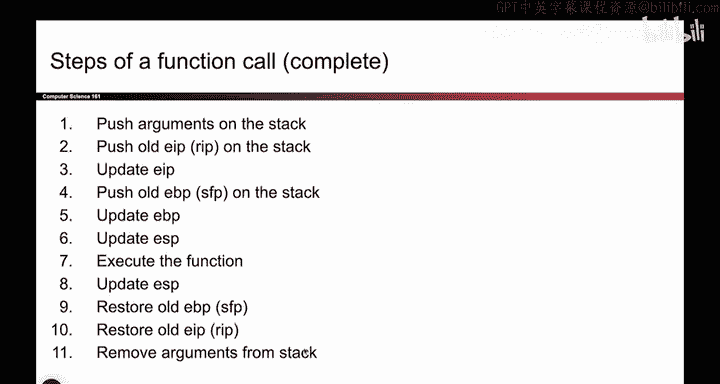
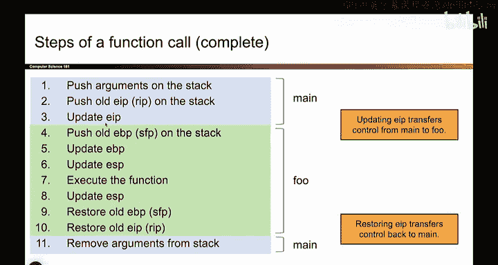
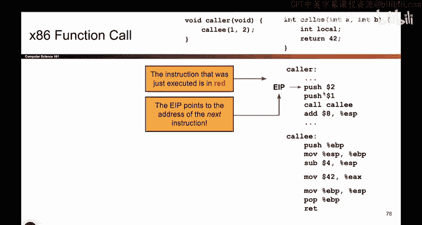
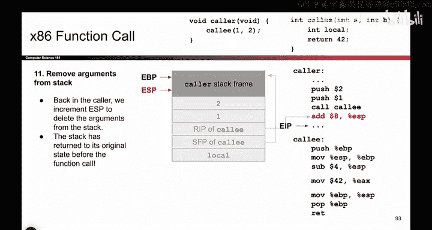

# 024：函数调用步骤（详细）

在本节课中，我们将深入学习X86架构中函数调用的详细步骤。理解这些步骤是掌握后续许多攻击技术的关键，也能帮助你更高效地完成项目。

上一节我们介绍了函数调用的高层概览，本节我们将详细拆解每一步，确保你透彻理解函数调用是如何工作的。

## 函数调用概述



回忆一下，函数调用涉及两个角色：**调用者**（caller，如 `main` 函数）和**被调用者**（callee，如 `foo` 函数）。整个过程的核心在于安全地转移三个关键寄存器的指向：
*   **EIP**：指令指针，指向下一条要执行的指令。
*   **EBP**：基址指针，指向当前栈帧的顶部。
*   **ESP**：栈指针，指向当前栈帧的底部。

调用新函数时，`EBP` 和 `ESP` 需要“下移”（即寄存器中的地址值减小），以指向新的栈帧。同时，`EIP` 需要改为指向新函数的指令。当函数返回时，一切必须恢复原状。我们通过在栈上保存这些寄存器的旧值来实现恢复。



现在，我们将通过11个具体步骤，展示每个寄存器是如何变化的，以及对应的X86汇编代码。

## 详细步骤解析

以下是函数调用的完整步骤流程图，我们将逐一讲解：




前几步由调用者（`main`）执行。一旦更新了 `EIP`，控制权就转移给了被调用者（`foo`），由它执行中间步骤。最后，当恢复原始的 `EIP` 后，控制权回到 `main`，由它完成最后的清理工作。

### 初始状态

我们有一段C代码及其编译后的X86汇编代码。我们将使用一个 `EIP` 小箭头来指示当前正在执行的指令。栈图是我们熟悉的样子：每一行是4字节，地址从下往上递增。需要更多空间时，在更低地址分配内存，这就是栈向下增长的含义。


此时，我们在调用者（`main`）中，`EIP` 指向 `call` 指令，`EBP` 和 `ESP` 标示着调用者的栈帧。

### 步骤 1-2：调用者准备参数并转移控制权

现在，调用者需要将控制权转移给被调用者。首先，它必须传递参数。

**步骤 1：将参数压入栈中**
调用者需要告诉被调用者有两个参数：数字1和数字2。传递方式是将它们压入栈中。按照X86惯例，参数以逆序压入。
```assembly
push 2
push 1
```
每压入一个值，`ESP` 必须下移，以表明这些值现在是栈的一部分。

**步骤 2：调用函数，保存返回地址并跳转**
现在准备跳转到被调用者的代码。但在此之前，必须保存当前 `EIP`（即 `call` 指令之后的下一条指令地址），以便函数返回时能回到这里。`call` 指令自动完成了这个复杂操作：
1.  将旧的 `EIP` 值（返回地址）压入栈中。
2.  将 `ESP` 下移。
3.  将 `EIP` 设置为被调用函数（`foo`）的起始地址，从而跳转过去。

至此，控制权正式转移到被调用者 `foo`。

### 步骤 3-5：被调用者建立新栈帧（序言）

现在轮到被调用者 `foo` 执行了。它需要建立自己的新栈帧。

**步骤 3：保存旧的 EBP 值**
`foo` 首先将当前 `EBP` 的值（指向调用者栈帧顶部）压入栈中保存。
```assembly
push %ebp
```
这样，即使之后改变 `EBP`，其旧值也安全地保存在栈上。

**步骤 4：设置新的 EBP**
接着，`foo` 将 `EBP` 设置为当前 `ESP` 的值，即新栈帧的顶部。
```assembly
mov %esp, %ebp
```
现在，`EBP` 和 `ESP` 指向同一个地址。

**步骤 5：为局部变量分配栈空间**
最后，`foo` 通过减小 `ESP` 来在栈上分配空间，用于局部变量等。
```assembly
sub $4, %esp
```
这里的数字 `4`（或其他值）由编译器根据函数的复杂程度（如局部变量数量）决定。这样就创建了一个专属于 `foo` 的新栈帧。

### 步骤 6：被调用者执行函数体

现在，`foo` 可以自由使用它的栈帧空间了。它可以进行运算、设置局部变量等。
```c
// 对应的C代码操作
int local = a + b; // 假设的操作
return 42;
```
在我们的例子中，它可能创建一个局部变量并准备返回值（通常放在 `EAX` 寄存器中）。

### 步骤 7-10：被调用者清理并返回（尾声）

函数执行完毕，需要返回。此时必须将所有寄存器恢复原状，以便调用者继续执行。

**步骤 7：释放局部栈空间（恢复 ESP）**
首先，将 `ESP` 移回 `EBP` 的位置，从而“释放”或“丢弃”为局部变量分配的空间。
```assembly
mov %ebp, %esp
```

**步骤 8：恢复旧的 EBP**
接着，需要将 `EBP` 恢复为调用者栈帧的顶部地址。这个旧值我们在步骤3中保存在栈上。`pop` 指令将其从栈中取出并放回 `EBP` 寄存器。
```assembly
pop %ebp
```
执行 `pop` 时，`ESP` 会自动上移。

**步骤 9：返回调用者（恢复 EIP）**
最后，需要让 `EIP` 指回调用者中 `call` 指令之后的位置。这个返回地址在步骤2中被保存在栈上。`ret` 指令相当于 `pop %eip`，它将栈顶的返回地址弹出并放入 `EIP`。
```assembly
ret
```
至此，控制权交还给了调用者 `main`。

### 步骤 11：调用者清理参数

函数已经返回，但之前压入栈中的参数还在。调用者需要清理它们。
```assembly
add $8, %esp
```
这条指令将 `ESP` 上移8字节（因为压入了两个4字节参数），从而将参数从栈中移除。

## 最终状态与总结



观察最终状态图，并与初始状态对比，你会发现一切已恢复原状：
*   `EBP` 和 `ESP` 重新指向调用者（`main`）栈帧的顶部和底部。
*   `EIP` 指向 `call` 指令之后的下一条指令。
*   栈上为此次函数调用临时保存的数据（参数、返回地址、旧EBP）已被清理。


本节课中，我们一起详细学习了X86函数调用的完整11个步骤，从调用者准备参数、转移控制权，到被调用者建立栈帧、执行代码、清理恢复，最后调用者完成收尾。这个过程虽然步骤繁多，但每一步都遵循着保存现场、执行任务、恢复现场的原则。透彻理解这些步骤是理解栈操作和后续内存安全概念的基础。如果你觉得复杂，这是完全正常的，建议多看几遍图示和讲解，直到内化于心。