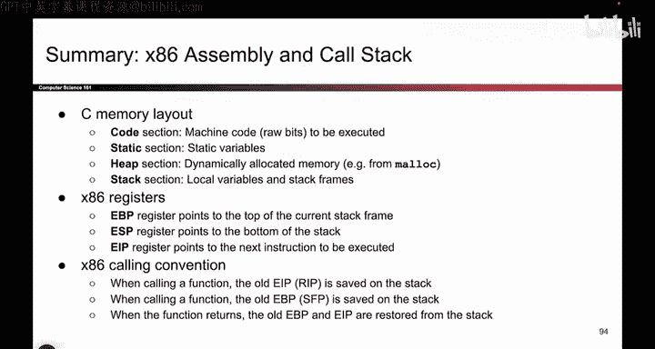
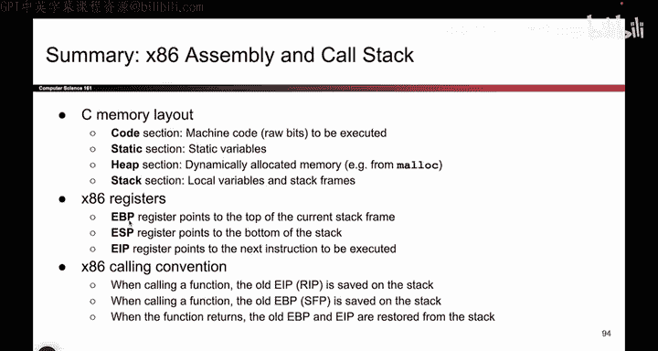
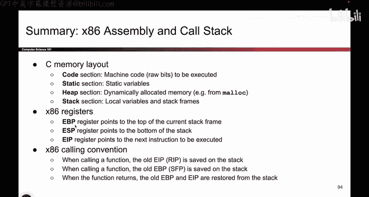
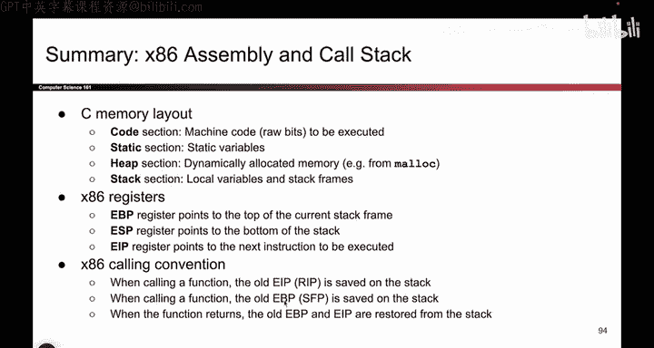

# 025：x86汇编与调用栈总结 🧠

在本节课中，我们将总结之前视频中关于C语言内存布局、x86汇编关键寄存器以及函数调用约定的核心内容。这些知识是理解程序如何在底层运行以及后续内存安全概念的基础。

## C语言内存布局 📊

上一节我们介绍了函数调用栈的细节，本节我们来回顾程序运行时的整体内存布局。一个C程序在内存中主要分为四个我们关心的区域。

以下是这四个内存区域及其用途：

*   **代码区**：存放编译后的机器指令，即由0和1组成的二进制代码。
*   **静态区**：存放静态变量，例如全局变量。
*   **堆区**：存放通过`malloc`等函数动态分配的内存。
*   **栈区**：存放函数的局部变量。

在最近的课程中，我们花了大量时间深入探讨了栈区的工作原理。

## 关键寄存器 💾

理解了内存布局后，我们需要知道CPU如何与这些区域交互，这离不开寄存器的帮助。本节我们来看看三个至关重要的寄存器。

以下是三个核心寄存器及其作用：

*   **EIP**：指令指针寄存器。它告诉我们当前正在执行的是哪一条指令。
*   **ESP**：栈指针寄存器。它指向当前栈帧的底部。
*   **EBP**：基址指针寄存器。它指向当前栈帧的顶部。

人们常常会忽略EBP，但它非常重要。它标明了栈帧的顶部位置，我们可以利用它来定位栈上的其他数据，这非常有用。

## 函数调用约定 📞

掌握了寄存器的功能后，我们来看看它们是如何在函数调用过程中协同工作的。这就是函数调用约定，它包含了一系列步骤。

调用约定包含许多步骤，你可以反复观看视频以掌握它。但最重要的是，**无论何时你要修改EIP或EBP这类寄存器的值，都必须先将它们的旧值压入栈中**。这样，当函数返回时，才能从栈上取出这些值并恢复EBP和EIP。

这可能是本系列视频中最重要的知识点。

---

本节课中，我们一起学习了C程序的内存四区划分，认识了EIP、ESP、EBP三个关键寄存器的作用，并理解了函数调用约定的核心原则——保存和恢复上下文。这些底层机制是理解程序控制流和后续内存漏洞（如缓冲区溢出）的基础。