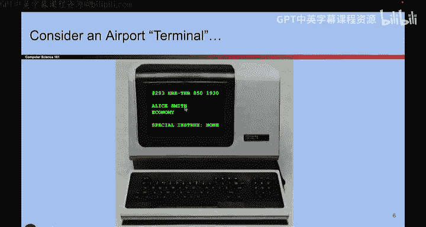
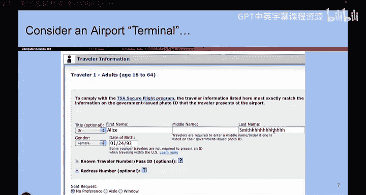
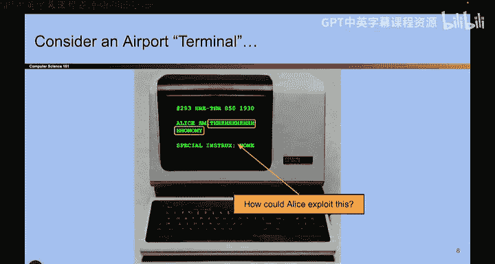
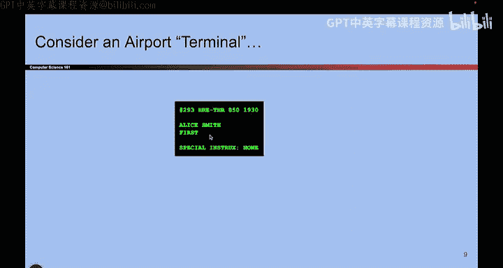

# 026：机场类比 🛫

在本节课中，我们将学习内存安全漏洞的基本概念。我们将通过一个机场值机系统的类比，来理解C语言中缓冲区溢出的核心原理。上一节我们回顾了X86汇编和调用栈的基础知识，本节中我们来看看一个具体的漏洞场景。

## 课程概述

本节课我们将探讨一个模拟的机场值机系统漏洞。这个例子将帮助我们理解，当程序在内存中存储数据时，如果缺乏明确的边界，攻击者如何通过输入超长数据来破坏程序的正常逻辑，从而获得未授权的访问或特权。

## 机场值机系统类比

想象一个使用非常老旧计算机的机场值机柜台。这台计算机会加载乘客提交的机票信息，通常包括姓名、舱位等级（如经济舱、头等舱）以及任何特殊说明。其界面可能看起来非常古老。

现在，假设一位名叫Alice Smith的乘客在订票时，不小心（或故意）在输入姓名时睡着了，或者她的猫在键盘上走过。结果，她的姓名不是“Alice Smith”，而是变成了“Alice SmithHHHHHHHHH”。这是一个非常奇怪的名字。

那么，当Alice Smith带着这个姓名去机场值机时，会发生什么呢？她前往值机，那台老旧的电脑显示了以下信息：你的名字是 Alice Smith HHHHH，而你的舱位等级变成了 HH。

这很有趣。我们来思考一下这里发生了什么。或许可以问你一个问题：你希望如何利用这一点？想一想，Alice可以给自己起一个什么样的名字，来导致一些不好的事情发生？

暂停视频，思考一下。

好的。假设现在Alice的名字是“Alice Smith HHHHHH business”。让我们看看如果输入这个名字会发生什么。

也许我先输入名字，但得到了类似的效果：“Alice Smith HHHHHH first”。我甚至可以更聪明一点，不用‘H’，而是用空格键。所以名字变成了“Alice Smith”后面跟着一串空格，然后是“first”。

现在，当你值机时，系统突然只显示你在头等舱。这对你来说是好事，但对航空公司来说是坏事。这就是我们可以进行的一种攻击。

如果我想更有创意，我可以添加更多字符，甚至可以更改特殊说明，比如“给我香槟”或“不要弄丢我的行李”之类的。

那么，我用了哪两个想法来实现“Alice Smith”后面跟一串空格然后是“first”呢？这里发生了两件事。

一件事是，我没有全部用‘H’，而是用了空格键，以此来欺骗机场值机柜台的人员，让他们不觉得这里有什么奇怪。

但更重要的是，这里到底发生了什么？如果你思考一下这台计算机在做什么，它似乎非常老旧，似乎不知道姓名在哪里结束，舱位等级在哪里开始。这里有这两行信息。而且似乎没有任何边界来阻止某人写入超过第一行的末尾并进入第二行。

因此，如果我必须总结这台计算机的问题所在，那就是：**这两行之间没有边界**。

这允许Alice Smith使她的名字变得非常长，写入超过第一行的末尾，并写入到第二行，而这本不应该发生。现在，Alice Smith有了香槟，她的行李也不会丢失了。所以，坏事发生了。

## 核心概念总结

这就是我们的类比。从这个故事中得出的关键要点（你不需要记住任何关于机场柜台的具体细节）是：**内存中缺乏边界**。

在内存的某个地方，没有明确的概念来标识事物从哪里开始，到哪里结束。这使得攻击者能够越过一个事物的末尾，写入到另一个本不应由他们控制的事物（比如舱位等级）中。这就是这个故事的核心要点。

## 本节总结

本节课中，我们一起通过一个机场值机系统的生动类比，理解了内存安全漏洞中的一个基本问题——缓冲区溢出。我们看到了当程序在内存中存储数据时，如果缺乏明确的边界检查，攻击者如何通过提供超长的输入数据，覆盖相邻的内存区域，从而篡改程序逻辑和数据。下一节，我们将把这个类比映射到实际的C代码和内存布局中，深入探讨缓冲区溢出的技术细节。