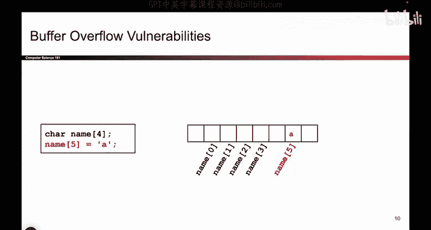
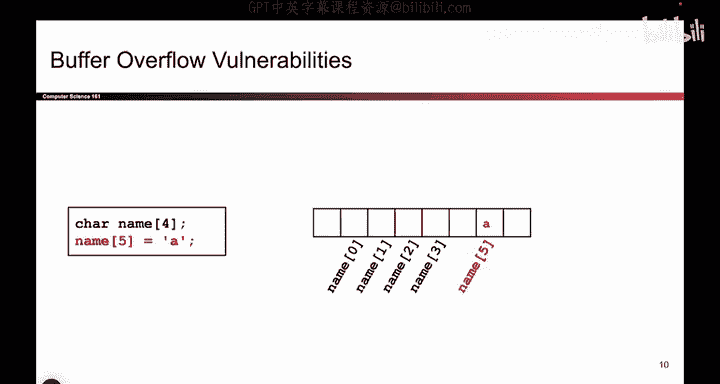
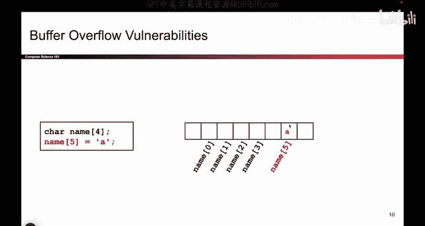
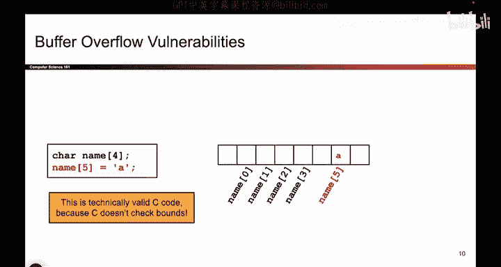
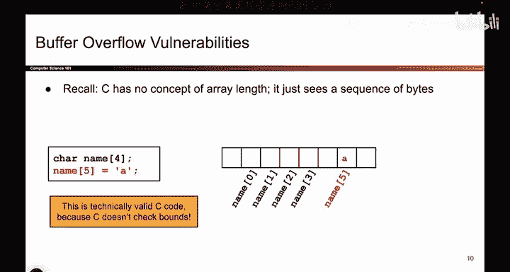
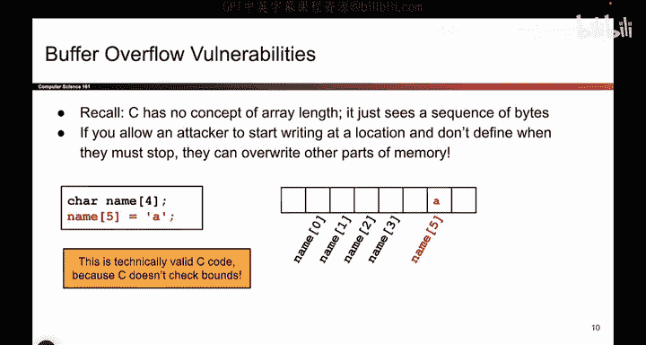

# 027：缓冲区溢出漏洞 🛡️


在本节课中，我们将要学习C语言中一个核心的安全问题：缓冲区溢出漏洞。我们将通过对比其他高级语言的行为，来理解C语言处理内存访问时的独特方式及其潜在风险。



## 对比其他语言的行为

上一节我们介绍了内存的基本概念，本节中我们来看看C语言在处理数组访问时与其他语言有何不同。


在Java或Python等高级语言中，如果你尝试访问数组边界之外的元素，程序会明确阻止并报错。例如，以下代码在其他语言中会导致错误：

```c
char name[4] = "Dave";
name[5] = 'A';
```

以下是其他语言对此类操作的处理方式：

*   程序会检测到索引5超出了数组`name`（有效索引为0到3）的边界。
*   程序会抛出异常或错误，并终止运行。
*   这是一种安全机制，防止程序访问不属于它的内存区域。

## C语言的内存模型

那么，C语言会怎么做呢？C语言对内存的看法与上述语言截然不同。

C语言将内存视为一个巨大的、连续的字节序列，地址从0x0到0xFFFFFFFF。它本身并不跟踪变量或数组在内存中的确切边界。当执行`name[5] = 'A';`时，C语言会进行以下操作：


1.  找到数组`name`的起始内存地址。
2.  计算偏移量：起始地址 + 5 * sizeof(char)。
3.  将字符`'A'`写入计算得到的内存地址。






**核心概念**：C语言默认不进行数组边界检查。其内存访问可以抽象为以下公式：
`目标地址 = 基地址 + 索引 * 元素大小`




这意味着，只要计算出的地址在进程可访问的虚拟内存范围内，无论它是否属于`name`数组，C语言都会执行写入操作。因此，这段代码在C语言中是有效的，能够通过编译并运行。

## 缓冲区溢出漏洞的原理

正是由于C语言不检查边界，才导致了缓冲区溢出漏洞。

攻击者可以利用这一点，就像我们之前看到的航空公司值机系统示例一样。如果一个程序允许用户向固定大小的缓冲区（如数组）输入数据，但没有严格限制输入的长度，攻击者就可以输入超长的数据。


以下是可能发生的后果：

*   超出的数据会覆盖相邻内存区域的内容。
*   这些被覆盖的区域可能存储着其他变量、函数参数，甚至是控制程序流程的关键数据（如函数返回地址）。
*   通过精心构造的输入，攻击者可以改变程序行为，例如执行恶意代码或使程序崩溃。

这种攻击被称为**缓冲区溢出攻击**，它是利用软件漏洞最常见的手段之一。



## 总结




本节课中我们一起学习了缓冲区溢出漏洞的根源。我们了解到，C语言出于性能和灵活性的设计，将内存视为一个扁平的字节数组，并且不自动检查数组访问的边界。这与Java、Python等语言的安全机制形成鲜明对比。这种“信任程序员”的设计哲学，在缺乏足够安全检查时，会打开安全漏洞的大门，允许攻击者通过溢出缓冲区来读写相邻内存，从而可能控制程序执行流程。理解这一核心原理是学习后续更多内存安全攻击与防御技术的基础。