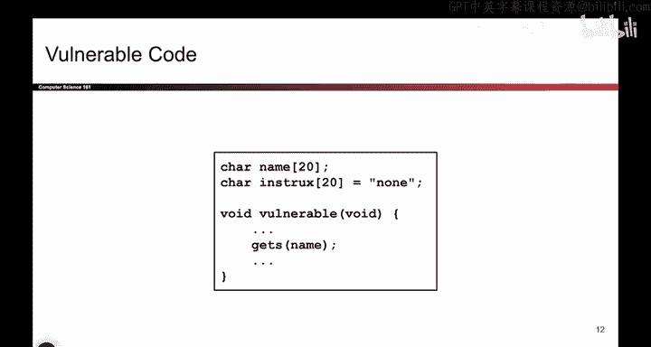
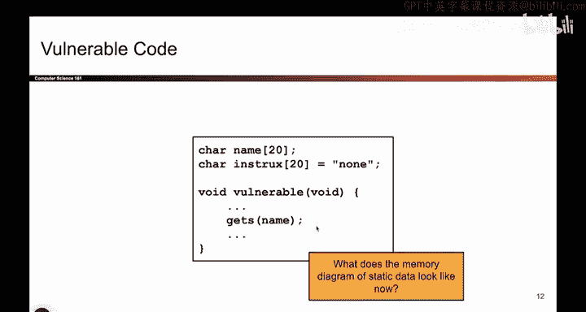
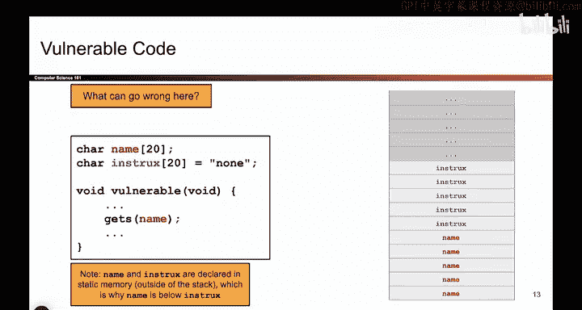

# 028：数据覆写攻击


## 概述

在本节课中，我们将学习一种经典的内存安全漏洞：缓冲区溢出攻击。我们将通过具体的代码示例，理解攻击者如何利用C语言不检查数组边界的特性，覆写本不应被修改的内存数据，从而改变程序的行为。

## 缓冲区溢出基础

上一节我们介绍了C语言中数组边界检查的缺失。本节中我们来看看一个最经典的例子：`gets`函数。


`gets`函数的作用是从用户处获取输入。它不限制用户输入的字符数量，会一直读取字符，直到用户按下回车键（输入换行符）。然后，它会将所有读取到的字符写入到指定的字符数组中。

```c
char name[20];
gets(name); // 危险！不检查输入长度
```

问题在于，如果用户输入的字符数量超过了`name`数组的容量（例如20个字符），`gets`函数依然会将所有字符写入内存。这会导致写入的数据超出数组边界，覆盖相邻内存区域的内容。

## 覆写相邻变量


理解了基础原理后，我们来看一个更具体的攻击场景。假设我们有两个相邻的字符数组。

```c
char name[20];
char instructions[20];
gets(name); // 攻击向量
```

在内存中，这两个数组通常是连续存放的。以下是内存布局的简化表示：

```
[ name 数组 (20字节) ]
[ instructions 数组 (20字节) ]
```

当调用`gets(name)`时，用户输入的数据从`name`数组的起始地址开始写入。如果用户输入超过20个字符（例如“Alice SmithHHHHH please serve me champagne”），多出的字符就会越过`name`数组的边界，继续向下写入内存，从而覆盖掉`instructions`数组的内容。





这样，攻击者就成功地篡改了`instructions`变量，而程序本身只允许向`name`写入数据。

## 覆写关键控制变量

让我们将问题升级。考虑一个控制用户权限的变量。




```c
char name[20];
int authenticated = 0; // 0表示未认证，1表示已认证
gets(name); // 攻击向量
```


在这个例子中，`authenticated`是一个整数变量，用于决定用户是否有权执行敏感操作（如查看密码）。其初始值为0（无权限）。

内存布局可能如下：

```
[ name 数组 (20字节) ]
[ authenticated 变量 (4字节) ]
```

当攻击者通过`gets(name)`输入超长字符串时，数据同样会从`name`开始写入。在写满20字节的`name`数组后，继续写入的字节就会覆盖后面的`authenticated`变量。

如果攻击者精心构造输入，使第21到24个字节的值为`1`（注意整数在内存中的表示方式），那么`authenticated`的值就会被从0修改为1。这样，攻击者就绕过了认证检查，非法获得了高级权限。

这个漏洞的根源在于，代码本意只允许修改`name`，但由于缺乏边界检查，攻击者得以篡改关键的`authenticated`变量。

## 总结


本节课中我们一起学习了缓冲区溢出攻击中的“数据覆写”类型。我们通过例子看到，由于C语言不检查数组边界，使用不安全的函数（如`gets`）会导致用户输入的数据覆盖相邻的内存区域。攻击者可以利用这一点，覆写程序中的其他变量，从而改变程序逻辑，例如覆写一个权限控制变量来提升自己的访问权限。理解这种攻击模式是编写安全代码、避免此类漏洞的第一步。