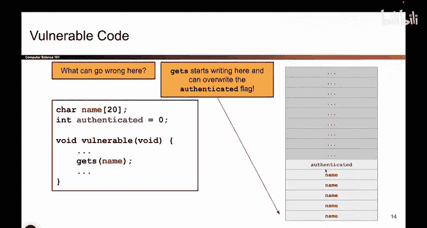
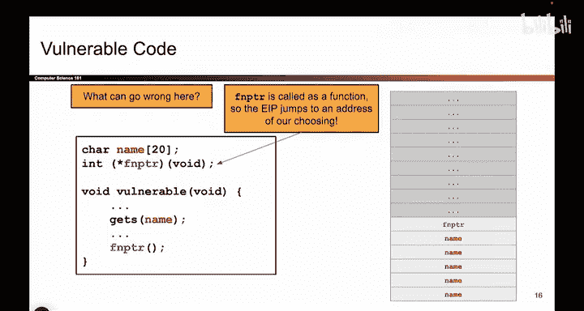
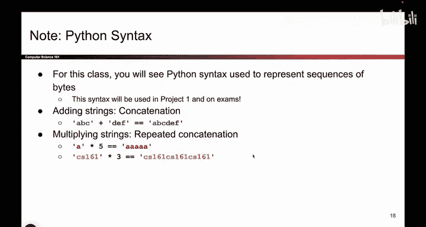

# 029：覆盖命令与函数指针



在本节课中，我们将学习缓冲区溢出漏洞的另外两种具体表现形式：覆盖终端命令和覆盖函数指针。我们将通过简单的例子，理解攻击者如何利用这些漏洞执行恶意操作。

## 概述

上一节我们介绍了通过缓冲区溢出来覆盖普通变量（如`champagne`）的值。本节中，我们将看到同样的溢出原理，如何被用来覆盖更危险的元素：**系统命令**和**函数指针**。理解这些模式，有助于我们认识到此类漏洞在真实世界中的普遍性与严重性。

## 覆盖终端命令

以下是第一个示例。我们有一个字符缓冲区和一个存储终端命令的字符数组。

```c
char buffer[512];
char command[] = "ls"; // 列出文件的命令
gets(buffer); // 不安全的输入函数
system(command); // 执行命令
```

代码中，`gets(buffer)`允许用户向`buffer`写入任意长度的数据。由于`buffer`在栈上，紧随其后的可能就是`command`数组。如果用户写入的数据超过了512字节，多出的部分就会“向上”覆盖栈内存，从而可能修改`command`的内容。

此时，`command`中原本无害的`ls`命令，可能被替换成任何恶意命令，例如：
*   `email_passwords_to_attacker`
*   `rm -rf /` （删除系统文件）
*   发送垃圾邮件

随后，`system(command)`函数会打开终端并执行这个已被篡改的命令，导致严重后果。

## 覆盖函数指针

接下来，我们看一个更特殊的例子：函数指针。

什么是函数指针？在C语言中，函数指针是一个**存储函数地址**的变量。通过这个地址，程序可以找到并执行相应的函数代码。

```c
void (*func_ptr)(); // 声明一个无参数、无返回值的函数指针
func_ptr = &harmless_function; // 指向一个无害函数
gets(buffer); // 不安全的输入
func_ptr(); // 调用函数指针
```

在这段代码中，`gets(buffer)`同样允许溢出。如果`buffer`溢出后覆盖了`func_ptr`变量，那么`func_ptr`中存储的地址就会被改变。

攻击者可以将这个地址覆盖为**恶意函数**的地址，例如：
*   `delete_all_files`函数的地址
*   `print_secrets`函数的地址

当程序执行`func_ptr()`时，它就会跳转到攻击者指定的恶意函数去执行，而不是原本无害的函数。

在以上所有代码示例中，核心问题都是相同的：**向缓冲区写入的数据超过了其边界，并覆盖了后续内存中的关键变量**。无论是覆盖一个字符串、一条系统命令，还是一个函数指针，其破坏性都取决于被覆盖变量的用途。

## 现实世界中的重要性

你可能会觉得这些例子是刻意构造的，现实中不会有程序员犯这种低级错误。然而，事实恰恰相反。



此类漏洞——即“越界写”漏洞——在真实软件中无处不在。它长期位列最具危险性的软件漏洞榜单前列。例如，在某个权威机构发布的历年十大危险软件漏洞中，“越界写”漏洞 consistently 位居前五，甚至在2023年位列第一。

这意味着，理解并防范此类漏洞，对于编写安全的代码至关重要。

## 总结

本节课中，我们一起学习了缓冲区溢出漏洞的两种高级利用方式：
1.  **覆盖终端命令**：通过溢出修改本应执行的系统命令，导致执行任意恶意指令。
2.  **覆盖函数指针**：通过溢出修改函数指针的地址，导致程序跳转并执行任意恶意函数。



它们的共同根源都是**不检查输入长度的不安全函数（如`gets`）**。在接下来的项目中，即使你使用Python等更安全的语言，理解这些底层C语言的漏洞模式，也能帮助你建立起牢固的软件安全意识。