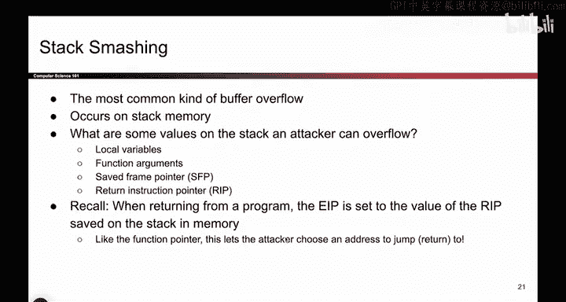
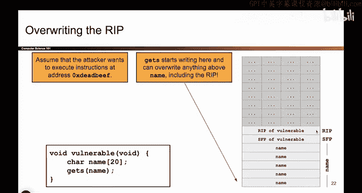

# 030：栈溢出攻击

在本节课中，我们将学习一种经典的内存安全漏洞利用技术——栈溢出攻击。我们将了解函数调用时栈帧的结构，并探索攻击者如何通过覆盖关键数据来控制程序的执行流程。

## 概述


上一节我们介绍了如何通过溢出缓冲区来覆盖相邻的变量。但那种情况似乎有些刻意，因为现实中很少会恰好有一个函数指针紧邻着缓冲区。然而，有一种“函数指针”在每次函数调用时都会自动出现在栈上，这就是我们将要利用的关键。

## 栈帧与返回地址

当调用一个函数时，系统需要保存一些信息以便函数返回后能继续正确执行。这些信息被保存在称为“栈帧”的内存区域中。

以下是压入栈的两个关键值：
*   **保存的 EBP**：指向调用者栈帧的基址。
*   **保存的 EIP（返回地址）**：这是最关键的值。它保存了函数执行完毕后，下一条要执行的指令的地址。本质上，**它是一个由系统自动管理的函数指针**。

函数返回时，会从栈上取出这个返回地址，将其放回 EIP 寄存器，然后 CPU 就会跳转到那个地址继续执行。



## 漏洞代码示例

考虑以下一段看似普通的 C 代码：

```c
void vulnerable() {
    char name[16];
    printf("What's your name? ");
    gets(name); // 危险函数：不检查输入长度
}
```

当 `vulnerable` 函数被调用时，栈帧结构大致如下（地址从高到低增长）：

```
| ...         |
| 保存的 EIP   | <- 返回地址，指向调用者（如 main 函数）
| 保存的 EBP   |
| name[15]    |
| ...         |
| name[0]     |
| ...         |
```

`gets(name)` 函数会无限制地读取用户输入并写入 `name` 缓冲区。如果用户输入超过 16 个字符，多出的字符就会继续向高地址方向写入，从而覆盖栈上的其他数据。

## 构造攻击

假设攻击者已将恶意代码放置在内存地址 `0xDEADBEEF` 处。他们的目标是让程序在 `vulnerable` 函数返回后，跳转到这个地址执行恶意代码。

攻击者需要精心构造输入，使其不仅能填满 `name` 缓冲区，还能精确覆盖栈上的返回地址。

以下是攻击输入的计算与构成：
1.  **填充缓冲区**：首先输入足够多的字符（例如 16 个‘A’）来填满 `name` 数组。
2.  **覆盖保存的 EBP**：继续输入 4 个字符（例如另外 4 个‘A’）来覆盖掉“保存的 EBP”。这部分内容对本次攻击本身不重要，但需要被覆盖以到达目标。
3.  **覆盖返回地址**：最后，输入目标地址 `0xDEADBEEF` 的字节序列。需要注意的是，x86 架构采用**小端字节序**，因此地址 `0xDEADBEEF` 在内存中应从低到高存储为 `\xEF\xBE\xAD\xDE`。

因此，完整的攻击输入是：`16个‘A’ + 4个‘A’ + “\xEF\xBE\xAD\xDE”`。



## 攻击过程

当攻击者提供上述输入后，`gets` 函数会将其写入栈中，导致栈帧被破坏：

```
| ...              |
| 0xDEADBEEF       | <- 返回地址被覆盖为恶意地址
| 0x41414141 (AAAA)| <- 保存的 EBP 被覆盖
| AAAAAAAAAAAAAAAA | <- name 缓冲区
| ...              |
```

当 `vulnerable` 函数执行完毕准备返回时，它会从栈上取出“返回地址”并跳转。此时，它取出的不再是原来合法的返回地址，而是被覆盖后的 `0xDEADBEEF`。于是，CPU 将跳转到该地址，开始执行攻击者预设的恶意指令，攻击就此完成。

## 总结

本节课我们一起学习了栈溢出攻击的基本原理。我们了解到，函数调用时保存在栈上的返回地址是一个关键的“隐形”函数指针。通过使用不安全的函数（如 `gets`）向栈上的缓冲区写入超长数据，攻击者可以覆盖这个返回地址，从而劫持程序的执行流程，使其跳转到任意地址（通常是恶意代码所在处）。这种攻击是许多安全漏洞的根源，理解它对于编写安全的代码至关重要。