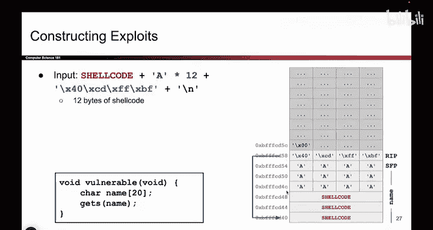

# 031：编写Shellcode 🐚

在本节课中，我们将学习如何利用缓冲区溢出漏洞，通过向目标程序注入并执行我们自己的恶意代码（即Shellcode）来获得系统控制权。我们将从理论到实践，一步步构建一个完整的攻击链。

上一节我们介绍了如何通过覆盖返回地址来劫持程序的控制流。本节中我们来看看，当内存中没有现成的恶意指令时，攻击者如何自行注入并执行代码。

## 概述：从覆盖地址到注入代码

之前我们假设内存中已存在恶意指令（例如在地址 `0xdeadbeef`），并通过覆盖返回地址跳转到那里执行。但在现实中，程序开发者不会主动留下恶意代码。因此，攻击者需要一种方法，将自己编写的指令放入内存并执行。

一种可行的方法是：利用 `gets` 这类不安全的函数。`gets` 允许向内存写入任意数据。攻击者不仅可以写入填充字符（如 `'A'`）和地址，还可以直接写入编译好的机器指令（即 `shellcode`）。

例如，攻击者可以用汇编语言编写恶意指令，将其编译成二进制机器码（一系列 `0` 和 `1`）。这些二进制字节可以被写入到程序内存中。随后，攻击者通过溢出漏洞覆盖返回地址，使其指向刚刚写入的 `shellcode` 的起始地址。当函数返回时，程序就会跳转并执行这些攻击者注入的指令。

这些指令可以执行任意操作，例如删除文件、运行其他程序或发送垃圾邮件。但攻击者最常做的一件事是 **生成一个shell（终端）**。这意味着在目标机器上打开一个命令行终端，攻击者便可以在上面输入任意命令。试想，如果这段存在漏洞的代码运行在一台机密服务器上，攻击者通过注入 `shellcode` 获得了一个终端，就相当于完全控制了那台机器。

这种用于生成shell的恶意代码，通常就被称为 **Shellcode**。

所以，本课的核心要点是：即使程序本身没有恶意代码，攻击者也可以自行注入并执行。接下来，我们将尝试组装一次完整的攻击。

## 构建完整的Shellcode攻击

我们现在知道，可以自行编写恶意代码，将其放入程序内存，并诱使程序执行它。让我们看看具体如何操作，并尝试将整个攻击串联起来。

以下是我们的攻击步骤：
1.  **发现漏洞**：找到程序中存在缓冲区溢出的位置。
2.  **注入Shellcode**：将我们编写的Shellcode写入内存。
3.  **覆盖返回地址**：修改保存返回地址的寄存器（如x86架构的EIP/RIP），使其指向我们刚刚写入的Shellcode的起始地址。

换句话说，我们告诉程序：“当你从这个函数返回时，请跳转到这个地址。” 而这个地址处存放的，正是我们刚刚写入的Shellcode。我们将在一个步骤中完成所有这些操作。当函数返回时，它会查看返回地址，跳转到指定位置，并开始执行恶意的Shellcode，攻击便成功了。

因此，我们的目标是：**写入一些Shellcode，然后强制返回地址（RIP）指向这段Shellcode**。

## 实战演练：内存布局与攻击构造

让我们通过一个具体的栈内存布局图来理解这个过程。下图展示了存在漏洞的函数（如 `vulnerable`）的栈帧结构，并标注了关键数据的地址。

假设我们有一段12字节的Shellcode。它原本不在内存中，我们需要通过溢出漏洞将其写入。现在的问题是：**我们该向内存写入什么内容，以及如何布局，才能让所有部分正确对齐，使得函数返回时能执行Shellcode？**

我们需要精心构造输入数据。以下是一种可行的解决方案：

1.  **首先写入Shellcode**：Shellcode本身是12字节，在内存中占据3行（假设每行4字节）。我们通过 `gets` 函数将其写入缓冲区起始位置。例如，写入到地址 `0xbffffcd40` 开始的地方。现在，恶意指令已经存在于内存中了。
2.  **然后写入填充数据**：`gets` 函数会连续地向更高地址写入数据，不能中途跳转。为了覆盖到位于栈中更高地址的返回地址（RIP），我们需要在Shellcode之后写入一定数量的“垃圾字节”（例如字符 `'A'`）作为填充。在这个例子中，我们需要填充12字节来覆盖栈图中的另外三行数据。
3.  **最后覆盖返回地址**：填充数据之后，下一个写入的数据就会覆盖关键的返回地址（RIP）。此时，我们写入我们希望的地址：**Shellcode的起始地址**，即 `0xbffffcd40`。在x86小端序系统中，我们需要以字节序列的形式写入这个地址。

以下是构造的攻击载荷在内存中的布局示意图：

当程序执行这段被精心构造的输入时，会发生以下情况：
函数执行完毕准备返回，它会读取被我们覆盖后的返回地址（RIP），发现其值为 `0xbffffcd40`。于是，程序跳转到该地址，并开始执行位于此处的指令——正是我们注入的Shellcode。攻击者由此成功执行了Shellcode，获得了系统控制权。

## 总结

本节课中我们一起学习了如何利用缓冲区溢出漏洞进行代码注入攻击。我们了解到，即使目标内存中没有现成的恶意指令，攻击者也可以通过溢出漏洞将自己的Shellcode写入内存，并通过覆盖返回地址来引导程序执行它。我们详细拆解了攻击的构造过程：**先注入Shellcode，再用填充数据覆盖到返回地址的位置，最后用Shellcode的地址覆盖返回地址本身**。这就是你的第一个完整的、包含自定义代码的内存安全漏洞利用实例。理解这个原理是认识更复杂攻击和构建有效防御措施的基础。