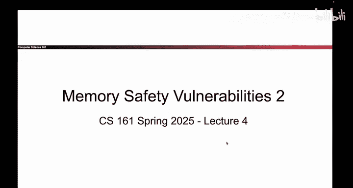

# 032：另一种攻击结构

## 概述

在本节课中，我们将学习内存安全漏洞利用的另一种结构。我们将探讨如何通过不同的方式在内存中布局，最终实现执行恶意代码的目标。理解这种灵活性对于掌握漏洞利用技术至关重要。

## 回顾：上一节的核心概念

上一节我们介绍了第一个内存安全漏洞利用。其核心思想是覆盖**返回指令指针**。这个指针保存了一个地址，当函数返回时，程序会跳转到该地址并执行那里的代码。如果我们能覆盖这个地址，就能在函数返回时强制程序跳转到我们指定的位置，执行我们注入的恶意代码。

## 漏洞利用的“杂耍”艺术

构思这些漏洞利用需要一点“杂耍”技巧。内存中有许多不同的“活动部件”，必须将它们都精确地放置在正确的位置，攻击才能按预期工作。

例如，在之前的例子中，我们选择将**shellcode**放在`name`字符数组的开头。这意味着shellcode的起始地址是`0xBFFFFD40`。因此，我们需要覆盖的**RIP**值也必须被设置为这个地址`0xBFFFFD40`，以便程序跳转到我们的shellcode。

另一个需要协调的部分是`gets`函数的行为。它会将用户输入连续写入内存中地址递增的位置。假设我们的shellcode长度为12字节，那么写完shellcode后，如果我们继续输入数据，接下来被覆盖的还不是**RIP**，而是`name`数组剩余的部分以及**保存的EBP**。因此，我们必须先写入一些“垃圾”字节来填充这些空间，然后才能覆盖到**RIP**。

所以，我们需要协调：把shellcode放在哪里？在**RIP**处写入什么地址？需要使用多少填充字节？通过将所有部分组合起来，我们才能构建出那个特定的攻击。

## 引入：另一种可行的攻击结构

然而，事实证明，这并不是在栈上布局和放置数据的唯一方式。下面我将展示另一种同样能导致shellcode执行的漏洞利用结构，也许这正是你想出来的方法。

也许你会想，与其把shellcode放在`name`数组的最开头，不如先写入填充用的垃圾字节。

以下是这种新结构的步骤：

首先，写入12个‘A’作为填充字节。这些字节可以是任何值，如‘B’、‘C’或‘X’，具体内容无关紧要。

然后，紧接着写入12字节的shellcode。这同样完全可行，它仍然实现了将shellcode写入内存的目标。这12个字节对应一些机器指令，即x86指令翻译成的、存在于内存中的机器码。

由于我们把shellcode放在了不同的位置，我们需要覆盖**RIP**的地址也必须随之改变。

为什么？因为shellcode不再位于地址`0xBFFFFD40`。从图中可以看出，shellcode现在位于地址`0xBFFFFD4C`，这是一个不同的内存地址。

因此，当我覆盖**RIP**时，我现在需要写入的地址是`0xBFFFFD4C`。地址改变的原因仅仅是因为我把shellcode放在了不同的位置。

仔细观察一下，你会发现这种攻击结构同样可以完美地工作。

## 总结

本节课中我们一起学习了内存安全漏洞利用的另一种结构。我们了解到，通过调整shellcode在内存中的位置以及相应地修改覆盖**RIP**的地址，可以构建出功能相同但布局不同的攻击。这展示了漏洞利用的灵活性，核心在于理解内存布局并精确控制数据流向，以确保程序最终跳转到我们注入的恶意代码。