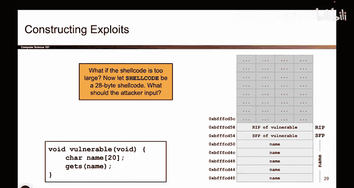
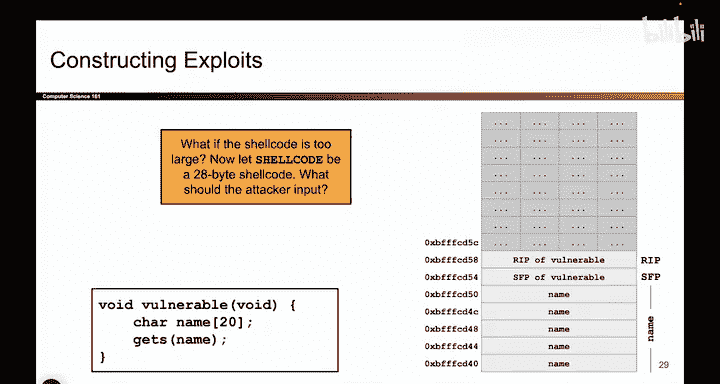
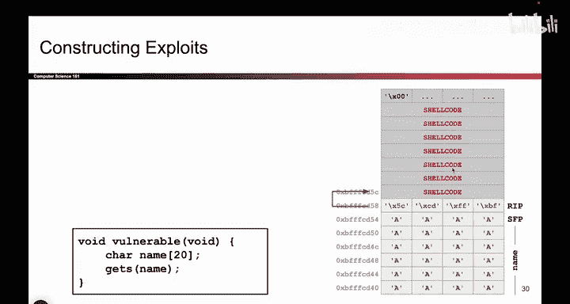
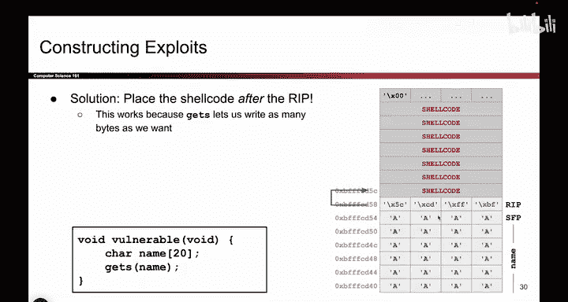

# 033：编写更长的Shellcode


在本节课中，我们将要学习当攻击者想要执行的Shellcode长度超过目标缓冲区容量时，如何调整攻击策略。我们将探讨如何利用`gets`函数的特性，将较长的Shellcode放置在栈上的不同位置，并成功劫持程序控制流。

## 问题引入：缓冲区空间不足





上一节我们介绍了如何利用短小的Shellcode覆盖返回地址。本节中我们来看看当Shellcode过长时会发生什么。


假设攻击者编写了一段Shellcode，编译成x86机器码后，其长度为28字节。然而，目标程序中的`name`字符数组仅能容纳20字节。

```c
char name[20];
```

紧接着`name`数组的是4字节的保存帧指针。这意味着，从`name`数组起始位置到返回地址之间，总共只有24字节的连续可覆盖空间。这不足以容纳28字节的Shellcode。




## 思考解决方案

以下是需要思考的核心问题：如果无法将Shellcode放置在返回地址之前，应该将它放在哪里？

请观察栈的内存布局图，并思考可能的解决方案。关键在于`gets`函数的行为：只要用户持续提供输入，`gets`函数会无限制地向栈上的更高地址写入数据。

## 解决方案：将Shellcode置于返回地址之后

经过思考，我们可以得出解决方案：既然Shellcode无法放入返回地址之前的空间，我们可以将它放在返回地址之后。


具体的攻击载荷结构如下：
1.  首先，用24字节的任意数据填充`name`数组和SFP。
2.  接着，在返回地址的位置，写入一个特定的内存地址。
3.  最后，在这个地址之后，写入我们28字节的Shellcode。






那么，返回地址处应该写入什么地址呢？这个地址应该指向Shellcode的起始位置。根据栈的布局，Shellcode现在位于返回地址之上的某个位置，假设其地址是`0xBFFFFD5C`。

因此，我们需要将地址`0xBFFFFD5C`以小端字节序格式写入到返回地址所在的内存中。

```python
# 攻击载荷结构示例
payload = b'A' * 24          # 填充 name[20] 和 SFP
payload += b'\x5c\xfd\xff\xbf' # 覆盖返回地址，指向Shellcode (0xBFFFFD5C)
payload += shellcode         # 28字节的Shellcode
```

当程序从易受攻击的函数返回时，它会读取被我们覆盖的返回地址，并将控制权转移到`0xBFFFFD5C`。CPU跳转到该地址后，便开始执行我们放置在那里的Shellcode。

## 总结

本节课中我们一起学习了如何利用`gets`函数无边界检查的特性，将过长的Shellcode放置在栈上返回地址之后的位置。攻击的核心模式与之前相同，都是覆盖返回地址以劫持控制流。唯一的区别在于，当Shellcode无法放入原始缓冲区时，我们可以利用`gets`的写入能力，将其放置在栈的更高地址处，并相应地调整返回地址指向这个新位置。