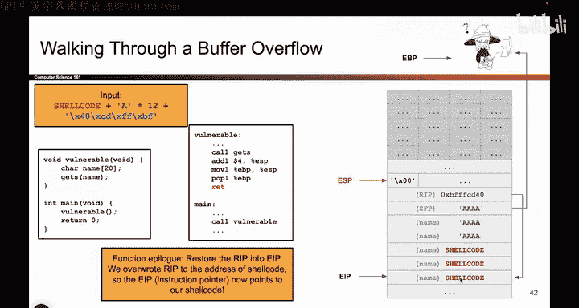
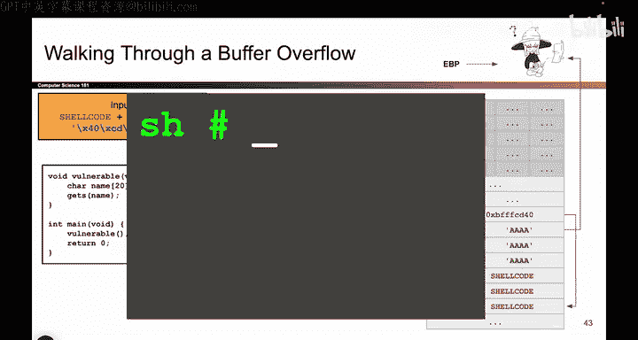

# 034：缓冲区溢出实战演练 🚀

在本节课中，我们将通过实际执行步骤，详细剖析缓冲区溢出攻击是如何发生的。我们将跟随程序的执行流程，特别是函数尾声（epilogue）的步骤，来观察攻击者如何利用漏洞劫持程序控制流，并最终执行恶意代码。

上一节我们介绍了缓冲区溢出的基本概念，本节中我们来看看当程序实际执行时，缓冲区溢出攻击的具体过程。

## 攻击场景回顾

假设我们有一个存在漏洞的函数 `getS`，它负责将用户输入写入栈上的缓冲区。攻击者精心构造的输入包含三部分：恶意代码（shellcode）、用于填充缓冲区的垃圾数据（如‘A’），以及一个指向shellcode的返回地址。

## 进入 `getS` 函数

程序执行进入 `getS` 函数。指令指针（EIP）指向 `getS` 的代码。该函数从用户处获取输入，并将其写入栈上名为 `name` 的字符数组中。

以下是攻击者提供的输入结构：
1.  **Shellcode**：一段恶意机器指令。
2.  **12字节的垃圾数据**：用于填充 `name` 缓冲区剩余空间。
3.  **返回地址**：一个指向栈上shellcode起始位置的地址（例如 `0xBFFFCD40`）。

`getS` 函数忠实地将这些数据写入栈内存。它首先写入12字节的shellcode，然后写入12个‘A’（即 `0x41414141`）来填充缓冲区。

## 覆盖关键数据

在写入过程中，发生了溢出。`name` 缓冲区被填满后，继续写入的‘A’覆盖了其后的栈内存。

*   **覆盖SFP**：首先被覆盖的是**保存的帧指针（SFP）**。SFP原本存储着调用者（`vulnerable`函数）栈帧的基地址（EBP），用于函数返回时恢复。现在它被 `0x41414141` 覆盖，导致EBP在恢复时将指向一个未知的、无意义的内存地址。
*   **覆盖返回地址**：紧接着，**返回地址（RIP）** 被覆盖。RIP原本存储着 `vulnerable` 函数中 `call getS` 指令之后的下一条指令地址，用于 `getS` 返回后继续执行。攻击者用精心计算的shellcode地址（`0xBFFFCD40`）覆盖了它。

至此，`getS` 函数的任务完成，攻击数据已全部写入栈中。

## 函数返回与尾声执行

现在，`getS` 函数执行完毕，需要返回 `vulnerable` 函数。随后，`vulnerable` 函数也执行完毕，准备返回其调用者（如 `main` 函数）。在x86架构中，函数返回时总会执行一段固定的指令序列，称为**函数尾声（function epilogue）**。

以下是 `vulnerable` 函数尾声的三个标准步骤，正是攻击发生的关键：

### 第一步：移动栈指针（ESP）

指令 `mov esp, ebp` 将栈指针（ESP）移动到当前帧指针（EBP）的位置。这相当于释放了 `vulnerable` 函数的整个栈帧（包括被溢出的 `name` 缓冲区区域）。虽然栈指针上移，但被写入的恶意数据仍然物理存在于那片内存中，并未被清除。

### 第二步：恢复帧指针（EBP）

指令 `pop ebp` 从栈顶弹出一个值，并将其存入帧指针寄存器（EBP）。这个弹出的值本应是之前保存的、有效的SFP。然而，由于SFP已被覆盖，现在弹出的值是 `0x41414141`。因此，EBP寄存器被设置为这个无意义的地址。这可能导致程序后续如果错误地使用EBP访问内存时崩溃，但攻击本身不依赖于此。

### 第三步：返回并跳转（RET）

指令 `ret` 从栈顶弹出下一个值，并将其作为下一条指令的地址加载到指令指针（EIP）中。这个弹出的值就是**返回地址（RIP）**。由于RIP已被攻击者覆盖为shellcode的地址（`0xBFFFCD40`），因此 `ret` 指令执行后，EIP将指向栈上的shellcode起始位置。

## 攻击达成

此时，程序的**控制流已被完全劫持**。处理器接下来将执行EIP所指向的指令，即攻击者放置在栈上的shellcode。shellcode通常会执行诸如打开一个系统shell（如 `/bin/sh`）等恶意操作，使得攻击者能够完全控制该进程。

---

本节课中我们一起学习了缓冲区溢出攻击的详细执行步骤。我们看到了攻击者如何通过溢出漏洞覆盖栈上的关键数据（SFP和RIP），并利用函数返回时必然执行的尾声指令，特别是 `ret` 指令，将程序控制流导向恶意代码。这个过程清晰地展示了为什么简单的内存写入越界会带来如此严重的远程代码执行后果。理解这些底层细节是构建有效防御措施的基础。