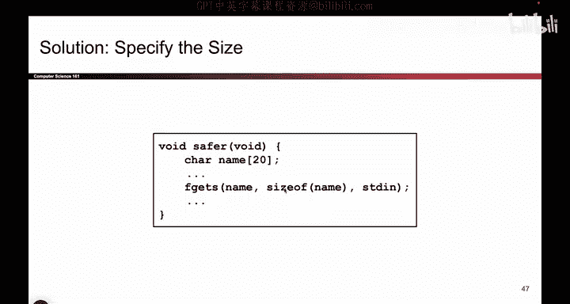
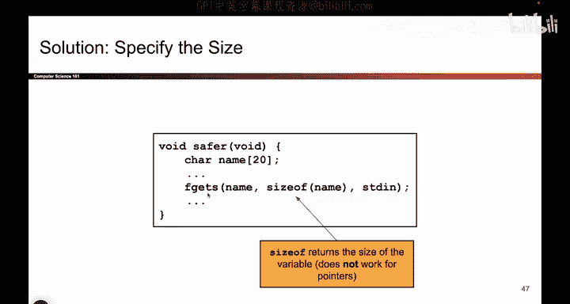
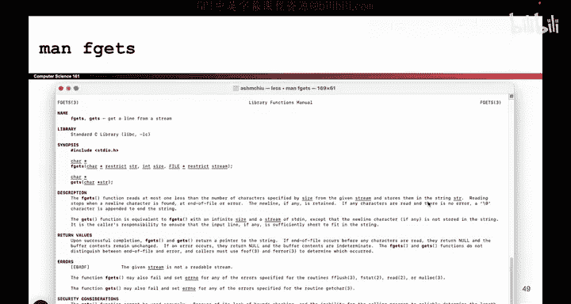

# 035：堆溢出与不安全的C库函数 🛡️

在本节课中，我们将要学习堆内存溢出的概念，并了解C语言中一些看似安全但实际上存在风险的库函数。我们将探讨这些函数为何危险，以及如何通过使用更安全的替代函数来保护程序。

## 堆内存溢出的风险


上一节我们介绍了栈缓冲区溢出的工作原理。本节中我们来看看堆内存溢出的情况。

以下是一段示例代码：

```c
char *name = malloc(20);
gets(name);
```

这段代码看起来可能没有问题，因为`name`指向堆内存，而非栈内存。因此，攻击者可能无法像之前那样覆盖返回地址（RIP）来实施栈粉碎攻击。然而，危险依然存在，因为C语言没有边界检查。攻击者可以通过`gets`函数输入超过20个字符，从而溢出`name`数组的边界。

堆内存中可能存储着许多敏感数据，例如用户身份验证标志、航班特殊指令等。如果攻击者向`name`写入超过20字节的数据，这些溢出数据就会覆盖堆上的其他敏感信息，造成安全问题。

## 如何防御内存安全漏洞

为了防御此类攻击，我们必须使用更安全的C库函数来替代那些不安全的函数。


以下是使用安全函数的一个例子：

```c
char *name = malloc(20);
fgets(name, 20, stdin);
```

`fgets`函数允许我们指定一个限制（本例中为20），确保用户输入不会超过缓冲区的大小。这样，即使用户尝试输入更多数据，程序也只会读取前20个字节，从而防止了溢出。

## 提高代码安全性


我们可以通过以下方式进一步提高代码的安全性：

```c
char *name = malloc(20);
fgets(name, sizeof(name), stdin);
```

使用`sizeof(name)`可以确保限制值与缓冲区大小始终保持一致。这样，如果我们将来将缓冲区大小从20改为15，限制值也会自动更新，避免了因忘记同步修改而引入的错误。

## 不安全函数与安全替代函数




C语言中有许多函数存在类似的安全问题。开发者必须记住哪些是不安全函数，并使用其安全版本进行替代。



以下是一些常见的不安全函数及其安全替代方案：

*   `gets` 是危险的，请使用 `fgets` 代替。
*   `strcpy` 是危险的，请使用 `strncpy` 代替。
*   `strlen` 在某些情况下是危险的，请使用 `strnlen` 代替。

在C语言编程中，必须仔细查阅函数文档（例如Unix/Linux系统中的`man`手册页），确认所使用的函数是否安全，并选择正确的安全替代方案。即使是一个小小的疏忽，也可能导致整个程序变得脆弱易受攻击。

## 总结




本节课中我们一起学习了堆缓冲区溢出的风险，它允许攻击者覆盖堆内存中的敏感数据。我们认识到C语言中许多标准库函数（如`gets`）由于缺乏边界检查而存在安全隐患。防御的关键在于使用具有长度限制的安全替代函数（如`fgets`），并确保代码中缓冲区大小与读取限制保持一致。在C语言开发中，始终保持警惕并查阅官方文档是避免内存安全漏洞的重要实践。