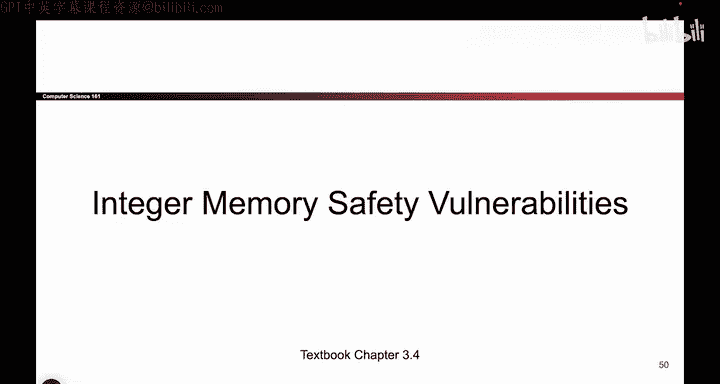
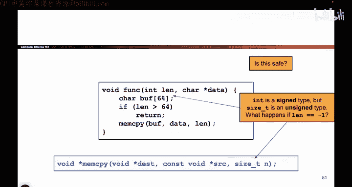
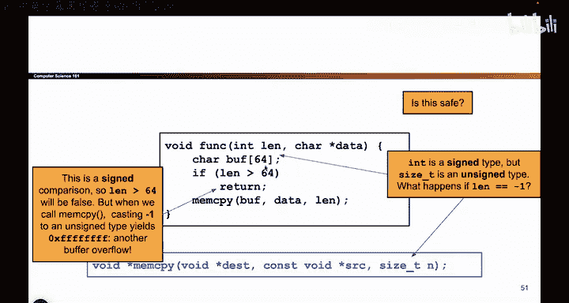
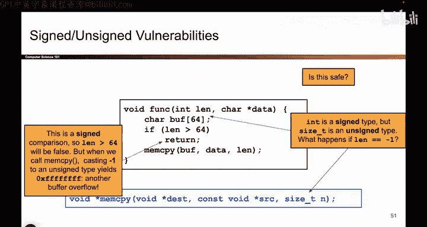

# 036：有符号与无符号整数漏洞 🔢

在本节课中，我们将学习一种称为“整数内存安全漏洞”的攻击方式。我们将分析一段看似安全的C语言代码，并揭示攻击者如何利用有符号和无符号整数之间的差异来绕过安全检查，从而执行恶意代码。

## 概述



上一节我们讨论了缓冲区溢出的基本原理。本节中，我们将深入探讨一种更隐蔽的漏洞类型：有符号与无符号整数漏洞。这种漏洞源于程序员对同一数据（一串二进制位）在不同上下文中解释方式（有符号数或无符号数）的混淆。

## 代码示例与分析

以下是一段存在潜在漏洞的C语言代码。让我们逐步分析它。

```c
void safe_copy(char* data, int length) {
    char buffer[64];
    if (length > 64) {
        return;
    }
    memcpy(buffer, data, length);
}
```

这段代码的功能是安全的吗？它接收一个字符数组 `data` 和一个表示其长度的整数 `length`。在C语言中，传递数组通常需要两个参数：一个指向数组起始地址的指针，以及一个表示数组中元素数量的参数。这是因为C语言本身不会进行数组边界检查。

代码创建了一个大小为64字节的缓冲区 `buffer`。它首先检查传入的 `length` 是否大于64。如果大于64，函数直接返回，不执行复制操作。如果 `length` 小于或等于64，则使用 `memcpy` 函数将 `data` 中的 `length` 个字节复制到 `buffer` 中。

乍看之下，这段代码似乎没有问题。它有一个安全检查，防止复制超过缓冲区大小的数据。只要攻击者诚实地报告长度，就不会发生溢出。


然而，这里存在一个非常微妙的漏洞。

## 漏洞原理

问题的关键在于参数 `length` 的数据类型是 `int`，即**有符号整数**。有符号整数可以表示正数、负数和零。

考虑以下场景：攻击者传入一个非常大的数组，其长度用十六进制表示为 `0xFFFFFFFF`。如果将其解释为**无符号整数**，这是一个巨大的正数（4,294,967,295）。攻击者诚实地报告了这个长度。



但是，当这个值 `0xFFFFFFFF`（二进制全为1）进入函数 `safe_copy` 时，由于参数 `length` 是 `int` 类型，程序会将其解释为**有符号整数**。在二进制补码表示法中，`0xFFFFFFFF` 代表 **-1**。

现在，让我们用 `length = -1` 来执行代码：
1.  检查 `if (length > 64)`：`-1 > 64` 吗？**不成立**。因此，安全检查被绕过。
2.  程序执行到 `memcpy(buffer, data, length);`。
3.  `memcpy` 函数的第三个参数类型是 `size_t`，这是一个**无符号整数**类型。于是，值 `-1`（在内存中仍是 `0xFFFFFFFF`）又被解释为一个巨大的无符号整数。
4.  `memcpy` 试图从 `data` 复制 `0xFFFFFFFF` 个字节（约4GB数据）到仅有64字节的 `buffer` 中，这必然导致**缓冲区溢出**。

**核心漏洞公式**：
`0xFFFFFFFF` (无符号) → 巨大正数
`0xFFFFFFFF` (有符号 `int`) → -1
`-1` (作为 `size_t` 传入 `memcpy`) → `0xFFFFFFFF` (无符号) → 巨大正数

攻击者利用了对同一串二进制位（`0xFFFFFFFF`）在代码流中不同位置（比较语句 vs. 复制函数）解释方式的切换，绕过了安全检查。

## 漏洞修复

修复这个漏洞的关键在于保持数据类型解释的一致性。以下是修复后的代码：



```c
void safe_copy(char* data, size_t length) { // 将参数类型改为 size_t
    char buffer[64];
    if (length > 64) {
        return;
    }
    memcpy(buffer, data, length);
}
```

**修复方法**：将函数参数 `length` 的类型从 `int` 改为 `size_t`（无符号整数类型）。这样，在整个函数内部以及传递给 `memcpy` 时，对 `length` 的解释都是无符号的。安全检查 `if (length > 64)` 将会正确地将巨大的长度值识别出来并阻止复制操作。



## 总结

本节课中我们一起学习了有符号与无符号整数漏洞。这种漏洞非常隐蔽，因为程序员常常忽略整数类型的符号性。其核心是**同一数据在不同上下文中的解释冲突**：比较时可能被当作有符号数（如-1），而在进行内存操作时又被当作无符号数（一个巨大的正数），从而绕过边界检查。


要避免此类漏洞，应始终保持对同一数据解释的一致性，特别是在涉及边界检查和安全关键操作时，谨慎选择并使用无符号整数类型（如 `size_t`）来表示大小和长度。