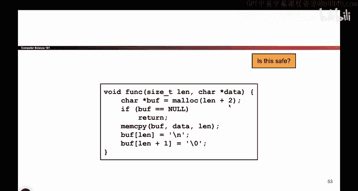
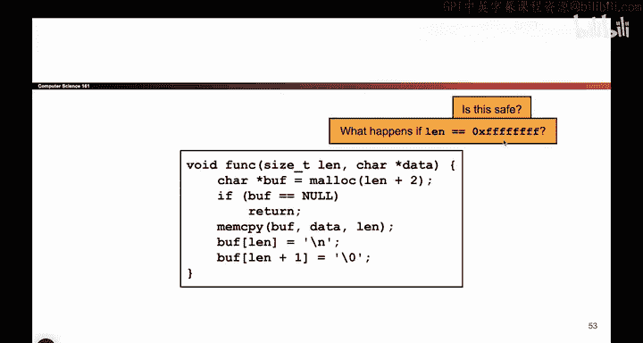
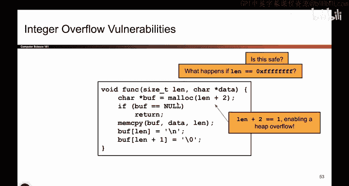
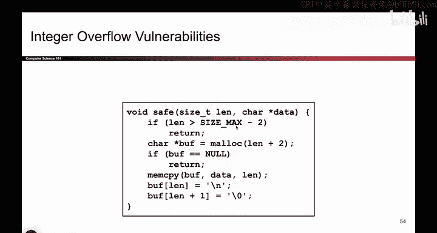

# 037：整数溢出漏洞 🧮

在本节课中，我们将学习整数溢出漏洞。这是一种当整数运算结果超出其数据类型所能表示的范围时，导致程序行为异常的安全问题。我们将通过一个具体的代码示例来理解其原理、危害及修复方法。

上一节我们讨论了整数表示和符号问题，本节中我们来看看另一种与整数相关的常见漏洞：整数溢出。

## 漏洞代码分析

我们来看一段代码。攻击者输入一个字符数组，程序接收一个指向该数组起始位置的指针，以及一个表示数组字节长度的参数 `L`。我们假设这些参数是如实传递的。

以下是程序的操作步骤：
1.  程序在堆上分配一个新的缓冲区。
2.  它调用 `malloc` 函数，分配大小为 `L + 2` 字节的内存。这里加2可能是为了在用户数组末尾添加一个换行符和一个空字节。
3.  程序使用 `memcpy` 将用户数组的数据复制到新分配的缓冲区中。

代码逻辑如下：
```c
size_t buffer_size = L + 2;
char* buffer = malloc(buffer_size);
memcpy(buffer, data, L); // data 是用户输入的数组指针
buffer[L] = '\n';
buffer[L+1] = '\0';
```
这段代码看起来没有问题，因为分配的空间 (`L+2`) 足够容纳要复制的数据 (`L`)。但这里潜藏着一个整数溢出问题。



## 漏洞原理 🔍



问题在于 `L + 2` 这个加法运算。如果攻击者传入一个非常大的 `L` 值，例如 `0xFFFFFFFFFFFFFFFF`（在64位系统上 `size_t` 能表示的最大值），会发生什么？

当我们对这个已经达到最大值的数加2时，会发生整数溢出（或称回绕）：
```
0xFFFFFFFFFFFFFFFF + 1 = 0x0000000000000000
0xFFFFFFFFFFFFFFFF + 2 = 0x0000000000000001
```
因此，`L + 2` 的实际计算结果为 `1`。这意味着 `malloc` 只分配了 **1个字节** 的内存。

然而，接下来的 `memcpy` 操作仍然试图从 `data` 复制 `L`（一个巨大的数字）个字节到 `buffer` 中。由于 `buffer` 实际只分配了1字节，这将导致大量的数据被写入缓冲区之外的内存区域，造成**堆缓冲区溢出**。

这种漏洞被称为**整数溢出漏洞**。关键问题在于，我们取了一个非常大的数，加上一个小数字后，它回绕成了一个非常小的数（如0或1）。

## 修复方法 🛡️

修复这类漏洞的代码通常比较繁琐，但为了安全是必要的。核心思想是在进行可能导致溢出的运算前，先进行检查。

以下是修复思路：
1.  我们需要检查 `L` 是否已经接近 `size_t` 类型能表示的最大值（`SIZE_MAX`）。
2.  如果 `L` 太大，以至于 `L + 2` 会溢出，那么我们应该拒绝这个请求，直接返回错误，而不是继续执行分配和复制操作。



示例修复代码如下：
```c
#include <stdint.h> // 用于 SIZE_MAX

if (L > SIZE_MAX - 2) {
    // 处理错误：长度过大，加法会溢出
    return ERROR;
}
size_t buffer_size = L + 2; // 现在这个加法是安全的
char* buffer = malloc(buffer_size);
if (buffer == NULL) { /* 处理分配失败 */ }
memcpy(buffer, data, L);
// ... 其余代码
```
这段代码通过检查 `L` 是否大于 `SIZE_MAX - 2` 来确保 `L + 2` 不会溢出。虽然代码看起来有些冗长，但这是用C语言编写安全程序时常常需要做的防御性检查。

有人可能会质疑，传入如此巨大的数组长度是否现实。为了更直观地理解，可以考虑使用范围更小的数据类型，例如 `uint8_t`（表示0到255）。对于一个期望 `uint8_t` 类型长度的函数，传入值255并加上2，就会溢出变成1，这是一个更易触发的场景。

## 总结



本节课中我们一起学习了整数溢出漏洞。我们看到了，即使代码看起来分配了足够的空间（`L+2`），但如果用户输入的长度 `L` 过大，简单的加法运算 `L + 2` 会导致整数回绕，使得实际分配的内存远小于预期，进而引发缓冲区溢出。


关键要点是：**在对来自不可信来源的整数（特别是用于内存分配大小的整数）进行算术运算（如加法、乘法）时，必须预先检查运算结果是否会发生溢出。** 这是编写安全C/C++代码需要养成的重要习惯。