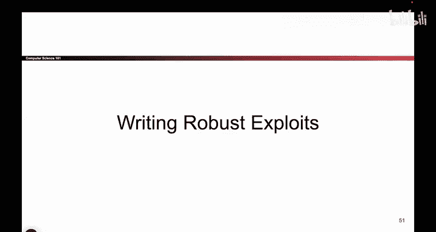

# 039：差一错误问答环节 🎯

在本节中，我们将探讨关于“差一错误”缓冲区溢出攻击的一些深入问题与解答。我们将分析攻击可能失效的场景、堆栈操作细节、寄存器的作用以及攻击载荷的灵活放置方式。

---

## 问题一：攻击是否在所有情况下都有效？

这是一个很好的问题。是否存在某些条件导致这种攻击无效？例如，如果这个C以某种方式“咬”过去，或者说回绕到了CE，你是对的。实际上在某些情况下，这种攻击在项目上可能不会成功。如果你运气不好，可能会遇到其中一种情况。我们稍后会讨论在项目中如何修复它，所以我把这留作一个练习，或者你可以稍后再问。某些地址配置可能导致攻击失败。这是一个好问题。

## 问题二：关于`add $16, %esp`指令

哦，是的，请讲。我在ESP上加16。这在这里确实不是最重要的事情，但如果你回顾函数调用的步骤，这是第11步，是我从堆栈中移除参数的步骤。在这里，我向堆栈压入了四个参数，为了删除它们，我加上16以从堆栈中移除四个参数。所以这只是完成对E的调用。真的不是那么重要，但为了完整性我们添加了它。

## 问题三：为什么打开shell后EBP的位置就不重要了？

这是一个很好的问题。为什么一旦你打开一个shell，EBP的位置就不重要了？这取决于你的shell代码在做什么。但如果你的shell代码从不引用这个值，那么你在那里放什么就真的不重要了。因为如果你仔细想想，EBP只是一个寄存器。它只是一个寄存器，它保存一个值。如果你需要它，你就向EBP询问它的值。但在这一点上，因为你正在执行自己编写的代码，如果你自己编写的代码从不询问EBP的意见，那么EBP里放什么就真的无关紧要了。实际上，如果你关心EBP里是什么，你甚至可以让自己的shell代码，把你关心的某个值重新注入到EBP中，如果你真的在乎的话。但它只是一个寄存器，它保存一个值。如果你的shell代码不使用它，那么就不会发生什么坏事。这是一个好问题。

## 问题四：伪造的RIP必须放在特定位置吗？

还有一个问题。是的，有一个问题是，在main函数中，你把伪造的RIP放在哪里重要吗？这也是一个好问题，你今天用所有这些好问题难住我了。你是对的，实际上还有其他方法也可以使这个漏洞利用成功。就像在最原始的缓冲区溢出中，我们展示的第一个例子一样，你可以把shell代码和shell代码的地址放在RIP下方或上方的各种不同位置。你可以把这组值，即伪造的SFP和伪造的RIP，放在下面这里，也可以放在上面这里，或者放在更上面这里，只要它是你可以覆盖的某个地方，就完全没问题。

## 问题五：为什么这些地址不改变？

这是一个关于为什么这些地址不改变的很好的问题。如果你再坚持大约一周，你就会得到答案。所以请保持关注。这是一个好问题。目前，我们假设它们是相同的。如果你再坚持一周，我们会改变它们。

---

## 总结

在本节中，我们一起探讨了关于差一错误攻击的几个关键问题。我们了解到攻击的成功依赖于特定的内存布局，并非在所有地址配置下都有效。我们回顾了清理堆栈参数的操作细节，并理解了在成功执行自定义shell代码后，某些寄存器（如EBP）的值可能变得无关紧要。此外，攻击载荷（如伪造的返回地址）在可覆盖的内存区域内具有放置的灵活性。最后，我们提到了内存地址的稳定性是一个暂时的教学假设，实际情况可能更为复杂。对于初学者来说，理解这些边界条件和假设是构建扎实漏洞利用知识的重要一步。