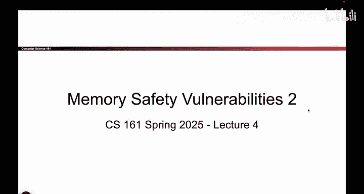
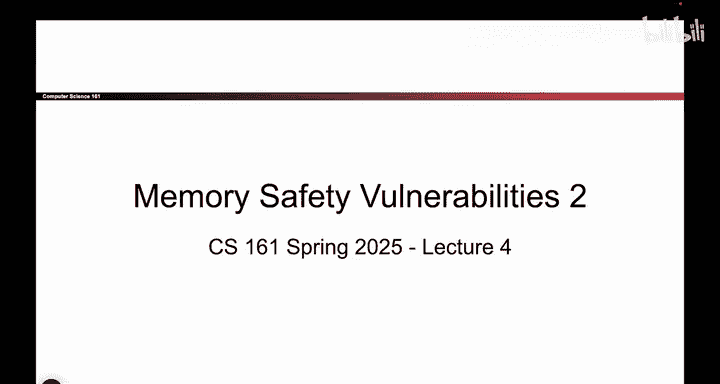
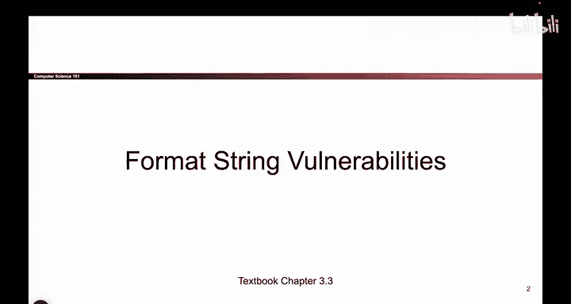
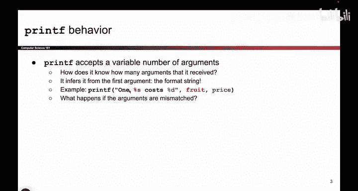

# 040：printf函数的预期行为 🖨️

在本节课中，我们将继续探索内存安全漏洞。我们将研究更复杂的方式，攻击者如何利用乍看之下似乎安全的代码片段，但实际上存在的漏洞来执行他们选择的任意代码。首先，我们将要分析的攻击类型被称为“格式化字符串漏洞”。这类漏洞相当棘手，接下来我将为你详细讲解。

## 格式化字符串漏洞概述

这类漏洞的核心围绕着一个我们经常使用的函数：`printf`。我们用它来打印输出值。你可能已经注意到，在C语言中使用`printf`与其他语言（如Python或Java）不同，它需要一种特殊的语法，即必须添加百分号（`%`）。如果不这样做，编译器就会报错，提示这不是使用`printf`的正确方式。那么，这些百分号究竟意味着什么呢？

## 理解printf格式化符号

这些百分号，我称之为“printf格式化符号”或“百分号格式化符号”。你可以将它们视为用户稍后想要替换的变量的占位符。

例如，在下面的`printf`调用中，第一个参数是字符串 `"one something costs something"`。由于字符串中包含了百分号符号，我告诉C程序，这里有两个占位符，我想打印它们，但在编写这段代码时，我还不知道它们的值。因此，我想打印 `"one something costs something"`，但具体是什么“something”，要等到程序运行时才知道。

那么，这些“something”是什么呢？用户可以通过向`printf`提供额外的参数来指定它们，即指定应该填入这些占位符的内容。

例如，在这个例子中，有两个格式化符号：`%s` 和 `%d`。因此，我将为`printf`提供两个额外的参数。我会说：第一个`%s`，请在运行程序时用变量`fruit`的值替换它；而这个`%d`，请用变量`price`的值替换它。

当C程序执行到这行`printf`代码时，它会打印“ONE ”，然后遇到一个百分号。它会取出第一个参数`fruit`，将其值替换到`%s`的位置并打印出来。接着，它会打印“ COSTS ”。然后，它又遇到一个百分号，并认为：“哦，用户又有一个格式化符号需要替换。”于是，它会查看下一个未使用的参数（第一个参数`fruit`已经用过了），即`price`参数，并将其值替换到`%d`的位置。简而言之，这将打印出变量`fruit`和`price`的当前值。

## printf的可变参数机制

`printf`的一个有趣之处在于，它可以接受可变数量的参数。因为用户可能有一个占位符，也可能有两个、五个、零个，甚至十个。`printf`实际接受多少个参数，取决于用户想要添加多少个占位符。

具体来说，`printf`如何知道它期望多少个参数呢？它会查看第一个参数（即格式字符串）。如果我在第一个参数中看到一个`%s`和一个`%d`，这就告诉我：“好的，我需要两个参数。”然后，我会从栈上取出这两个参数，将它们分别替换到对应的位置。

如果第一个参数（格式字符串）中有五个百分号符号，那就告诉我实际上需要从栈上获取五个参数，并将它们替换到`printf`中的五个格式化符号里。

## 正常工作的printf流程

当一切正常时，`printf`的工作流程如下：用户在第一个参数中指定带有占位符和其他要打印内容的格式化字符串。然后，他们为每一个占位符指定一个额外的参数，所有内容都能很好地匹配。`printf`看到五个百分号符号，就从栈上获取五个参数，一切顺利。

## 总结

本节课中，我们一起学习了`printf`函数的预期行为。我们了解了格式化符号（如`%s`和`%d`）作为占位符的作用，以及`printf`如何通过解析第一个参数（格式字符串）来确定需要从栈上获取多少个额外参数进行替换。这是理解后续格式化字符串漏洞攻击的基础。下一节，我们将探讨当这种预期行为被破坏时，可能产生的安全问题。