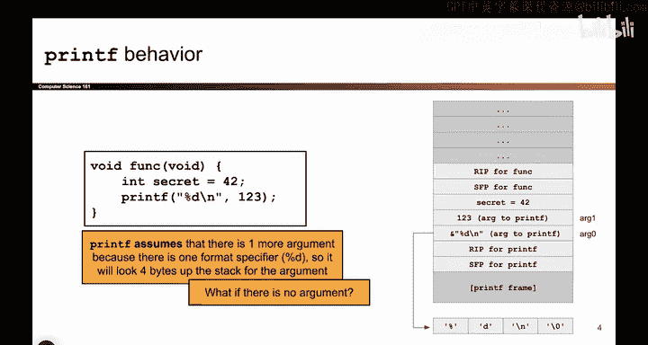
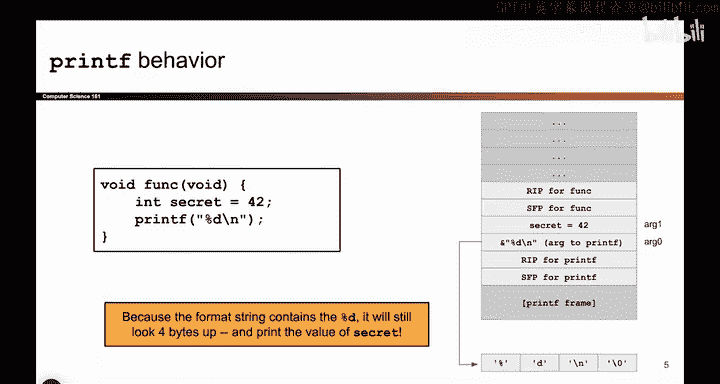

# 041：printf参数不匹配漏洞详解


在本节课中，我们将要学习`printf`函数的一个关键安全问题：当格式化字符串与提供的参数数量不匹配时会发生什么。我们将通过分析栈内存布局来理解攻击者如何利用这种不匹配来读取程序中的敏感数据。

## 正常情况下的`printf`调用

上一节我们介绍了`printf`的基本工作原理，本节中我们来看看一个正常工作的`printf`调用在栈上是如何组织的。

考虑以下函数：
```c
void example() {
    int secret = 42;
    printf("%d\n", 123);
}
```
当这个函数被调用时，栈的布局如下：


*   返回地址（RIP）和栈帧指针（SFP）
*   局部变量`secret`（值为42）
*   调用`printf`时压入的参数：首先是字符串`"%d\n"`的地址，然后是整数`123`

`printf`开始执行后，它会读取格式化字符串`"%d\n"`。当遇到`%d`时，它会到栈上寻找下一个参数（即`123`），并将其替换到输出中。因此，程序会正常输出`123`。

## 参数不匹配的情况

了解了正常情况后，现在我们来看看当`printf`的参数不匹配时会发生什么。



假设我们有以下不正确的`printf`调用：
```c
void vulnerable() {
    int secret = 42;
    printf("%d\n"); // 错误：缺少对应 %d 的参数
}
```
以下是此时栈的布局：

*   返回地址（RIP）和栈帧指针（SFP）
*   局部变量`secret`（值为42）
*   调用`printf`时压入的参数：**仅**有字符串`"%d\n"`的地址


`printf`函数开始执行，它依然会读取格式化字符串`"%d\n"`。当遇到`%d`时，它仍然会尝试到栈上寻找下一个参数来替换。然而，我们并没有为`%d`提供对应的参数。

因此，`printf`会错误地将栈上紧接着格式化字符串地址之后的值（在这个例子中，恰好是局部变量`secret`的值`42`）当作参数读取并打印出来。这导致了敏感信息`secret`的意外泄露。

## 核心要点与总结

本节课中我们一起学习了`printf`参数不匹配漏洞的核心机制。

关键要点如下：

*   `printf`的第一个参数（或称第0个参数）必须是一个包含格式说明符（如`%d`， `%s`）的硬编码字符串。
*   对于格式化字符串中的每一个格式说明符，都必须提供一个对应的额外参数。
*   如果提供的参数数量少于格式说明符的数量，C编译器通常不会报错，但`printf`在运行时仍会尝试从栈上读取“缺失”的参数。
*   这会导致`printf`读取并输出栈上的其他数据，这些数据可能是局部变量、返回地址或其他敏感信息，从而造成信息泄露。



这种参数不匹配是后续我们将要探讨的许多内存攻击技术的核心基础。在下一节视频中，我们将继续深入探索攻击者如何利用这一特性进行更复杂的攻击。