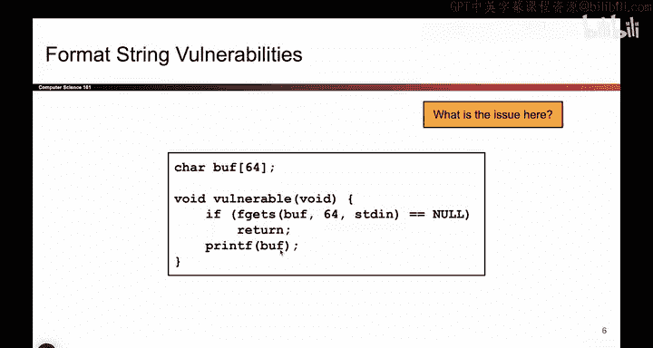

# 042：攻击者控制的printf


在本节课中，我们将学习当攻击者能够控制`printf`函数的格式化字符串参数时，会引发何种安全问题。我们将通过一个具体的例子，理解这种漏洞的原理和潜在危害。

## 回顾：参数不匹配的printf

上一节我们介绍了当向`printf`函数提供不匹配的参数时会发生什么。`printf`函数使用其第一个参数（即格式化字符串）来确定存在多少个格式说明符（即`%`占位符）。对于每一个`%`占位符，`printf`都需要一个额外的参数与之匹配。


如果你提供的参数数量不匹配，例如格式化字符串中有5个`%`符号，但你只提供了3个对应的参数，就会发生奇怪的事情。具体来说，`printf`会继续在栈上寻找参数，即使这些参数并未被提供。这会导致内存中的意外数据被当作参数处理。


在之前的视频中，我们看到了如何利用这一点来打印出预期之外的值。


## 攻击者控制的格式化字符串

一个更普遍的此类攻击场景是类似下面这样的代码：

```c
char buffer[64];
fgets(buffer, 64, stdin);
printf(buffer);
```

这段代码定义了一个字符数组`buffer`，并允许用户输入最多64个字节。这里使用了`fgets`函数，它保证一旦用户写入64字节，就不再读取更多输入。用户被限制在64字节内。


乍一看，这似乎完全没问题。用户只能向大小为64的字符数组写入64字节，他们无法溢出`buffer`的边界。


## 问题所在

那么问题在哪里？

问题在于，我们观察这个`printf`函数调用：`printf(buffer);`。它接收`buffer`作为其第一个输入，而这个输入我们允许用户写入。请记住，第一个输入至关重要，因为它决定了`printf`应该期待多少个额外的参数。

当参数数量不匹配时，坏事就会发生。所以这里的问题是，我们允许用户（在这里可能是攻击者）控制`printf`那个关键的第一个输入。

如果攻击者能够控制这个输入，他们实际上可以输入一些`%`格式说明符。如果攻击者输入了格式说明符，`printf`就会尝试将它们与不存在的参数匹配，从而导致坏事发生。

因此，核心问题是我们将`printf`关键的第一个输入的控制权交给了攻击者。


## 总结




本节课中我们一起学习了“攻击者控制的`printf`”漏洞。我们了解到，即使代码通过`fgets`等函数限制了输入长度以防止缓冲区溢出，但如果将用户输入直接作为`printf`的格式化字符串参数，攻击者仍可通过注入`%`格式说明符，迫使程序从栈上读取未提供的参数，从而可能泄露内存中的敏感信息或导致程序崩溃。这强调了永远不要将不可信的用户输入直接用作`printf`格式化字符串的重要性。