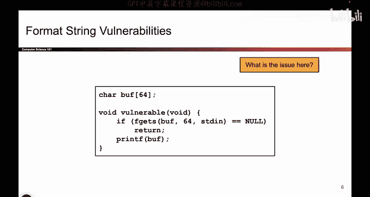
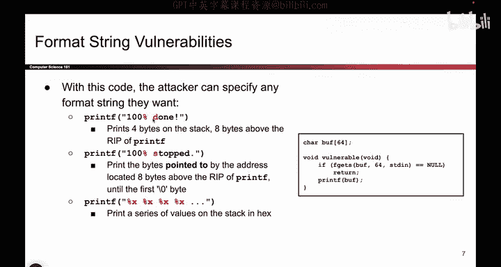

# 043：格式化字符串漏洞详解

在本节课中，我们将要学习C语言中`printf`函数的格式化字符串漏洞。攻击者如果能够控制`printf`的第一个参数（即格式化字符串），就可以利用`%`格式化符号来读取栈上的数据，甚至可能泄露敏感信息。我们将详细解释不同格式化符号的含义及其在漏洞利用中的行为。

## 攻击者如何利用格式化字符串

上一节我们介绍了`printf`函数的工作原理，本节中我们来看看如果攻击者能够控制`printf`的第一个格式化字符串参数，他们能做什么。

攻击者可以输入任何字符串，特别是包含`%`格式化符号的字符串。例如，攻击者可能输入一个包含`%d`的字符串。`printf`函数看到`%`符号后，会尝试从栈上获取一个额外的参数来匹配这个格式化符号。然而，如果程序没有提供额外的参数，这个`%d`就会匹配到栈上的其他未知值。

同样，如果用户输入包含`%s`，问题会更严重。`printf`会尝试从栈上读取一个地址，并将其解释为字符串的起始地址，然后打印出该地址指向的内存内容，直到遇到空字符为止。

攻击者甚至可以输入多个连续的格式化符号，例如`%x%x%x%x`。对于每一个`%`格式化符号，`printf`函数都会从栈上读取并打印出相应的值。这些值本应是函数参数，但实际上可能是栈上的其他数据。

以下是攻击者可能输入的恶意数据示例：
*   `%d`：尝试将栈上的值作为整数打印。
*   `%s`：尝试将栈上的值解释为地址，并打印该地址处的字符串。
*   `%x%x%x%x`：连续将栈上的多个值以十六进制形式打印出来。

所有这些方式都利用了`printf`函数参数不匹配的特性，可能导致数据泄露或其他不良后果。

## 格式化符号详解

前面我们提到了`%d`、`%s`等符号，现在我们来详细看看这些符号的具体含义。

`%`符号后面的字母指明了你想要打印的变量或值的类型。

*   **`%d`**：用于打印整数。当`printf`看到`%d`时，它会从栈上读取4个字节（假设是32位系统），并将这些字节解释为一个整数进行打印。代码示例：`printf(“%d”)`。如果未提供对应的整数参数，`printf`会读取栈上的其他数据并当作整数输出。
*   **`%s`**：用于打印字符串。在C语言中，字符串以字符数组起始地址的形式存储。当`printf`看到`%s`时，它会从栈上读取4个字节，将其解释为一个内存地址，然后跳转到该地址，开始打印字符，直到遇到空终止符（`\0`）为止。公式描述：`%s` → 读取地址 → 解引用 → 打印字符直到 `\0`。
*   **`%x`**：用于以十六进制形式打印值。当`printf`看到`%x`时，它会从栈上读取4个字节，并将其以十六进制格式打印出来。

这张图试图说明的核心概念是：`%`符号后的字母决定了`printf`要匹配的值的类型，并根据类型采取不同的操作。例如，`%s`会进行解引用操作（访问指针指向的内存），而`%d`则不会，它直接打印读取到的整数值。

本节课中我们一起学习了`printf`函数的格式化字符串漏洞。我们了解到，攻击者通过控制格式化字符串，可以迫使`printf`读取并打印栈上的额外数据，利用`%d`、`%s`、`%x`等格式化符号可能泄露内存中的敏感信息。理解这些符号的含义是识别和防范此类漏洞的基础。