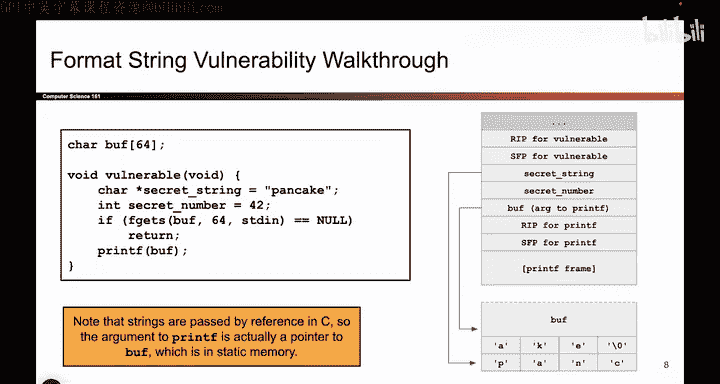
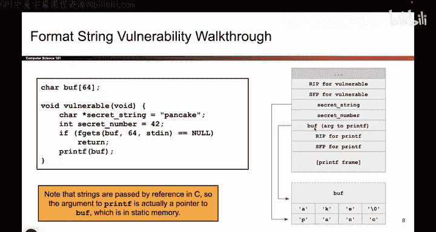

# 044：基本printf漏洞 - 环境搭建 🛠️


在本节课中，我们将学习一个具体的例子，展示当攻击者能够控制`printf`函数的第一个参数（格式化字符串）时，如何利用这个漏洞泄露内存中的秘密值。我们将从程序的内存布局开始，逐步分析漏洞的成因。

## 概述

上一节我们介绍了`printf`函数的工作原理以及控制其格式化字符串参数的危险性。本节中，我们将通过一个具体的代码示例，搭建一个存在漏洞的环境，并分析其栈内存布局，为后续的漏洞利用演示做好准备。

## 程序结构与内存布局

我们有一个定义在函数外部的缓冲区`buff`，它位于内存的静态区域。此外，我们有一个名为`vulnerable`的函数。

```c
char buff[64]; // 定义在函数外部的缓冲区




void vulnerable() {
    char* secret_string = "PANCAKE";
    int secret_number = 42;
    // ... 用户输入操作 ...
    printf(buff); // 漏洞点
}
```


记住，每当调用一个函数时，系统会为其开辟一个新的栈帧。首先被压入栈的是函数的返回地址（RP，即保存的EIP寄存器值）和保存的帧指针（SFP，即保存的EBP寄存器值）。


## 局部变量在栈上的表示


在`vulnerable`函数中，我们有两个局部变量：
1.  `secret_string`：这是一个`char*`类型的指针，指向字符串"PANCAKE"。
2.  `secret_number`：这是一个`int`类型的变量，值为42。

以下是关于字符串变量在栈上存储方式的关键点：
*   字符串本身（字符序列"P A N C A K E"以及结尾的`\0`）并不直接存放在栈上。
*   存放在栈上的`secret_string`变量，实际上是一个**内存地址**。这个地址指向存储字符串"PANCAKE"的真实位置。
*   因此，栈上的布局是：先保存`secret_string`这个指针（一个地址值），然后保存`secret_number`这个整数值42。

## 用户输入与漏洞触发


程序接下来允许用户（或攻击者）向`buff`缓冲区写入最多64个字节的任意数据。然后，程序会以`buff`作为第一个参数调用`printf`函数。


```c
// 模拟用户输入操作，例如使用 gets(buff) 或 scanf
// 然后调用 printf
printf(buff); // 攻击者可以控制buff的内容
```

## 调用printf时的栈状态

现在，让我们分析调用`printf(buff)`时栈的具体状态。回想函数调用的步骤，第一步是将参数压栈。

1.  `printf`在这里只有一个参数，即`buff`。
2.  在C语言中，数组名作为参数传递时，传递的是其地址（指针）。因此，压入栈中的是`buff`的地址。
3.  接着，执行`call printf`指令，`printf`函数开始执行，并建立自己的栈帧（包含其RP、SFP和局部变量）。

此时，栈的布局（从高地址到低地址）大致如下所示，这是`printf`函数正在执行时的视角：

```
| ... (更高地址) ... |
|--------------------|
| printf的局部变量    | <-- printf的栈帧
|--------------------|
| printf的SFP        |
|--------------------|
| printf的RP         | <-- 指向调用printf后的下一条指令
|--------------------|
| 参数：buff的地址    | <-- printf格式化字符串参数的位置
|--------------------|
| secret_number (42) | <-- vulnerable函数的局部变量
|--------------------|
| secret_string (地址)| <-- vulnerable函数的局部变量（指针）
|--------------------|
| vulnerable的SFP     |
|--------------------|
| vulnerable的RP      |
|--------------------|
| ... (更低地址) ...  |
```


**关键点**：`printf`函数期望其第一个参数（格式化字符串）之后的内存位置（即栈上的更高地址处）对应着格式说明符（如`%s`， `%x`， `%n`）所需要的参数。然而，在本例中，我们只传递了一个参数（`buff`的地址）。当`printf`解析`buff`中的内容时，它会将栈上“下一个”位置（即`secret_number`所在的位置）的数据当作第一个格式说明符的参数，将再下一个位置（即`secret_string`所在的位置）当作第二个格式说明符的参数，依此类推。


## 总结




本节课中，我们一起学习了存在`printf`格式化字符串漏洞的程序环境搭建。我们分析了程序的栈内存布局，明确了当攻击者控制`printf`的格式化字符串后，函数会如何错误地将栈上相邻的、本不应被访问的数据（如`secret_number`和`secret_string`的地址）当作参数来解析。这为下一节演示如何利用`%x`、`%s`等格式符泄露这些秘密值奠定了理论基础。