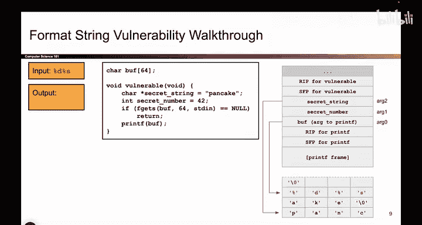
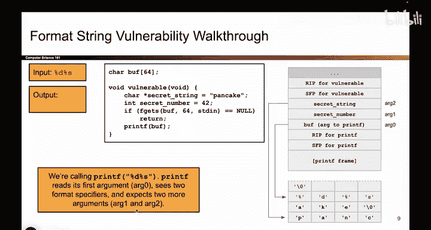
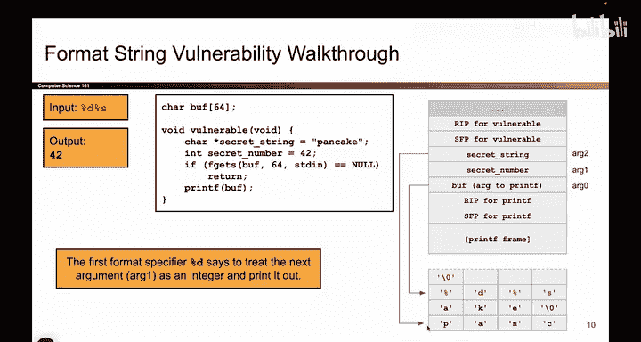
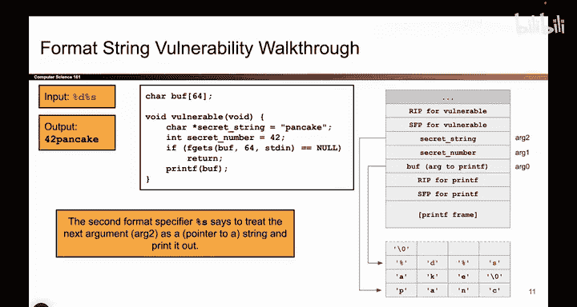

# 045：基础printf漏洞利用

## 概述
在本节课中，我们将学习一个基础的`printf`函数漏洞利用案例。我们将看到当攻击者能够控制传递给`printf`的格式字符串时，如何利用参数不匹配来泄露程序中的秘密数据。

## 漏洞原理分析

上一节我们介绍了`printf`函数的工作原理，本节中我们来看看当攻击者能够控制格式字符串时会发生什么。

攻击者可以控制我们放入缓冲区的内容。假设攻击者写入了一些百分号格式说明符。

攻击者写入了`%d %s`。这些是百分号格式说明符。

现在，当我们对包含`%d %s`的缓冲区调用`printf`时，将会出现参数不匹配，并开始发生不好的事情。

让我们思考一下，当`printf`读取攻击者提供的这个输入时，它内部是如何处理的。

`printf`函数逐个字符地读取，每当它看到一个百分号符号，它就会到栈上获取下一个参数，并将该参数插入到百分号格式说明符中。这就是`printf`的工作方式。

我们开始读取，立即看到一个百分号`%d`。`%d`表示十进制整数。因此，我应该到栈上，获取下一个参数，将其与`%d`匹配，并打印出该值，因为`%d`实际上是该参数的占位符。

这里是`%d`。我访问栈，获取下一个参数。下一个参数是什么？

第0个参数是`buff`，它在这里。如果第0个参数是`buff`，那么下一个参数必须在它上面4个字节处。

请记住，这就是我们将参数压入栈的方式：按相反顺序一个一个地压入。

如果`buff`是第0个参数并且在这里，那么`arg1`，即下一个参数，必须在这里。问题是我们实际上从未压入这个参数。

所以，谁知道这里是什么？这里碰巧是`secret_number`。因此，`printf`认为这是传递给它的一个参数，但`vulnerable`函数实际上并没有向`printf`传递任何额外的参数。

这里存在不匹配。`printf`并不知道这个不匹配，它访问栈并认为“嗯，这看起来像是`arg1`。如果它存在，就应该在这里。它实际上并不存在，但如果存在，`printf`就会到这里来寻找它。”

总而言之，我们访问栈，获取下一个未使用的参数，即第0个参数上方4个字节处，而它碰巧就是`secret_number`。因此，我将把`secret_number`作为整数打印出来，以匹配`%d`。

所以，我们不是打印出`%d`，而是打印出`42`，因为这恰好是与`%d`匹配的参数。

`printf`期望还有两个参数，但实际上并没有。尽管如此，我们仍会去寻找这些参数，并可能发现一些要泄露的秘密值。所以，`42`被打印出来。

## 泄露字符串数据

接下来会发生什么？`printf`继续逐个字符地读取这个输入，它立即看到另一个百分号。

我看到`%s`，`s`代表字符串。这意味着我必须访问栈，获取下一个未使用的参数，并将其插入到`%s`占位符中。

到目前为止我使用了什么？我已经用`%d`使用了这个`arg1`。

那么下一个尚未使用的参数，必须在它上面4个字节处，必须就在这里，我将其标记为`arg2`。

因此，这个`secret_string`值应该被替换到`%s`中。`s`表示字符串，而字符串是指向字符数组开头的指针。

所以我将其读取为一个地址。我前往那个地址，并开始打印字符，直到看到空字符为止。

我打印出`P`、`A`、`C`、`A`、`K`、`E`。我看到了空字符，然后结束。所以总的来说，`%d %s`导致我打印出`42 pancake`。

我的两个秘密值都被泄露了，因为攻击者提供了一个`%d`，它匹配到了`secret_number`，以及一个`%s`，它匹配到了`secret_string`。

本来不应该有这些参数给`printf`，但`printf`不知道这一点，仍然将它们视为参数。

## 总结
本节课中我们一起学习了如何利用`printf`函数的格式字符串漏洞。当攻击者能够控制格式字符串并包含额外的格式说明符（如`%d`、`%s`）时，`printf`会盲目地从栈上读取本不属于它的数据，并将其作为参数处理，从而导致敏感信息泄露。这个案例清晰地展示了不匹配的参数如何被利用来访问内存中的秘密值。