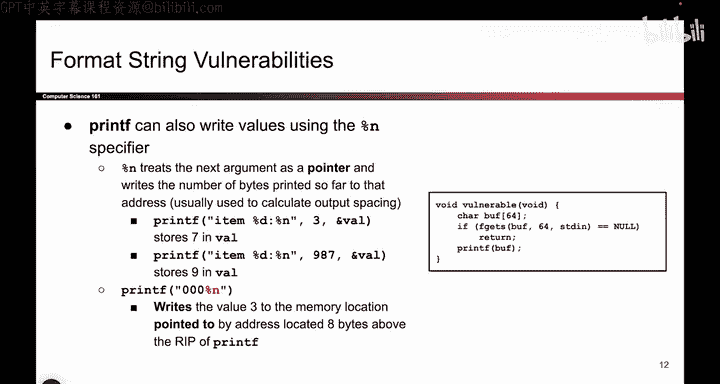
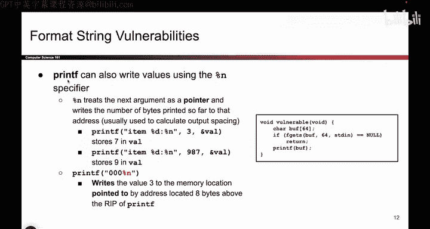
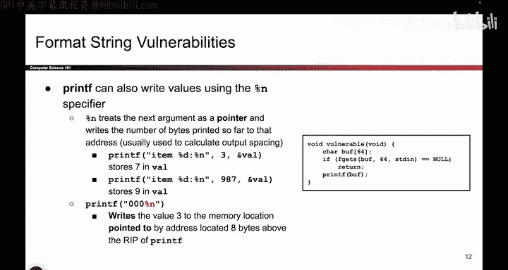
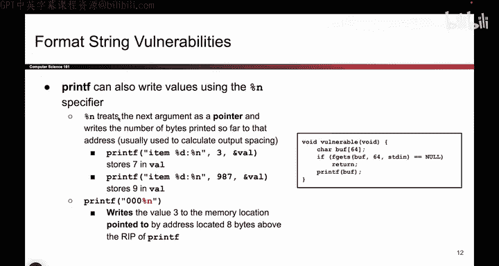
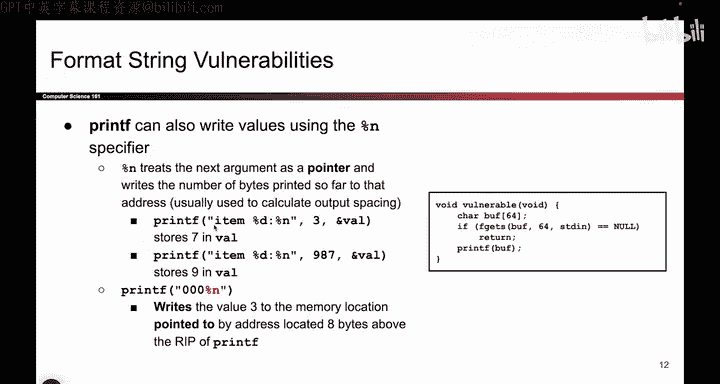
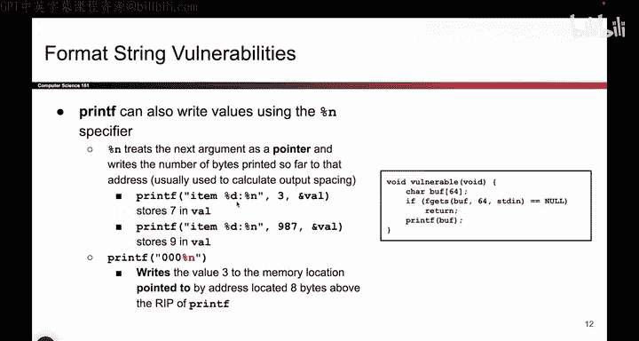
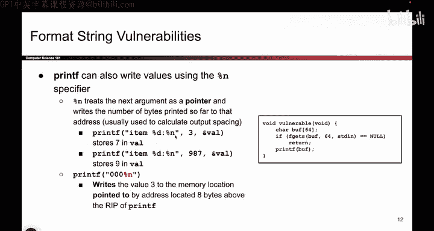
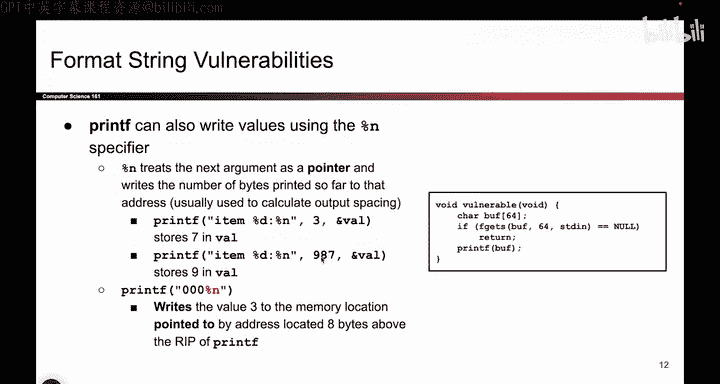
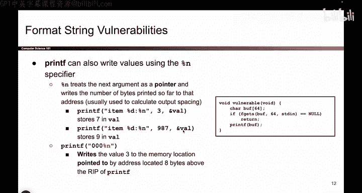

# 046：%n 格式化符 🖋️



在本节课中，我们将要学习 `printf` 函数中一个特殊且危险的格式化符：`%n`。我们将了解它的工作原理，以及攻击者如何利用它向内存中写入数据，从而可能控制程序的行为。

## 概述









之前我们已经看到，如果提供给 `printf` 的格式化符数量与参数不匹配，`printf` 会从栈上读取本不应被读取的数据，导致信息泄露。然而，`printf` 的功能远不止于此。`%n` 格式化符赋予了 `printf` 向内存**写入**数据的能力，这比单纯读取数据要危险得多。


## `%n` 格式化符的工作原理

`%n` 是一个特殊的格式化符。与 `%d` 或 `%s` 类似，它会从栈上获取下一个参数。但它不是读取该参数的值来输出，而是**将该参数解释为一个内存地址**。

它的行为可以概括为以下步骤：
1.  `printf` 计算到目前为止已经输出到屏幕的字符总数。
2.  遇到 `%n` 时，它从栈上获取下一个参数。
3.  它将这个参数的值视为一个地址（指针）。
4.  **它将步骤1中计算的字符总数，写入到这个地址指向的内存位置。**


用伪代码描述其核心行为：
```c
int bytes_printed_so_far = ...; // 已输出的字节数
int *address = (int*)next_argument_on_stack; // 将栈上的下一个参数解释为地址
*address = bytes_printed_so_far; // 将字节数写入该地址
```
这非常奇怪，因为 `printf` 本应是一个输出函数，但它却执行了写入内存的操作。据我所知，设计 `%n` 的本意可能是为了帮助格式化输出（例如对齐表格），但除了攻击者，几乎没人会使用它。


## `%n` 的正确用法示例

为了更好地理解，我们先看一个 `%n` 在参数匹配情况下的正常使用例子。







假设有以下代码：
```c
int val;
printf("Item %d: %n", 3, &val);
```
以下是 `printf` 的执行过程：
1.  输出字符串 `"Item "`。
2.  遇到 `%d`，用参数 `3` 替换，输出 `"3"`。目前输出了 `"Item 3"`，共6个字符。
3.  输出冒号 `:`。目前总共输出了 `"Item 3:"`，共7个字符。
4.  遇到 `%n`。它从栈上获取下一个参数 `&val`（变量 `val` 的地址）。
5.  它将到目前为止输出的字符总数（7）写入到 `val` 变量中。

执行后，变量 `val` 的值变为 7。

再看另一个例子：
```c
int val;
printf("Item %d: %n", 987, &val);
```
执行过程：
1.  输出 `"Item "`。
2.  输出 `"987"`。
3.  输出 `:`。
4.  此时已输出字符为：`"Item 987:"`，共9个字符。
5.  `%n` 将数字 9 写入 `val`。




所以，`%n` 在参数正确时，会将已输出的字符数写入指定的变量。


## 结合参数不匹配的漏洞




上一节我们介绍了 `%n` 在正常情况下的行为。本节中我们来看看，如果将 `%n` 与我们之前学过的“参数不匹配”问题结合起来，会发生什么更危险的事情。




当格式化符数量多于实际参数时，`printf` 会继续从栈上读取数据，并将它们当作参数。如果其中包含 `%n`，`printf` 就会把栈上的某些数据**当作地址**，并向该地址写入数据。

考虑以下危险的调用：
```c
printf("000%n");
```
这里，格式化字符串包含三个 `0` 和一个 `%n`，但没有提供任何额外参数。`printf` 会这样执行：
1.  输出三个字符 `"000"`。
2.  遇到 `%n`。由于没有提供对应参数，它会从栈上读取**本应是下一个参数的位置**的数据。
3.  它将这4个字节的数据**解释为一个地址**。
4.  它将到目前为止输出的字符数（3）**写入到这个未知的地址指向的内存中**。

这极其危险。攻击者可以通过精心构造输入的字符串，控制输出的字符数，从而控制写入的值（比如通过增加更多字符来写入更大的数字）。更重要的是，他们可以尝试让栈上的特定数据被解释为目标地址（例如某个函数的返回地址或关键变量），从而实现**任意内存写入**。


## 总结


本节课中我们一起学习了 `printf` 的 `%n` 格式化符。
*   `%n` 使 `printf` 具备了向内存写入数据的能力，它会将已输出的字符数写入到由栈上参数指定的地址。
*   在正常使用时，这是一个生僻的功能。
*   当与参数不匹配的漏洞结合时，攻击者可以诱使程序将数据写入到非预期的内存位置，这为更复杂的攻击（如修改程序控制流）打开了大门。


理解 `%n` 是理解格式化字符串漏洞攻击的关键一步，因为它将漏洞从“信息泄露”升级到了“内存篡改”。