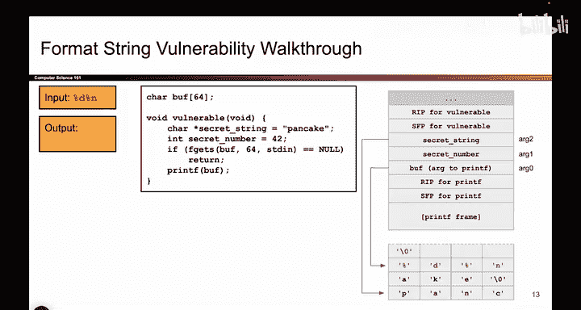
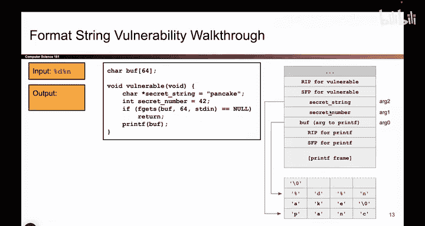
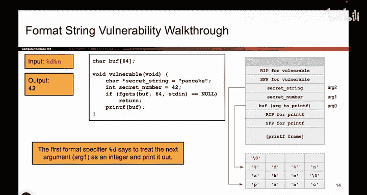

# 047：利用%n的基本printf漏洞



在本节课中，我们将学习如何利用`printf`函数中的`%n`格式说明符，实现从内存读取数据到向内存写入数据的转变。我们将通过一个具体的代码示例，详细解析攻击者如何控制程序向任意内存地址写入数据。

上一节我们介绍了利用`%d`和`%s`进行内存读取的原理，本节中我们来看看如何利用`%n`进行内存写入。

## 漏洞代码环境

我们使用与之前相同的代码环境。核心部分如下：

```c
char buff[64];
// 攻击者可以控制buff的内容
printf(buff); // 关键调用
```





我们定义了一个64字节的缓冲区`buff`，并允许攻击者向其写入任意内容。随后，程序使用用户控制的`buff`作为格式化字符串参数调用`printf`函数。

## `%n`格式说明符的作用

与读取数据的`%d`或`%s`不同，`%n`是一个用于**写入**的格式说明符。它的功能是：将到当前位置为止，`printf`已经成功打印输出的**字符总数**，写入到一个由参数指定的内存地址中。

以下是`printf`处理`%d%n`这类格式化字符串的详细步骤。

### 第一步：处理`%d` - 读取并打印

`printf`首先解析格式化字符串。当遇到第一个格式说明符`%d`时，它会执行以下操作：
1.  到调用栈上寻找下一个未使用的参数。
2.  将该参数的值（例如`42`）视为一个整数。
3.  将这个整数（`42`）以十进制形式打印输出。




此时，输出为“42”，共计打印了**2个字符**。`printf`内部会记录这个计数。

### 第二步：处理`%n` - 计算并写入

紧接着，`printf`遇到了`%n`格式说明符。此时，它将执行写入操作：
1.  **确定写入地址**：`printf`再次到调用栈上寻找下一个未使用的参数。这个参数必须是一个**指针**（即内存地址）。在我们的例子中，这个参数是`secret_string`的地址。
2.  **确定写入内容**：`printf`计算从开始输出到`%n`之前已经打印的字符总数。根据第一步，这个数字是**2**。
3.  **执行写入**：`printf`跟随在栈上找到的指针，找到对应的内存位置，然后将数字**2**写入该地址。

这个过程可以用以下伪代码描述：
```
写入地址 = 从栈上获取的下一个参数（作为指针）
*写入地址 = 已打印的字符数（例如 2）
```

## 攻击效果演示


因此，当攻击者提供`%d%n`作为输入时，整个攻击流程会产生两个效果：
1.  打印出栈上的一个秘密数值（例如`42`）。
2.  将数字`2`写入到由栈上另一个参数（`secret_string`）所指向的内存位置，从而修改了该处的数据。


本节课中我们一起学习了`printf`函数中`%n`格式说明符的基本利用方法。我们了解到，攻击者可以通过精心构造的格式化字符串，不仅读取栈上的数据，还能将数据（已打印字符数）写入到由栈上参数指定的任意内存地址中。这为更复杂的攻击（如修改函数返回地址、劫持程序流程）奠定了基础。