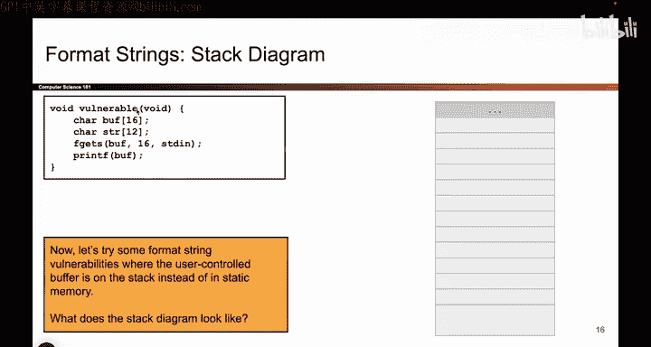
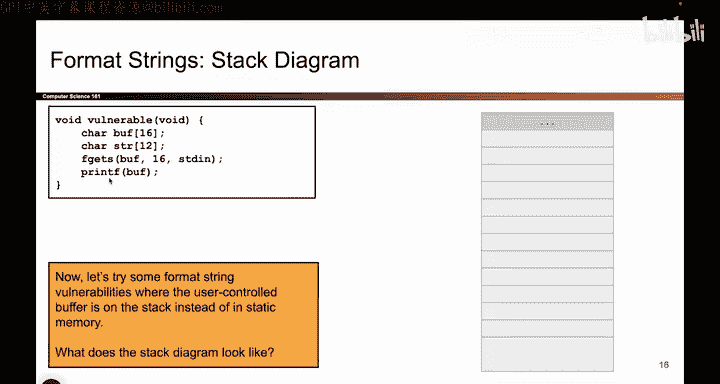
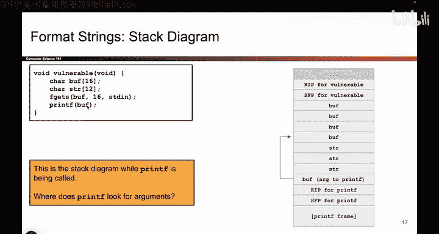
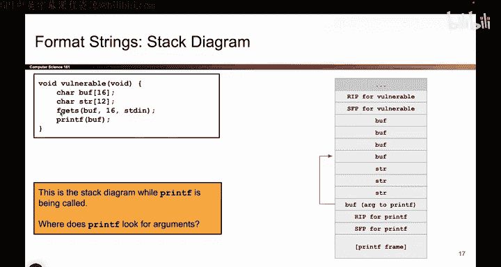
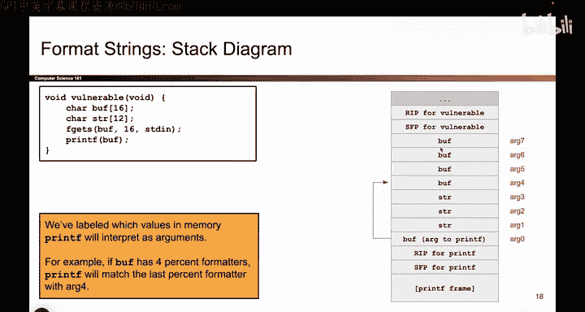
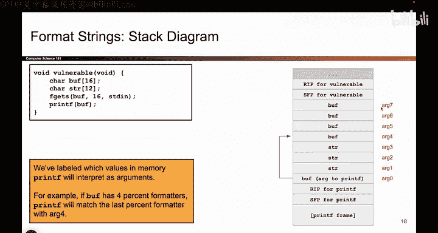

# 048：更复杂的printf漏洞 - 环境搭建 🛠️

在本节课中，我们将学习一个更复杂的 `printf` 格式化字符串漏洞的利用场景。与之前不同，这次我们将缓冲区放置在栈上，而非内存的静态区域，以展示更复杂的攻击可能性。

## 栈布局分析 📊

上一节我们介绍了基本的 `printf` 漏洞原理，本节中我们来看看当缓冲区位于栈上时，内存布局会发生什么变化。

首先，当函数 `vulnerable` 被调用时，会创建一个新的栈帧。栈帧中必须包含以下内容：
*   返回地址
*   保存的帧指针
*   局部变量 `buff` 和 `string`

以下是栈帧的构成示意图：

## 函数调用顺序 🔄

接着，代码会调用 `printf` 函数。`printf` 会建立自己的栈帧。我们传递给 `printf` 的参数是 `buff`。在C语言中，字符数组作为参数传递时，传递的是指向该数组的指针。因此，我们传递的是 `buff` 的地址。

`printf` 的栈帧包含其返回地址和保存的帧指针。一个常见的疑问是：`fgets` 的栈帧在哪里？代码是按行执行的。我们先执行 `fgets`，它运行时会创建自己的栈帧。但当 `fgets` 返回后，它的栈帧就被完全清除了。然后我们才执行下一行代码，调用 `printf` 并创建其栈帧。所以，在 `printf` 被调用时，`fgets` 的栈帧已经不存在了。

以下是 `printf` 被调用时的栈状态示意图：

## printf的参数匹配机制 🎯

现在，程序执行到 `printf` 内部。`printf` 会解析 `buff` 中的内容。如果 `buff` 中包含任何格式化占位符（如 `%s`, `%x`），`printf` 就需要为它们匹配对应的参数。

`printf` 会从栈上寻找这些参数。具体来说，它会按照以下顺序进行匹配，为了方便理解，我们为栈上的位置进行了编号：

匹配规则如下：
*   第0个参数（即包含所有占位符的格式字符串）位于 `buff` 所指的位置。
*   如果格式字符串中有第一个 `%` 占位符，`printf` 会尝试与栈上的这个位置匹配。
*   第二个 `%` 占位符会与这个位置匹配。
*   第三个 `%` 占位符会与这个位置匹配。
*   第四个 `%` 占位符会与这个位置匹配，依此类推。

关键点在于：`printf` 认为栈上的这些位置存放着它的参数，但实际上这些位置可能原本存放的是其他数据（如返回地址、局部变量等），而并非传递给 `printf` 的真正参数。

下图清晰地标出了 `printf` 寻找参数的各个位置：

## 总结 📝

本节课中我们一起学习了栈上 `printf` 格式化字符串漏洞的环境搭建与分析。核心在于理解当攻击者控制 `printf` 的格式字符串参数，并且该字符串位于栈上时，`printf` 会错误地将栈上原有的数据（如返回地址、局部变量）当作其可变参数来读取。这为后续更复杂的攻击（如读取内存、写入内存）奠定了基础。下一节我们将探讨如何利用这一机制。