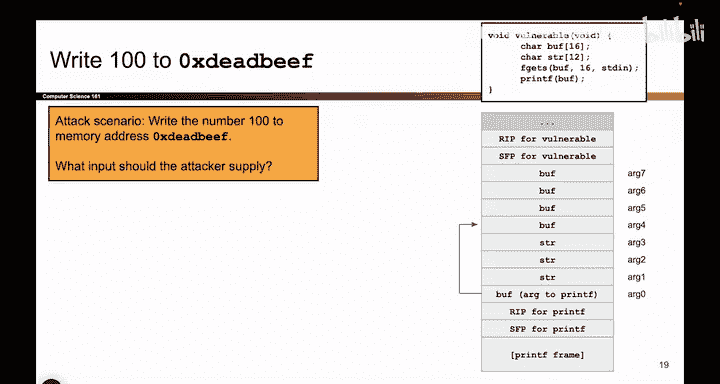

# 049：更复杂的printf漏洞利用 - 目标设定 🎯

在本节课中，我们将学习如何利用`printf`函数的格式化字符串漏洞，实现一个更复杂的目标：将任意数值写入任意内存地址。我们将以写入数值`100`到地址`0xdeadbeef`为例，讲解攻击的构思过程。

## 攻击目标设定

上一节我们介绍了`printf`漏洞的基本原理。本节中，我们来看看如何设定一个具体的攻击目标。

我们的目标是：利用`printf`函数的格式化字符串漏洞，将数值`100`写入内存地址`0xdeadbeef`。

这个目标比单纯打印出秘密值要复杂一些。你可以选择写入其他数值和目标地址，例如写入shellcode的地址，或者写入RIP寄存器的地址。但核心攻击方法是通用的。我们选择`100`和`0xdeadbeef`作为示例，你可以将其替换为你需要的任意值和地址。

以下是本次攻击的代码环境设定：
*   我们有一段存在漏洞的代码。
*   在执行`printf`时，我们绘制了其栈布局图。
*   `printf`函数会跟踪栈上的参数。当它遇到一个格式化占位符（如`%s`， `%x`）时，会将其与栈上**下一个未使用的参数**匹配，并打印该值或向该地址写入数据。
*   我们作为攻击者的总体目标，是向`Buff`中提供特定的输入，使得`printf`最终将数值`100`写入地址`0xdeadbeef`。

## 攻击原理与挑战

在设定好目标后，我们现在开始思考如何将`100`写入`0xdeadbeef`。

我们已经知道，攻击中必然包含`%n`，因为`%n`是让我们能够向内存写入数据的关键。但此时事情开始变得棘手，因为要让这次攻击成功，许多条件必须同时满足。

我将这种攻击比作杂耍。在杂耍中，你必须让所有球同时保持在空中；在漏洞利用中，你必须将所有要素放置在正确的位置。有时，让它们同时就位是非常困难的。

在构造漏洞利用时，经常发生这样的情况：你修正了一个问题，却破坏了另一个问题。你去修复那个新问题，又破坏了另外两个。这个过程可能需要一些试错。经过多次的“破坏”与“修复”，最终所有要素必须以一种非常特定的方式排列整齐，目标值才能被写入目标地址。

这就是我们接下来要看到的内容：我们将尝试让`printf`将所有要素排列在正确的位置。

## 需要同时满足的两个条件

我们已经知道攻击中需要`%n`，因为`%n`是写入内存的方式。当`%n`出现时，请记住，`printf`会逐字符读取第零个参数（格式化字符串）。每当它看到一个`%`，就会用相应的操作（如打印或写入内存）来替换它。

当`printf`逐字符扫描并遇到`%n`时，**两件事必须同时为真**。这就是“杂耍”的难点所在：你可能满足了其中一个条件，却破坏了另一个；当你修复它时，可能又破坏了第一个。但我们需要两者同时成立。

以下是必须同时满足的两个核心条件：

1.  **控制写入地址**：当`%n`出现在`printf`的输出中时，栈上的**下一个未使用的参数**必须是目标地址`0xdeadbeef`。
    *   **原理**：`printf`看到`%n`，它会到栈上取出下一个未使用的参数，将其**用作一个地址**，然后前往该地址写入数据。
    *   **要求**：因此，当`%n`出现时，无论下一个未使用的参数是`arg4`、`arg6`还是`arg7`，我们都必须确保值`0xdeadbeef`恰好位于那个内存位置。这样`%n`看到`0xdeadbeef`，就会尝试向该地址写入。
    *   **后果**：如果搞错了这一点，`printf`可能仍然会写入`100`，但会写入错误的位置。

2.  **控制写入数值**：到目前为止已打印的字节数必须恰好是`100`。
    *   **原理**：`printf`如何知道要写入什么值？它会计算**到目前为止已打印的字节数**。
    *   **要求**：因此，第二个必须同时满足的条件是：当执行到`%n`时，已打印的字节数必须正好是`100`。这样`printf`会认为“我已经打印了100个字节，很好”，然后前往`0xdeadbeef`并写入数字`100`。
    *   **难点**：正是这一点使得漏洞利用如此棘手。

所以，我们必须同时“杂耍”好这两个事实：我需要已打印100个字节，并且当`printf`看到`%n`时，栈上无论哪个位置的下一个未用参数，其内容恰好是值`0xdeadbeef`。所有这些都必须通过我们输入到`Buff`的`printf`格式化字符串来实现。这就是必须发生的“杂耍”。接下来，我们将实现它。

## 总结

本节课中，我们一起学习了如何为一次复杂的`printf`格式化字符串攻击设定具体目标：将指定值（100）写入指定地址（0xdeadbeef）。我们分析了攻击的核心在于同时满足两个条件：1) 控制`%n`读取的栈参数为目标地址；2) 控制`%n`执行时已打印的字节数为目标值。这个过程就像杂耍，需要精心构造输入字符串，让所有要素在正确的时间点对齐。在接下来的课程中，我们将具体实施这个构造过程。