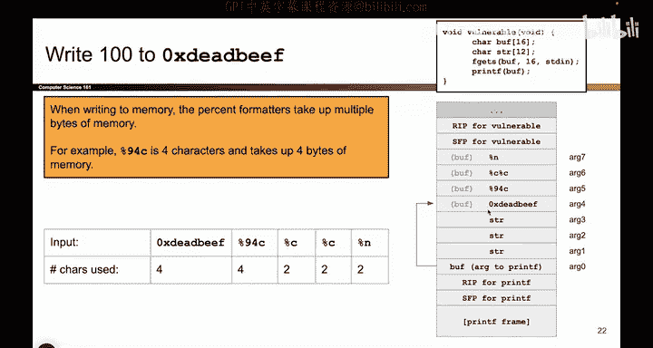
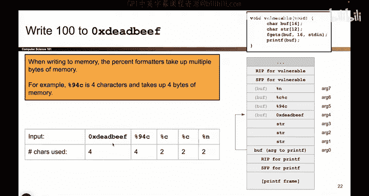
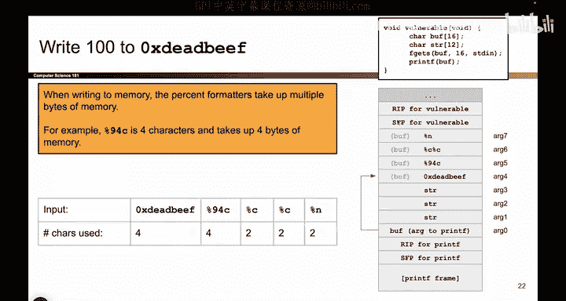

# 050：更复杂的printf漏洞 - 控制写入位置 🎯

在本节课中，我们将学习如何利用`printf`函数的格式化字符串漏洞，精确控制程序向内存中的哪个地址写入数据。我们将通过一个具体的攻击示例，分解其工作原理，并理解攻击者如何通过精心构造的输入来达成目标。

## 概述

攻击的核心在于，攻击者只能通过`fgets`函数向一个名为`buff`的缓冲区写入16字节的数据。然而，通过巧妙构造这些数据，并利用后续`printf`函数处理格式化字符串的方式，攻击者可以控制程序向任意内存地址（例如`0xdeadbeef`）写入一个特定的值（例如100）。

## 攻击载荷分析

以下是攻击者构造并写入`buff`的完整载荷：
```
\xef\xbe\xad\xde%94c%c%c%n
```

让我们逐步分析这个载荷在内存中的布局以及`printf`如何处理它。


### 第一步：数据写入内存




首先，`fgets`函数将用户输入的原样写入`buff`缓冲区。此时，`printf`尚未执行，所有数据都只是普通的字节序列。


以下是数据在内存中的布局示意图：




*   **`0xdeadbeef`**：这是4个字节的目标地址。它被写入`buff`的开头。
*   **`%94c`**：这是4个字符：`%`、`9`、`4`、`c`。它们被顺序写入内存。
*   **`%c`**：2个字符。
*   **`%c`**：另一个2字符的`%c`。
*   **`%n`**：2个字符，作为载荷的结尾。


至此，`fgets`的任务完成。它只是简单地将字符序列复制到了栈上的`buff`中。


### 第二步：printf解析与执行





现在，程序调用`printf(buff)`。`printf`开始将`buff`的内容作为格式化字符串进行解析。它会逐个字符读取，当遇到`%`符号时，会将其视为一个格式化占位符，并从栈上按顺序取出一个参数与之匹配。

以下是`printf`解析过程的示意图：


1.  `printf`从`buff`起始处开始读取。
2.  它依次读取并输出字节 `0xef`， `0xbe`， `0xad`， `0xde`。因为它们都不是`%`，所以被当作普通字符打印。
3.  接着，它遇到了第一个`%`（属于`%94c`）。`printf`知道这是一个格式化指令。它需要从栈上找一个“朋友”（即参数）来匹配这个占位符。这个`%94c`与栈上的第一个未使用参数（`arg1`）配对。
4.  `printf`继续解析，遇到第二个`%`（第一个`%c`）。这个`%c`与栈上的下一个未使用参数（`arg2`）配对。
5.  同理，第三个`%`（第二个`%c`）与`arg3`配对。
6.  最后，它遇到第四个`%`（`%n`）。这个`%n`与栈上的下一个未使用参数（`arg4`）配对。

**关键点在于**：通过精心构造输入字符串中`%`格式化符的数量，我们让`%n`成功匹配到了`arg4`的位置。而在我们的内存布局中，`arg4`这个位置存放的正是我们之前写入的地址 `0xdeadbeef`。

这个过程需要反复试验和调整（例如增减`%c`的数量），以确保`%n`能对准目标地址。

### 第三步：完成攻击

当`%n`格式化符与存放着`0xdeadbeef`的栈位置配对后，`printf`会执行`%n`的功能：**将截至目前已输出的字符总数，写入`%n`对应的参数所指向的地址**。

在这个例子中：
*   `%n`对应的参数值是`0xdeadbeef`。
*   在遇到`%n`之前，`printf`已经输出了：
    *   4个地址字节（`0xefbeadde`）
    *   `%94c`会输出94个字符（填充空格）
    *   两个`%c`各输出1个字符（其对应的`arg2`和`arg3`的值被当作字符打印）
*   因此，已输出的总字符数为：`4 + 94 + 1 + 1 = 100`。

所以，`printf`最终会将数字**100**写入内存地址`0xdeadbeef`，从而完成了攻击。

## 总结

本节课我们一起学习了一个利用`printf`格式化字符串漏洞进行内存写入的复杂案例。我们了解到：

1.  **控制写入地址**：通过将目标地址（如`0xdeadbeef`）作为数据的一部分放入缓冲区，并精心调整格式化字符串中占位符（`%`）的数量，可以引导`printf`的`%n`格式化符在解析时恰好使用该地址作为其参数。
2.  **控制写入值**：通过组合使用其他格式化输出（如`%94c`用于输出大量字符，`%c`用于消耗栈参数并增加计数），可以精确控制`printf`在遇到`%n`时已输出的字符总数，从而决定写入目标地址的数值。
3.  **攻击的本质**：这种攻击是**对程序预期数据流（数据）与控制流（格式化指令）的混淆**。程序将用户输入的数据直接当作控制指令（格式化字符串）执行，导致了安全漏洞。

理解这个构建过程需要耐心和试验，但它清晰地展示了格式化字符串漏洞的强大与危险。