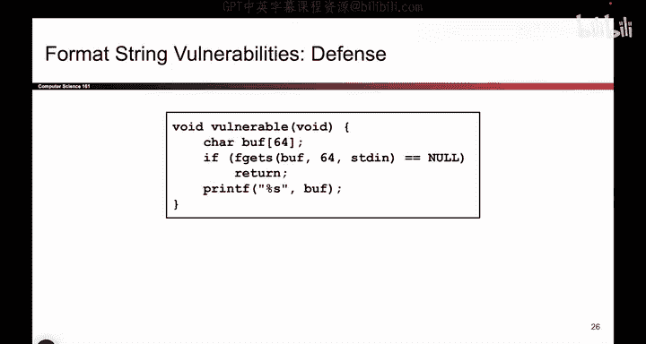
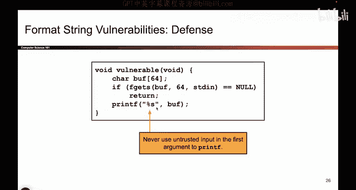
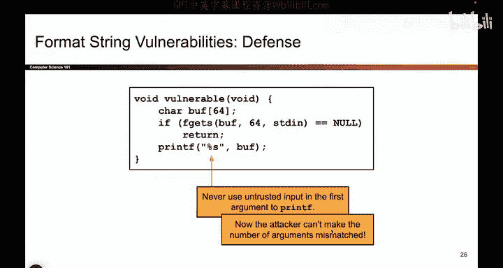

# 053：printf 漏洞防御 🛡️



在本节课中，我们将学习如何防御之前讨论的格式化字符串漏洞。我们将看到，防御的核心非常简单直接，关键在于理解漏洞的根源并采取正确的编码实践。

上一节我们详细介绍了格式化字符串漏洞的成因和危害，本节中我们来看看如何有效地防御它。

## 漏洞根源与防御原理

格式化字符串漏洞的根源在于攻击者能够控制传递给 `printf` 函数的**第零个参数**（即格式化字符串本身）。如果攻击者能在这个字符串中插入任意数量的 `%` 格式化符号，而程序又没有提供相应数量的后续参数，`printf` 就会从栈上读取本不属于它的数据，从而导致信息泄露或任意内存写入等严重后果。

因此，防御的核心思路非常直接：**永远不要让攻击者控制 `printf` 的第零个参数**。因为只有第零个参数会被用来解析 `%` 符号并与栈上的数据进行匹配。




## 正确的编码实践

以下是防御格式化字符串漏洞的关键步骤：

1.  **永远使用静态字符串作为格式化参数**：在调用 `printf` 时，格式化字符串应该是硬编码的常量字符串，而不是用户输入或变量。
    ```c
    // 正确做法
    printf("%s", user_input_buffer);
    // 错误做法
    printf(user_input_buffer);
    ```

2.  **将用户输入作为后续参数传递**：如果你需要打印用户提供的内容，应该使用 `%s` 等格式化占位符，并将用户缓冲区作为后续参数传入。这样，即使用户在缓冲区中插入了 `%` 符号，它们也不会被 `printf` 解释为格式化指令。

遵循以上实践，即使攻击者在缓冲区中放入大量 `%` 符号也无济于事，因为这些内容不再是第零个参数，因此不会被当作格式化指令处理。只有第零个参数才用于确定后面需要多少个参数。


## 总结




本节课中我们一起学习了防御格式化字符串漏洞的方法。关键点在于：漏洞的根源是攻击者控制了 `printf` 的第零个参数（格式化字符串），导致参数数量不匹配。修复方法极其简单——永远不要将用户可控的数据直接作为 `printf` 的第一个参数传递，而应使用静态的格式化字符串（如 `"%s"`）并将用户数据作为后续参数。虽然修复方法简单，但开发者常常忘记这一点，从而导致严重的安全问题。牢记这一原则，就能有效避免此类漏洞。