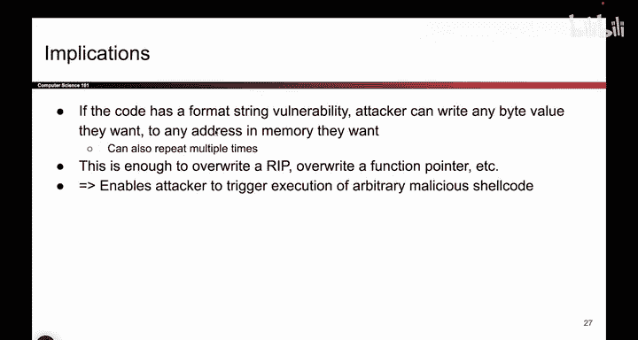

# 054：printf 漏洞利用的深远影响 🎯

在本节课中，我们将快速回顾并总结刚刚看到的格式化字符串漏洞的深远影响。我们将了解，一旦代码存在此类漏洞，攻击者能够实现何种程度的控制，以及如何利用它来构建复杂的攻击。

## 漏洞核心原理回顾

上一节我们演示了格式化字符串漏洞的基本利用。本节中，我们来看看这个漏洞所能带来的更广泛的影响。

记住，如果代码存在格式化字符串漏洞，我们能够实现以下操作：
*   我们可以选择任意目标数值（我们选择了100，但也可以是89、105或其他任何值）。
*   我们可以将这个值写入任意目标地址（我们选择了 `deadbeef`，但也展示了如何用其他地址替换它）。

本质上，这实现了 **向任意地址写入任意值**。

## 漏洞的扩展利用

更进一步，如果代码多次调用 `printf`，或者你在提供的输入中包含了更多的格式化说明符（我们提供了4个，但也可以是8个、12个或更多），你实际上可以 **向多个地址写入多个值**。

你可以利用这一点来构建我们之前见过的一些攻击利用链。例如：
*   你可以利用这个 `printf` 格式化字符串漏洞将 shellcode 写入内存。
*   你可以用 shellcode 的地址覆盖返回地址指针。

因此，你基本上可以实现任何你想要的操作。虽然可能需要一些努力和技巧（例如，精心调整栈上的数据以使所有 `%n` 格式化说明符正确对齐），但只要付出足够的努力，你就能覆盖 RIP，使其指向 shellcode，从而再次执行任意你想要的 shellcode。

## 总结与评估

本节课中，我们一起学习了格式化字符串漏洞的深远影响。尽管实际利用起来可能需要更多的工作量才能确保正确，但这种 `printf` 格式化漏洞与我们见过的其他漏洞一样危险。它赋予了攻击者强大的内存读写能力，是构建复杂攻击链的关键一环。