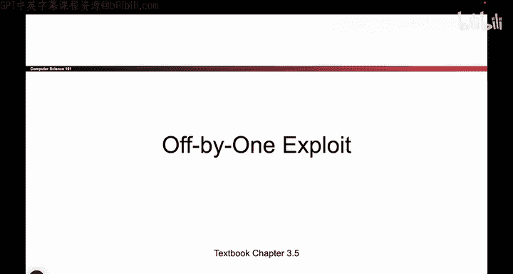
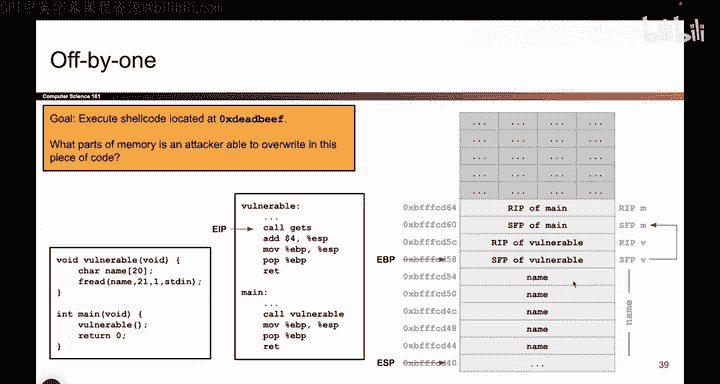

# 055：Off-by-One漏洞 - 设置

在本节课中，我们将学习并利用一种被称为“Off-by-One”的漏洞。这种漏洞在项目中很常见，它能很好地检验你对调用栈工作原理的理解。如果你尚未完全掌握，强烈建议你回顾第二讲，确保你清楚地理解了当一个函数被调用和返回时，EBP、ESP和EIP是如何变化的，这对于理解本漏洞至关重要。



## 漏洞代码示例

让我们考虑如下代码：

```c
int main() {
    vulnerable();
}

void vulnerable() {
    char name[20];
    fgets(name, 21, stdin); // 注意：这里允许写入21个字符，但数组大小是20
}
```

这里，`vulnerable`函数定义了一个大小为20的字符数组`name`。然而，在调用`fgets`时，代码错误地允许写入21个字符。这个小小的打字错误就是“Off-by-One”漏洞的根源。

## 绘制栈图分析

面对不熟悉的漏洞时，绘制栈图是一个非常有用的方法。它能帮助我们直观地理解内存布局。

以下是调用`vulnerable`函数时的栈结构示意图：

```
（高地址）
+-------------------+
|   main的返回地址   | <-- RIP (Saved EIP)
+-------------------+
|   main的帧指针     | <-- SFP (Saved EBP)
+-------------------+
|                   |
|    name[16-19]    |
|    name[12-15]    |
|    name[8-11]     |
|    name[4-7]      |
|    name[0-3]      | <-- ESP (栈顶)
（低地址）
```

*   **EBP**：指向`vulnerable`栈帧的顶部（即保存的SFP位置）。
*   **ESP**：指向`vulnerable`栈帧的底部（即`name`数组的开始位置）。
*   `name`数组占用20字节，在栈上占据5行（每行4字节）。

> **说明**：为了简化教学，我们假设`main`函数也像普通函数一样有自己的RIP和SFP。在实际操作系统中，`main`的调用方式可能更复杂，但这对我们理解当前漏洞没有影响。

## 分析可覆盖的内存范围

作为攻击者，我们只能通过输入来控制写入栈的数据。因此，明确我们能覆盖和不能覆盖哪些内存区域是关键。

根据代码，我们可以向`name`数组写入21字节。这意味着：

*   **可以覆盖**：整个20字节的`name`数组。
*   **还可以覆盖**：**保存的帧指针（SFP）的最低有效字节**（即第21个字节覆盖的位置）。
*   **无法覆盖**：**返回地址（RIP）**。我们无法像经典缓冲区溢出那样，直接修改返回地址指向shellcode。

下图高亮部分（黄色）展示了我们能够覆盖的内存区域：

```
+-------------------+
|   main的返回地址   | <-- 无法覆盖
+-------------------+
|   SFP (字节3)     | <-- 无法覆盖
|   SFP (字节2)     | <-- 无法覆盖
|   SFP (字节1)     | <-- 无法覆盖
|   SFP (字节0)     | <-- **可以覆盖（第21字节）**
+-------------------+
|    name[16-19]    | <-- 可以覆盖
|    name[12-15]    | <-- 可以覆盖
|    name[8-11]     | <-- 可以覆盖
|    name[4-7]      | <-- 可以覆盖
|    name[0-3]      | <-- 可以覆盖
+-------------------+
```

通过以上分析，我们已经排除了直接覆盖RIP的经典攻击方式。攻击的焦点自然落在了那个**唯一能被覆盖的SFP字节**上。



## 本节总结

本节课我们一起设置了“Off-by-One”漏洞的分析环境。我们首先查看了存在漏洞的代码，然后绘制了详细的栈图来理解内存布局。最关键的一步是，我们分析了攻击者输入所能影响的内存范围，发现只能覆盖`name`数组和保存的帧指针（SFP）的一个字节，而无法触及返回地址（RIP）。这为我们指明了下一步的探索方向。

在下一节中，我们将深入探讨，如何仅仅通过覆盖这一个字节，来实现有效的漏洞利用。