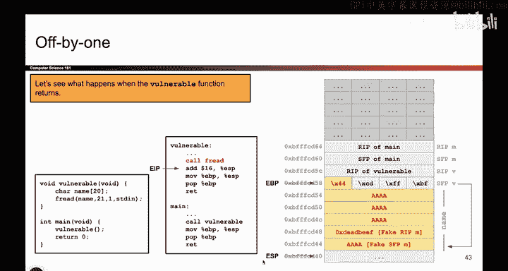

# 056：Off-by-One漏洞利用构建 🧩

在本节课中，我们将学习如何利用一个“差一字节”（Off-by-One）漏洞来构建一个完整的攻击。我们将从一个具体的栈内存布局图出发，理解哪些内存区域可以被覆盖，并重点分析如何通过修改一个关键字节来劫持程序的控制流。

## 栈布局回顾与关键字节

上一节我们介绍了栈的基本布局。现在，我们来看一下当前问题的设定。我们已经绘制了栈内存图，并明确了哪些内存区域可以被覆盖，哪些不可以。

关键在于，我们只能覆盖一个字节，即**保存的帧指针（SFP）的最低有效字节**。

> 一个小提示：如果你对字节序（Endianness）不熟悉，可以回顾相关视频。在x86架构（小端序）中，存储在最低内存地址的字节是数值的最低有效字节。例如，如果SFP保存的地址是 `0xBFFFCD60`，那么我可以修改的 `0x60` 就是最低有效字节。

这告诉我们，我们可以改变这个SFP，让它指向另一个地方。那么，我们首先要问自己：它当前指向哪里？程序如何使用栈上存储的这个值？改变它为什么能帮助我们执行shellcode？

## 帧指针（SFP）的作用

回想栈帧和函数调用过程，这个SFP值代表了**前一个栈帧的顶部**。当易受攻击的函数返回时，这个值会被放回`EBP`寄存器。当程序返回到`main`函数时，`EBP`应该恢复到`main`函数栈帧的顶部。

换句话说，这个值指示了前一个栈帧的顶部。更具体地说，我们定义任何栈帧的顶部就是它的SFP。因此，每个SFP值都保存着**前一个栈帧的SFP的地址**。这是一种方便的说法：每个SFP都持有一个地址，该地址是前一个栈帧顶部的地址。

那么，这个地址有什么用呢？程序如何使用它？程序将这个值恢复回`EBP`后，就可以使用这个基指针来定位栈上的其他值。例如，如果`EBP`在这里，程序可以通过从`EBP`向上偏移4字节来找到返回地址（RIP），或者继续向上偏移来找到函数的参数。基指针对于在栈上定位自身和其他数据非常有用。

## 利用SFP定位关键地址

所以，SFP（因为它保存了将要放入`EBP`的值）是程序在栈上定位其他值的一个便捷方式。我们特别关心的是找到**返回地址（RIP）**，因为如果我们能覆盖它，就可能引发恶意行为。

举个例子：
*   如果程序在`vulnerable`函数中，我们问“`vulnerable`的RIP在哪里？”，程序会查看当前`EBP`指向的位置（即SFP），然后向上看4字节，那里就是RIP。
*   如果我们问“`main`函数的RIP在哪里？”，程序会怎么做？它会利用保存的基指针作为锚点。它会查看`vulnerable`的SFP值（这是一个地址），**跟随这个地址**，到达它所认为的`main`函数的SFP位置，然后再向上看4字节，就找到了`main`的RIP。

**核心逻辑**：程序通过 `当前函数的SFP值 -> 前一个函数的SFP位置 -> 向上偏移4字节` 这个链条来定位前一个函数的返回地址。

## 构造攻击：篡改SFP

既然我们控制着用于寻找`main`函数RIP的那个值（`vulnerable`的SFP），并且我们可以改变它的一个字节，那么如果我们改变这个字节会发生什么？

假设我们将SFP的最低字节从 `0x60` 改为 `0x44`。现在，这个地址不再指向`main`函数真正的SFP，而是指向了`main`函数中更下方的某个位置（比如，在字符数组`name`内部）。**但程序并不知道我们修改了它**。

如果我们再次问程序“`main`的RIP在哪里？”，程序仍然会执行相同的逻辑：
1.  取出`vulnerable`的SFP值（现在已被我们修改）。
2.  跟随这个地址（现在指向`name`数组内部）。
3.  认为这里就是`main`的SFP（我们称之为 **伪造的SFP**）。
4.  向上偏移4字节，认为那里就是`main`的RIP（我们称之为 **伪造的RIP**）。

实际上，那里并不是真正的RIP，而是`name`数组中的一部分内存。**关键在于，这部分内存是我们能够完全控制的！**

## 完成攻击载荷

这就是“差一字节”攻击背后的核心思想。我们无法直接覆盖`vulnerable`函数自身的RIP，但我们可以通过修改其SFP的一个字节，间接地让程序**误以为**`main`函数的RIP位于我们控制的内存区域（`name`数组）中。

现在，我们只需要填充剩余部分来完成攻击。

以下是构建攻击的步骤：

1.  **计算偏移**：精确计算输入数据中，哪个字节对应着`vulnerable`函数SFP的最低有效字节。
2.  **确定目标地址**：决定我们希望伪造的SFP指向`name`数组中的哪个位置。将这个地址的最低字节（例如`0x44`）写入SFP的覆盖点。
3.  **放置Shellcode地址**：在`name`数组中，**伪造的SFP位置向上偏移4字节**的地方（即程序认为的“伪造的RIP”），写入我们shellcode的内存地址。例如，如果shellcode在地址 `0xDEADBEEF`，我们就在这里写入 `0xDEADBEEF`。
4.  **写入Shellcode**：将实际的恶意shellcode代码写入`name`数组的其他位置（通常是伪造的RIP之后或之前，并确保地址正确指向它）。

最终，当`vulnerable`函数返回，然后`main`函数返回时，程序会取出我们伪造的RIP值（即shellcode的地址）并跳转执行，从而完成攻击。

## 总结

本节课中，我们一起学习了如何利用一个微小的Off-by-One漏洞构建完整的控制流劫持攻击。我们了解到：
*   栈帧指针（SFP）在函数返回和栈导航中的关键作用。
*   通过修改SFP的一个字节，可以诱使程序错误地定位前一个函数的返回地址。
*   攻击的核心在于**让程序从一个我们可控的内存区域（如缓冲区）中读取它“认为”的返回地址**，而我们则在该地址处放入恶意代码的指针。
*   整个攻击链可以概括为：**覆盖SFP最低字节 -> 重定向SFP指向可控缓冲区 -> 在伪造的RIP位置写入shellcode地址 -> 执行shellcode**。

在下一节中，我们将具体观察函数实际返回时，这个攻击是如何一步步执行的。