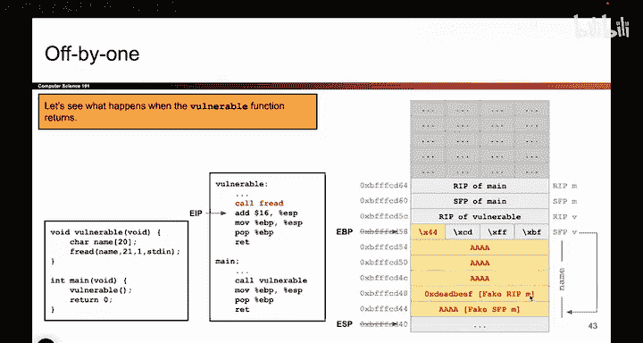
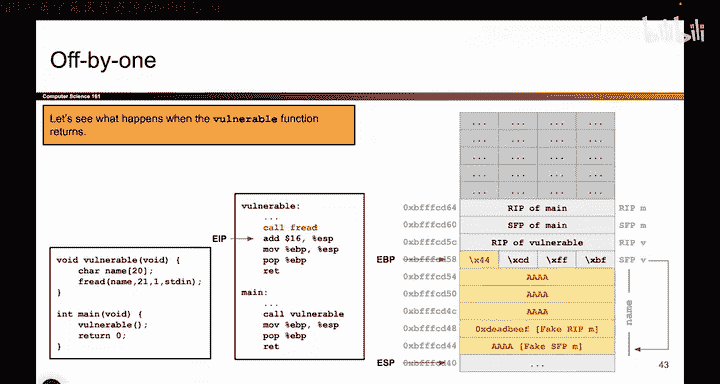

# 057：Off-by-One漏洞利用详解 🎯


在本节课中，我们将详细分析一个Off-by-One漏洞的完整利用过程。我们将看到，通过精心构造的输入，攻击者如何利用一个字节的溢出，最终引导程序执行恶意代码。理解这个过程需要掌握两个核心概念：栈帧指针的链式关系，以及需要两次函数返回才能触发代码执行的原因。


上一节我们介绍了如何构造攻击载荷来覆盖栈上的关键数据。本节中，我们来看看当`vulnerable`函数和`main`函数依次返回时，程序的控制流是如何被劫持的。





## 核心概念一：栈帧指针链 🔗

第一个关键概念是，栈帧指针总是指向**前一个栈帧的栈帧指针**。用公式表示这个关系就是：




```
SFP_current -> SFP_previous
```


这意味着，如果你顺着当前栈帧指针的值去查找，你应该能找到前一个栈帧的栈帧指针。但是，由于我们覆盖了这个指针的一个字节，程序在顺着这个被破坏的地址查找时，会定位到一个错误的位置。程序误以为这个错误位置是一个栈帧指针，并进一步认为它上方存储的是返回地址。这是理解该漏洞利用为何能成功的第一个要点。

## 核心概念二：需要两次返回 🔄

第二个关键概念是，我们覆盖的是`main`函数的返回地址，而不是`vulnerable`函数的。这意味着，要让这段代码执行Shellcode，我们需要经历两次函数返回过程：

1.  从`vulnerable`函数返回。
2.  从`main`函数返回。

只有第二次从`main`函数返回时，才会触发Shellcode的执行，因为程序误将我们覆盖的数据当作了`main`函数的返回地址。而`vulnerable`函数的返回地址未被触碰，因此第一次返回是正常的。


接下来，让我们分步观察这两次返回是如何发生的。

## 第一次函数返回过程

此时栈的布局已经设置好，我们准备执行第一组函数收尾指令。

以下是第一次返回的三个标准步骤：

1.  **移动栈指针**：`ESP`被移动到`EBP`所在的位置，这释放了`vulnerable`函数的栈帧空间。
    ```
    mov esp, ebp
    ```
2.  **恢复前一个栈帧指针**：`pop ebp`指令将栈顶的值（即保存的帧指针SFP）弹出并放入`EBP`寄存器。由于我们覆盖了这个值的一个字节，`EBP`现在指向一个我们控制的错误位置。
    ```
    pop ebp
    ```
3.  **返回**：`ret`指令类似于`pop eip`，它将栈顶的下一个值弹出并放入指令指针`EIP`。这个值（`vulnerable`的原始返回地址）未被修改，因此`EIP`会正常地跳回`main`函数继续执行。
    ```
    ret
    ```

第一次返回完成后，只有`EBP`寄存器指向了错误的位置，`EIP`和`ESP`都处于正常状态。这为第二次返回埋下了伏笔。

## 第二次函数返回过程

现在，我们开始执行第二次函数返回。此时唯一的异常是`EBP`指向了栈上的一个错误位置。

以下是第二次返回的步骤：

1.  **移动栈指针**：同样，`ESP`被移动到`EBP`所在的位置。但由于`EBP`指向错误位置，`ESP`也被拖到了这个低地址处。
    ```
    mov esp, ebp
    ```
2.  **“恢复”栈帧指针**：程序执行`pop ebp`，将当前栈顶的值（程序误以为是SFP）弹出到`EBP`。这个值是我们填充的垃圾数据，因此`EBP`会指向一个不可预知的地址。
    ```
    pop ebp
    ```
3.  **关键跳转**：这是整个利用的“高光时刻”。程序执行`ret`指令，将下一个栈值弹出到`EIP`。程序误以为这是一个返回地址，但实际上，这个值是我们精心构造的、指向Shellcode的地址（例如`0xdeadbeef`）。
    ```
    ret  ; 实际效果： pop eip
    ```
    当`EIP`被设置为Shellcode的地址后，处理器便开始执行我们的恶意代码。

## 总结 📝

本节课中我们一起学习了Off-by-One漏洞的完整利用链。我们了解到，由于只覆盖了一个字节，攻击需要依赖两次函数返回才能完成：

*   第一次返回破坏了`EBP`，将其引导至攻击者控制的栈区域。
*   第二次返回则利用了这个被破坏的`EBP`，通过标准的函数收尾指令，最终将程序控制流劫持到Shellcode的地址。

这个利用过程巧妙地利用了程序对栈布局的信任，通过一个微小的溢出，引发了连锁反应，最终实现了代码执行。理解这个过程对于防御此类漏洞至关重要。