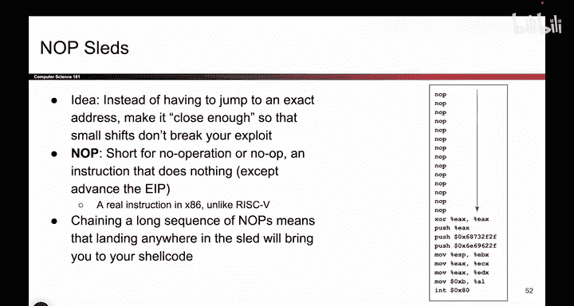

# 058：NOP雪橇技术

在本节课中，我们将探讨如何使内存安全漏洞利用更加鲁棒。我们将介绍一种名为“NOP雪橇”的技术，它允许攻击者在信息不完整的情况下，提高其攻击成功的概率。通过理解这种技术，你将明白为何仅仅依赖“攻击者不了解我的代码”这种假设是不足以保障安全的。

## 假设攻击者拥有完整信息

上一节我们讨论了多种内存安全漏洞利用技术。你可能会质疑这些攻击的可行性，认为它们假设攻击者能获得你的代码副本、知晓所有内存地址并能精确预测一切。这种质疑是合理的，我们确实做了一些假设。

然而，回顾我们最初关于安全原则的讲座，我们曾讨论过“通过隐匿实现安全”的概念，并强调**不应依赖这种安全方式**。隐藏信息并非保障安全的有效借口。我们不能假设攻击者不了解我们的代码或内存布局，因此他们无法实施攻击。

我们必须始终假设攻击者了解我们的系统。例如，他们可能入侵系统获取代码副本，或者代码是开源的，甚至可能因泄露而被获取。因此，我们不能依赖“希望攻击者不了解我的代码”这种想法来确保安全。我们应该假设攻击者确实拥有代码副本，并确保我们的代码足够健壮，能够抵御攻击，即使代码信息已泄露。

## 提高攻击成功率：NOP雪橇技术

虽然我们强调应假设攻击者拥有完整信息，但现实中，攻击者有时可能信息不全。他们可能对地址有大致猜测，但无法精确知晓栈的布局或代码细节。在这种情况下，攻击者可以使用一些巧妙技巧来提高成功率。以下将介绍一种这样的技巧，它表明即使攻击者信息有限，仍能造成严重危害。

这种技巧称为“NOP雪橇”。首先，在X86汇编语言（以及几乎所有汇编语言）中，存在一条名为“NOP”的指令，其含义是“无操作”。例如，一条将0与0相加但不存储结果的指令，就是一条什么都不做的指令。NOP指令有多种用途，但攻击者可以利用它来构建“NOP雪橇”。

假设我们没有使用NOP指令，而只想执行位于内存中特定位置的shellcode（例如，从`XOR`指令开始的一系列指令）。在经典的缓冲区溢出攻击中，我们需要将返回指令指针（RIP）精确覆盖为`XOR`指令的地址。成功的条件只有一个：RIP必须精确指向`XOR`指令的地址。如果稍有偏差，例如地址偏移了4个字节，程序可能会跳转到非指令数据区，导致崩溃或不可预测行为，攻击便会失败。

现在，考虑使用NOP雪橇的情况。攻击者可以重写其shellcode，使其不是立即以`XOR`指令开始，而是在前面插入大量NOP指令。修改后的shellcode功能与原始完全相同，只是在有效指令前执行了大量无操作。

这样做的好处是，攻击者成功的机会大大增加。现在，攻击者不仅可以将RIP覆盖为`XOR`指令的地址，还可以覆盖为前面任何一个NOP指令的地址。无论跳转到雪橇中的哪个NOP指令，程序都会顺序执行这些无操作指令，“滑行”通过整个NOP区域，直到抵达第一个有效指令（`XOR`），然后完整执行后续的shellcode。

因此，NOP雪橇技术为信息不完整的攻击者提供了一种提高成功概率的有效方法。它表明，仅依赖“攻击者不了解我的代码”这种防御思想是远远不够的。即使攻击者对你的系统知之甚少，他们仍能利用此类技巧使恶意事件发生，并提高其成功率。

## 总结

本节课中，我们一起学习了NOP雪橇技术。我们首先重申了不应依赖“通过隐匿实现安全”的原则，必须假设攻击者可能拥有系统代码和信息的访问权限。接着，我们探讨了当攻击者信息不完整时，如何利用NOP雪橇技术来扩大成功覆盖的地址范围，从而提高缓冲区溢出等攻击的成功率。理解这种技术有助于我们认识到，构建安全的系统需要从根本上消除漏洞，而非依赖攻击者对系统内部细节的无知。