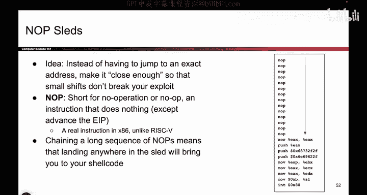

# 059：总结

在本系列视频中，我们探讨了多种内存安全漏洞。本节课程将对所有内容进行总结，帮助您巩固理解。

## 格式字符串漏洞

上一节我们介绍了缓冲区溢出，本节中我们来看看格式字符串漏洞。其核心思想是，如果向 `printf` 函数传递的参数数量不匹配，`printf` 仍会从栈中读取参数，这可能导致危险。

以下是该漏洞的关键点：
*   `printf` 会从栈中读取本不应被打印的数据，导致信息泄露。
*   如果使用 `%n` 格式化符号，`printf` 会将当前已打印的字节数写入栈中下一个值所指向的地址。这允许攻击者向任意内存地址写入数据，非常危险。

因此，我们必须谨慎防范格式字符串漏洞，确保用户无法控制 `printf` 至关重要的第一个参数（即格式字符串本身）。

## 差一错误漏洞

在讨论了格式字符串漏洞后，我们来看另一种常见漏洞：差一错误。这种漏洞虽然未在幻灯片上显示，但其原理非常重要。

差一错误是指，如果仅覆盖了保存帧指针（SFP）的一个字节，就可以欺骗程序，使其认为前一个函数的返回地址（RIP）位于不同的位置。通过这种欺骗，攻击者可以在该位置写入自己的RIP值，从而导致程序执行任意代码（如shellcode）。

此外，我们还学习了如何通过添加“空操作雪橇”（NOP sleds）等技巧来增强攻击的鲁棒性。即使没有关于目标系统的完整信息，这些技巧也能提高攻击成功的概率。

## 总结与警示

本节课中，我们一起学习了格式字符串漏洞和差一错误漏洞。如果代码中存在内存安全漏洞，我们必须假设系统已被攻破，攻击者可以执行任何操作。这些漏洞威力巨大，即使攻击者只覆盖一个字节，也可能完全控制您的系统。

因此，这些漏洞极其危险，我们必须时刻保持警惕，并在开发中采取严格措施来预防它们。