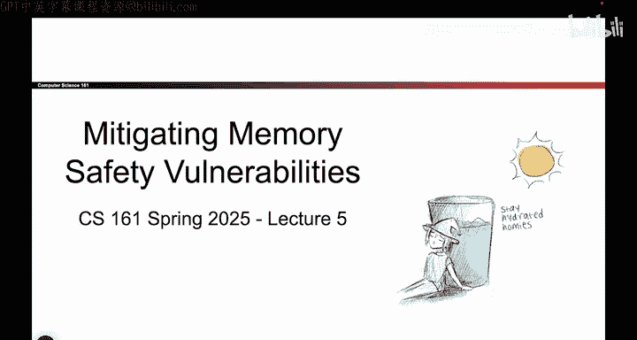
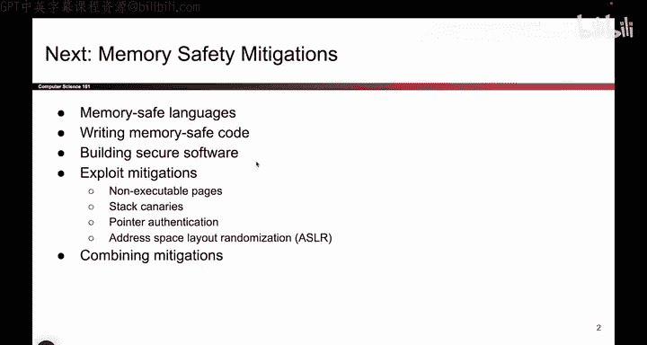

# 060：引言

在本节课中，我们将学习如何防御或缓解之前介绍过的内存安全漏洞。我们将首先探讨这些漏洞为何至今仍然存在，然后深入分析四种主要的防御策略，以降低这些漏洞被利用的风险和影响。

## 为什么漏洞依然存在？🤔

上一节我们介绍了内存安全漏洞的危险性。本节中，我们来看看一个更根本的问题：为什么在2025年的今天，这些漏洞仍然普遍存在？它们常年位居最常见安全漏洞榜单前列，这背后有四个较为哲学层面的原因。

## 四种防御策略概览 🛡️

理解了漏洞的根源后，我们将重点转向防御。以下是本系列视频将详细探讨的四种主要防御策略类别，我们将逐一审视。

*   **策略一：** 通过改进编程语言或工具，在程序运行前预防漏洞的产生。
*   **策略二：** 在程序编译或链接阶段，加入检测和阻止漏洞的机制。
*   **策略三：** 在程序运行时，实时监测并阻止恶意行为。
*   **策略四：** 即使漏洞被触发，也采取措施限制其可能造成的损害。

本节课中，我们一起学习了内存安全漏洞防御的引言部分，探讨了漏洞持续存在的原因，并概述了后续将深入讲解的四大防御策略。接下来，我们将逐一详细分析这些策略。