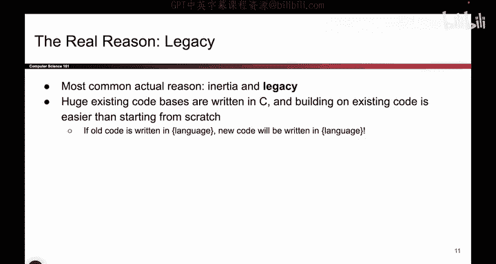

# 061：使用内存安全语言 🛡️


在本节课中，我们将要学习如何通过使用内存安全语言来从根本上防止内存安全漏洞。这是一种非常直接且有效的方法。

## 概述

防止内存安全漏洞的第一类方法是使用一种本身就不存在此类漏洞的编程语言。这听起来似乎显而易见，但实际上是一种非常有效的防御策略。核心思想是：选择一种在设计上就具备安全特性的编程语言。

## 内存安全语言的工作原理

上一节我们介绍了使用内存安全语言的基本概念，本节中我们来看看它们是如何工作的。

一些编程语言在设计时，就内置了边界检查机制。例如，Java、Python、Go 等语言会在你访问数组时自动检查索引是否越界。

当你定义一个大小为 5 的数组，并试图访问第 6 个元素时，程序会直接拒绝这个操作，不会让你访问。

**代码示例：**
```python
# 在Python中尝试访问越界索引
my_list = [1, 2, 3, 4, 5]
# 以下操作会引发 IndexError 异常，程序会停止
# element = my_list[5]
```


C 语言则不是这样设计的。在 C 语言中，如果你定义了一个大小为 5 的数组并请求第 6 个元素，C 语言会允许你访问，即使它已经超出了边界。

内存安全语言的设计者在构建语言时，就加入了自动的边界检查。因此，这些语言本身就不存在内存安全漏洞。我们讨论过的所有内存安全漏洞，都与向数组末尾之外进行读写操作有关。如果你的语言根本不允许你越界读写，那么内存安全漏洞就不会发生。


## 如何选择内存安全语言

以下是选择内存安全语言时需要考虑的几个关键点：

*   **广泛的选择**：实际上，大多数现代编程语言都是内存安全的。我们能想到的非内存安全语言主要是 C、C++ 及其衍生语言（如 Objective-C）。只要你不使用这些语言，就无需担心内存安全问题。
*   **最坚固的防御**：使用具备边界检查的语言，是对抗内存安全漏洞最稳健的防御方式。因为在这种语言中，此类漏洞根本不存在。这是本课程中少数几种可以保证 100% 有效的防御措施之一。

如果你使用像 Java、Python 或 C# 这样的语言，你就能防御 100% 的此类漏洞，因为这种攻击方式在你的编程环境中并不存在。你从根本上解决了问题。

## 为什么人们仍然使用 C 语言？

基于以上内容，你可能会产生一个疑问：既然内存安全语言这么好，为什么人们还在使用 C 语言呢？

以下是几个常见的原因：


*   **性能考量**：一个常见的论点是，C 语言虽然不安全，但速度非常快。人们认为需要在速度（C语言）和安全性（内存安全语言）之间做出权衡。例如，Java 因为是内存安全语言，需要进行额外的内存跟踪和边界检查，这可能会引入一点延迟。而 C/C++ 的内存管理可以达到最快的速度。
*   **性能权衡的再思考**：首先，性能差异在日常编程中往往被夸大了。对于 99% 的应用程序（如作业、工作项目），使用 Java 和 C 之间的速度差异微乎其微，用户根本无法察觉。用 10 毫秒的微小延迟换取巨大的安全性提升，通常是值得的。更重要的是，如今出现了许多既高性能又内存安全的语言（如 Rust），打破了“安全必然慢”的旧观念。如果两者可以兼得，为什么还要做取舍呢？
*   **开发效率**：从更高的哲学层面看，使用像 C 这样的语言，你会花费大量时间调试内存安全漏洞。如果从“每日产出代码行数”的效率来看，使用内存安全语言可能反而更快，因为它节省了调试和修复错误的时间。
*   **利用高性能库**：即使你使用像 Python 这样相对较慢的语言，它们也通常拥有可以调用底层 C/C++/Rust 库的接口（如 NumPy）。这样，你既能享受内存安全语言的安全性和开发便利，又能通过高性能库获得所需的运行速度。
*   **遗留代码问题**：最后一个重要原因是历史遗留。在过去几十年里，人们用 C 语言编写了大量的代码。当你接手一个庞大的 C 语言项目时，你只有两个选择：要么用 Rust 等安全语言重写整个项目，要么在现有代码库上继续开发。几乎所有人都会选择后者，因为这容易得多。如果你加入一家公司，其所有代码都是 C 语言写的，你不太可能将其全部重写，而很可能会继续用 C 语言进行开发。

## 总结



本节课中我们一起学习了使用内存安全语言来防御内存安全漏洞。我们了解到，像 Java、Python、Go、Rust 等语言通过内置的自动边界检查，从根本上消除了缓冲区溢出等漏洞。虽然历史上人们因性能和遗留代码问题仍在使用 C/C++，但现代语言的发展正在缩小性能差距，使得安全与高效可以兼得。对于新项目，选择一门内存安全语言是避免此类安全问题的强有力策略。