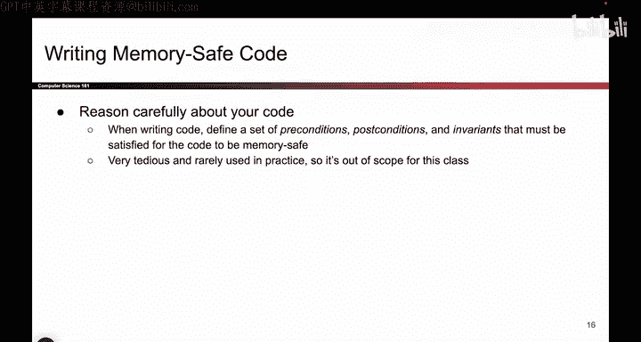

# 062：编写内存安全代码

在本节课中，我们将学习为何会存在内存安全漏洞，以及如何在编写代码时采取策略来避免它们。我们将重点探讨在使用不安全语言（如C语言）编程时，如何通过防御性编程等方法，尽可能地减少安全风险。

上一节我们讨论了内存安全漏洞的根源。本节中，我们来看看如何在实际编程中应对这些风险。


## 防御性编程的必要性

我们目前处于一个现实情况：大量遗留代码是用C语言编写的。当你在一个使用C语言的公司工作时，你很可能需要继续编写C代码。这就是为什么内存不安全的语言至今仍然存在。

既然我们或多或少被这些不安全的语言所“困住”，那么如何编程才能避免我们之前看到的、非常危险的缓冲区溢出攻击呢？本节将探讨在使用不安全语言编写代码时，如何尝试更安全地编程。


## 什么是防御性编程？

防御性编程的理念类似于防御性驾驶，但应用于编程领域。其核心思想是：在使用内存不安全语言（如C或其衍生语言）编程时，必须保持高度警惕。因为我们已经看到，即使是最微小的错误也可能导致整个程序变得脆弱。

因此，我们必须格外小心。具体来说，为代码添加检查至关重要，即使你认为这些检查没有必要，或者你认为输入“总是”会在缓冲区内。添加检查可以防止你犯错或应对意外情况。

以下是防御性编程的一些具体实践：

*   **检查指针**：在解引用指针（即访问该内存地址）之前，务必检查它是否为`NULL`，即使你非常确定它不是。
    ```c
    if (ptr != NULL) {
        // 安全地使用 ptr
    }
    ```
*   **验证输入**：当从用户接收输入时，必须检查接收的字节数是否符合预期，且没有超出限制，即使你对此很有信心。
    ```c
    if (bytes_received <= buffer_size) {
        // 安全地处理数据
    }
    ```

防御性编程是一种好方法，但说实话，它实施起来颇具挑战性。这要求程序员非常有纪律性，并且对编程方式非常谨慎。在临近截止日期、时间紧迫时，人们往往容易忽略这些检查。因此，这是一种理想的做法，但并非总能被始终贯彻。这是在编写不安全语言代码时应具备的思维方式。

## 选择安全的库函数

我们上次也提到，如果你用C这样的不安全语言编写代码并需要调用C库函数，务必查阅这些库函数的文档，确保你使用的是安全的版本。

以下是一些安全与不安全函数的对比示例：

*   **不要使用** `gets`，因为它允许写入超出数组末尾。**应使用** `fgets`，因为它限制了写入量。
    ```c
    // 不安全
    gets(buffer);
    // 相对安全
    fgets(buffer, sizeof(buffer), stdin);
    ```
*   **不要使用** `strcpy`，它允许用户复制任意多数据到目标位置。**应使用** `strncpy`，它允许你指定一个限制，并在复制超出数组末尾时截断。
    ```c
    // 不安全
    strcpy(dest, src);
    // 相对安全
    strncpy(dest, src, dest_size - 1);
    dest[dest_size - 1] = '\0'; // 确保字符串终止
    ```

库函数有安全和不安全之分，确保使用正确的版本非常重要。同样，这需要程序员的高度自律。在截止日期压力下，一旦疏忽使用了不安全的函数，整个代码的安全性就可能崩塌。

人们常问，既然`gets`如此不安全，为何它仍然存在？原因还是在于遗留代码。如果直接从C库中移除`gets`，大量旧代码可能会停止工作。因此，出于兼容性考虑，许多不安全的函数被保留了下来。我们将在后续视频中尝试缓解它们的影响。但如果你不得不使用C语言编程，上述就是你应该秉持的理念。

## 形式化验证：代码正确性证明

如果你想更精确地确保代码安全，实际上可以通过形式化验证来严格检查代码的正确性。这涉及到计算机科学的一个专门领域。

其做法是：取一段代码，对其进行严谨的逻辑推理，写出称为**前置条件**、**后置条件**和**不变式**的断言。本质上，他们是在尝试为代码的安全性编写一个数学证明。

例如，可以尝试证明：基于输入满足特定条件，并且代码的每一行执行特定操作，最终可以论证这段代码是内存安全的，不会发生越界写入。

然而，坦白说，这个过程也相当繁琐。这是一种良好的实践，也确实有人这么做。但现实是，当编程截止日期临近时，你很可能不会坐下来为你的代码为何能工作而撰写证明。你更可能将其提交给自动评分器并希望它能通过。因此，我们不会过多深入此话题。只需知道，更复杂的代码正确性证明策略是存在的，尽管在日常编程中你可能不会用到它们。



本节课中，我们一起学习了在面对内存不安全语言时的编程策略。我们介绍了**防御性编程**的核心思想，即通过添加额外检查来预防错误。我们还强调了**选择安全的库函数**的重要性，并简要了解了通过**形式化验证**证明代码正确性的高级方法。记住，在使用C这类语言时，保持警惕和自律是编写安全代码的关键。