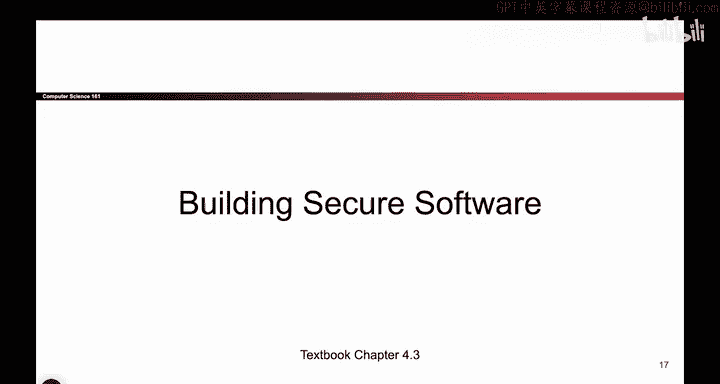

# 063：构建安全系统的工具 🛠️

在本节课中，我们将学习在不得不使用内存不安全语言（如C语言）进行编程时，如何利用各种工具和方法来增强系统的安全性。我们将探讨运行时检查、监控、沙箱、自动化分析工具以及安全测试等多种策略。

## 运行时检查与监控 🔍

上一节我们讨论了通过切换语言或谨慎编程来避免内存安全问题。然而，这些方法有时并不足够。本节中，我们来看看如何利用在程序运行时工作的工具。

以下是两种主要的运行时方法：

*   **运行时检查工具**：这些工具与你的程序一同运行，可能会为你执行一些边界检查。如果检查失败，它们会发出警报或使程序崩溃。例如，它们可以检测数组越界访问。
    *   **代价**：引入性能开销，会减慢程序运行速度。
*   **代码行为监控工具**：这些工具监控代码的执行行为，寻找异常活动。例如，如果你的代码从未调用过某个危险的系统函数（如 `execv`），但监控工具发现它突然开始调用，这可能表明程序已被攻击者利用缓冲区溢出漏洞劫持。
    *   **局限性**：这类工具通常在异常行为发生后才能发现攻击，可能为时已晚，无法阻止损害发生。

## 隔离与遏制损害 🏝️

既然我们无法完全阻止所有攻击，另一个思路是尽量控制攻击成功后的破坏范围。

一种有效的方法是使用**沙箱**或**虚拟机**。这些是隔离的运行环境。即使攻击者通过缓冲区溢出控制了你的程序，他们也被限制在这个隔离环境中，无法逃逸出去影响系统的其他部分。

这类似于我们之前讨论的安全原则中的**权限分离**：只赋予程序完成任务所必需的最小权限。这样，即使程序被攻破，攻击者也无法获得整个系统的控制权。

## 自动化分析与外部审计 📋

除了运行时工具，还有一些静态或半自动化的方法可以帮助发现漏洞。

以下是一些可行的途径：

*   **自动化代码扫描工具**：这些工具扫描源代码，尝试发现常见的不安全模式，例如使用了不安全的函数 `gets`。它们并不完美，可能会有误报，但能提供有价值的参考。
*   **聘请外部安全公司进行代码审计**：由专业的安全工程师人工审查代码，寻找内存安全错误。这种方法可能更有效，但成本也更高。这涉及到安全经济学：你是否愿意为代码审查付费？
*   **漏洞扫描与渗透测试**：这两种方法的核心思想是：在程序发布前，自己尝试攻击它。
    *   **漏洞扫描**：使用工具自动探测系统中已知的漏洞。
    *   **渗透测试**：聘请安全专家（在授权范围内）尝试入侵你的系统。如果他们成功了，他们会告诉你如何被入侵的，从而让你有机会在问题暴露给外界之前修复它。

## 针对安全性的测试 🧪

测试代码功能是否正确是基础，但针对内存安全性进行专门测试同样至关重要。

编写安全性测试颇具挑战性，因为我们并非总是知道“正确的安全行为”具体是什么。以下是几种方法：

*   **模糊测试**：向程序输入大量随机生成的数据（成千上万甚至数百万条）。如果任何一条输入导致程序崩溃或行为异常，就可能发现了内存安全漏洞。有时，简单的随机测试就足够有效。
*   **使用专门工具**：例如，**Valgrind** 这类工具可以帮助检测内存泄漏和越界访问等问题。
*   **故意测试边界情况**：专门测试那些你之前未考虑到的极端输入，确保程序不会在这些情况下崩溃。

然而，安全性测试的充分性难以衡量。我们无法确定测试到何种程度才算“安全”。代码覆盖率工具可以告诉你有多少代码被测试过，但这只是一个参考指标。

## 管理第三方依赖 🔄

现代软件开发严重依赖第三方库，这引入了额外的安全挑战。

关键点在于：**即使你的代码是安全的，你所使用的库如果不安全，整个系统依然脆弱。** 因此，保持所有依赖库的更新至关重要。当库作者发布安全补丁时，你必须及时应用这些更新。

这在实际操作中可能很麻烦（例如，系统频繁要求重启以更新），但却是必要的。忽略库更新会使你的系统暴露在已知漏洞之下。

---

本节课中我们一起学习了多种在内存不安全环境下构建安全系统的工具和方法：从运行时检查、行为监控、沙箱隔离，到自动化扫描、渗透测试和专门的安全测试，再到管理第三方库的更新。虽然这些方法不能根除所有漏洞，但它们能显著提高攻击门槛，并在攻击发生时有效遏制损害，是构建深度防御体系的重要组成部分。