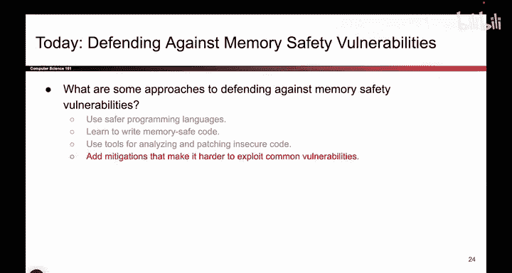
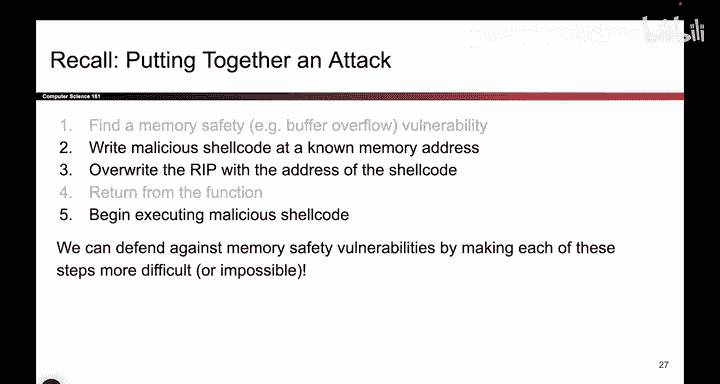

# 064：漏洞利用缓解措施

在本节课中，我们将学习一类被称为“漏洞利用缓解措施”的防御技术。我们将探讨如何通过改变程序的编译和运行方式，来增加攻击者利用常见内存安全漏洞的难度。

## 概述

上一节我们介绍了一些保护系统免受内存安全漏洞攻击的通用理念。本节中，我们将深入探讨“漏洞利用缓解措施”这一类别。其核心思想是，即使我们被迫使用不安全的语言（如C语言）维护大型遗留代码库，也可以通过技术手段增加攻击成本，使常见攻击更难成功。

## 缓解措施的目标与理念

假设你刚入职一家公司，接手了一个用C语言编写的大型代码库。重写代码以使用内存安全语言（第一种防御方式）通常不现实。虽然存在一些辅助工具和防御性编程方法，但它们并不完美。

因此，我们的目标是在不得不使用不安全代码的场景下，尝试阻止一些常见攻击。这就是本节要讨论的“漏洞利用缓解措施”。我们通过改变编译器和运行时执行代码的方式，来增加漏洞利用的难度。

我们无法使攻击变得完全不可能。杜绝所有攻击的唯一途径是切换到内存安全语言，但在此场景下我们无法做到。然而，我们可以尽力增加常见攻击的难度，给攻击者制造麻烦。

一个常见的策略是：与其让攻击者成功利用程序，不如改变程序运行方式，使得攻击尝试最终导致程序崩溃。程序崩溃固然糟糕，但让攻击者执行任意代码显然更糟。因此，即使无法阻止攻击，有时能检测到攻击并让程序崩溃，也比任由攻击者为所欲为要好。

我们的目标是提高攻击者的攻击成本，使其更耗时、更费力，从而可能劝退一部分攻击者，或阻止那些技术不够娴熟的攻击者。

这类防御措施的一个普遍优点是成本低廉，通常不会显著降低程序性能或增加过多开销。虽然并非完全免费，但权衡之下，只需付出少量代价，就能阻止大量常见攻击，因此通常非常值得采用。

## 针对攻击链的防御

为了理解如何改变程序运行以阻止常见漏洞利用，我们需要回顾一下构建一次攻击所需的步骤。

以下是攻击者通常采取的步骤：
1.  扫描代码，寻找内存安全漏洞（例如，发现调用了不安全的 `gets` 函数）。
2.  将恶意代码（Shellcode）写入内存中一个已知的地址。
3.  覆盖函数的返回地址（RIP），使其指向Shellcode的地址。
4.  函数返回。
5.  程序跳转到被覆盖的返回地址，开始执行恶意Shellcode。

对于第1步（漏洞本身）和第4步（函数返回），我们很难直接干预。漏洞一旦存在就存在，而函数返回是正常程序流程的一部分。

因此，我们的缓解措施将重点针对第2、3、5步。我们将分别研究三种缓解技术，每种技术旨在增加其中一个步骤的难度：
*   增加将Shellcode写入已知内存地址的难度。
*   增加用特定地址覆盖返回地址（RIP）的难度。
*   增加执行Shellcode本身的难度。

通过实施这些缓解措施，我们可以使许多常见的漏洞利用变得更加困难。

## 总结

本节课我们一起学习了“漏洞利用缓解措施”的基本概念。我们了解到，在无法使用内存安全语言的情况下，可以通过技术手段针对攻击链的特定环节（如注入代码、篡改控制流、执行代码）设置障碍，从而显著增加攻击者的利用难度和成本。虽然这不能根除漏洞，但能有效提升软件的安全性基线，是一种性价比很高的防御策略。