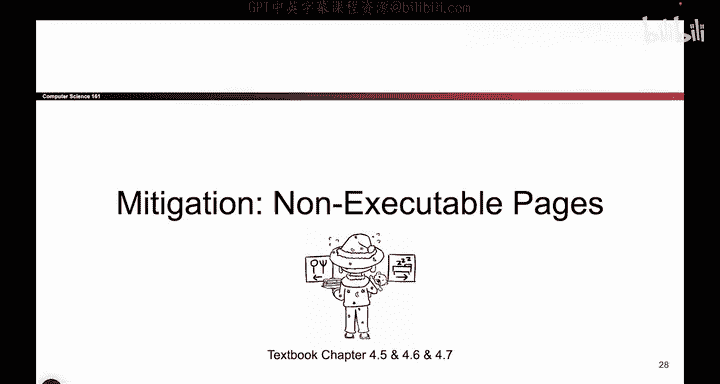
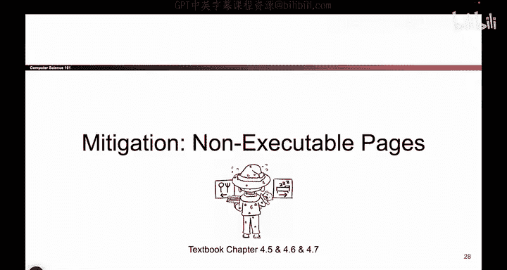
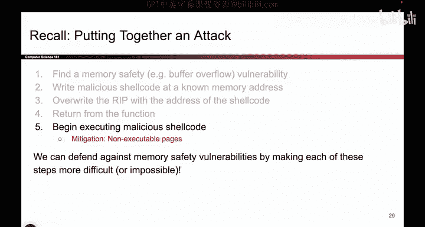
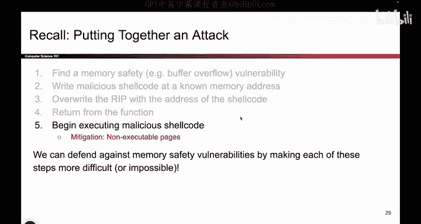

# 065：非可执行页

在本节课中，我们将要学习一种名为“非可执行页”的内存安全缓解技术。我们将了解它的工作原理、如何设置内存权限，以及它为何能有效阻止某些类型的攻击。

## 攻击的第五步

上一节我们回顾了缓冲区溢出攻击的五个步骤。本节中，我们来看看如何针对其中的第五步——攻击者开始执行恶意shellcode——进行防御。我们的目标是让攻击者执行恶意代码变得非常困难。

我们将利用内存布局由四个独立区域组成这一事实来实现防御。这四个区域是：栈、堆、数据段和代码段。

## 内存区域的职责

以下是这四个内存区域在正常程序执行中的典型作用：

*   **代码段**：存放程序的X86指令（即编译后的0和1序列），CPU读取并执行这些指令。
*   **数据段**：存放全局变量。
*   **堆**：存放动态分配的数据。
*   **栈**：存放局部变量。

在正常执行中，只有代码段应该包含需要被CPU执行的程序指令。其他三个区域存放的是数据，而不是指令。

## 设置内存权限

基于上述职责，我们可以为每个内存区域设置权限位，规定其是否可执行或可写。

以下是关于可执行权限的分析：

*   **代码段**：必须可执行，因为这里存放着需要运行的指令。
*   **数据段、堆、栈**：不应可执行。这些区域存放的是数据，CPU不应尝试将此处的内容作为指令来执行。如果CPU试图执行这些区域的指令，操作系统应予以阻止。

以下是关于可写权限的分析：

*   **栈、堆、数据段**：必须可写。程序需要在这些区域修改变量值或写入数据。
*   **代码段**：应设为只读。程序在运行时通常不应修改自身的代码。你编写代码，然后运行它，而不是在运行时动态重写指令。

## 非可执行页的核心思想

综合以上权限设置，我们得到了“非可执行页”的核心思想：**每个内存页可以被设置为可写或可执行，但不能同时具备这两种权限**。

具体来说：
*   代码段：**可执行**，但**不可写**。
*   栈、堆、数据段：**可写**，但**不可执行**。

这种权限分离是通过虚拟内存系统实现的。操作系统和硬件本就支持为内存页设置这些权限位，我们只需正确配置它们即可。这项技术有时也被称为 **W^X**（Write XOR Execute，即可写异或可执行）或 **NX位**。

## 为何有效？

现在我们已经了解了非可执行页是什么，接下来看看它为何有效。让我们回到缓冲区溢出攻击的步骤。

攻击者的目标是：**将shellcode写入内存，然后执行这段相同的代码**。

如果启用了非可执行页防御，攻击者将无法同时完成这两件事：
1.  攻击者可以将shellcode写入内存（例如栈或堆），因为这些区域是可写的。
2.  但是，当他们尝试跳转到该地址并执行时，操作系统会进行检查。由于这些区域被标记为**不可执行**，操作系统会阻止CPU执行其中的内容。

因此，即使攻击者成功植入了恶意代码，也无法执行它。这有效地阻断了攻击链的第五步。

## 总结

本节课中，我们一起学习了“非可执行页”这一内存安全缓解技术。我们了解到，通过合理设置内存区域的权限（代码段可执行不可写，栈、堆、数据段可写不可执行），可以阻止攻击者执行其注入的恶意shellcode。这项技术利用了操作系统已有的虚拟内存权限机制，能有效防御依赖于执行注入代码的攻击。