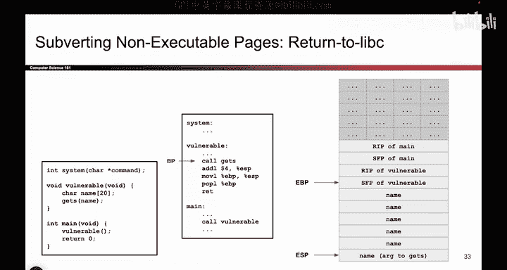

# 066：Return-to-libc 攻击概述 🛡️➡️📚

在本节课中，我们将要学习一种名为“Return-to-libc”的攻击技术。这种攻击旨在绕过“不可执行”内存页的保护机制。我们之前提到，不可执行页可以阻止某些内存安全攻击，但它并不能防御所有攻击。

上一节我们介绍了不可执行页如何阻止攻击者执行自己注入的代码。本节中我们来看看，如果攻击者利用内存中已经存在的代码，会发生什么。

## 攻击原理

程序运行时，内存中不仅包含程序自身的指令，还包含导入的库函数代码，例如C标准库。这些库代码位于标记为可执行的内存区域。因此，攻击者虽然无法执行自己写入的恶意代码，但可以尝试跳转并执行内存中已有的代码。

Return-to-libc攻击的核心思想正是利用这一点。攻击者不再注入自己的shellcode，而是通过篡改程序控制流，使其跳转到内存中已有的、具有危险功能的库函数（如`system`函数），并为其提供恶意参数。

以下是实现此攻击的两个关键步骤：

1.  **覆盖返回地址**：通过缓冲区溢出等技术，覆盖栈上的返回地址，使其指向目标库函数（例如`system`）的地址。
2.  **布置函数参数**：在栈上精心布置数据，使其在目标函数被调用时，被解释为该函数所需的恶意参数。

## 攻击示例分析

假设我们有一个存在缓冲区溢出漏洞的函数，并且系统启用了不可执行页保护。


```c
void vulnerable_function() {
    char name[64];
    gets(name); // 危险函数，不检查输入长度
}
```

内存中已加载了C标准库，其中包含`system`函数。该函数接收一个字符串参数并执行它。

攻击者可以构造以下攻击载荷：



```
[ 填充64字节的垃圾数据 ][ 覆盖保存的帧指针 ][ system函数的地址 ][ 返回地址（任意值） ][ 参数字符串地址（指向"rm -rf /"） ]
```


当`vulnerable_function`返回时：
*   程序会跳转到我们覆盖的返回地址，即`system`函数的地址。
*   `system`函数会从栈上读取其参数。根据调用约定，参数位于返回地址之后。因此，它会将我们布置的参数字符串地址（如指向`"rm -rf /"`）作为命令执行。

这样，攻击者就成功地利用了内存中已有的`system`函数代码，执行了恶意命令，而无需注入任何可执行的shellcode。

## 总结

本节课中我们一起学习了Return-to-libc攻击。这种攻击通过**覆盖返回地址**指向内存中已有的库函数（如`system`），并**在栈上布置恶意参数**，从而绕过了不可执行内存页的保护。它揭示了仅依赖不可执行页并不足以保证内存安全，因为攻击者可以“借用”程序本身或库中的合法代码来达到恶意目的。在后续章节中，我们将看到在此思路上更复杂的攻击变种。