# 067：Return-to-libc攻击详解 🧠

在本节课中，我们将详细拆解一个名为“Return-to-libc”的攻击。这种攻击通过覆盖函数返回地址，劫持程序执行流，使其跳转到库函数（如 `system`）并执行恶意代码。我们将重点关注攻击的构造原理和栈布局的关键细节。

## 攻击概览 🎯

从高层次看，这次攻击的结构如下：
*   我们覆盖了返回地址（RIP），使其指向 `system` 函数的地址。
*   我们在栈上提供了一个恶意的参数。

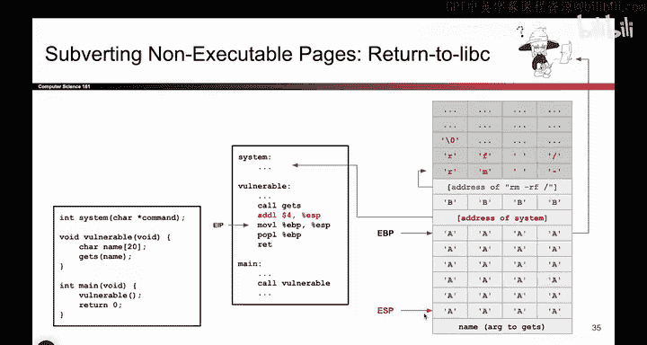

## 攻击细节剖析 🔍

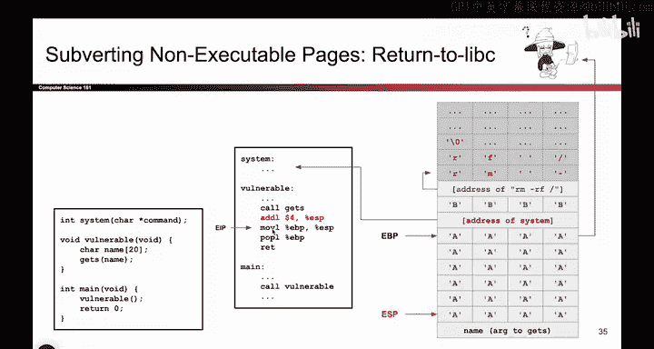

上一节我们介绍了攻击的整体思路，本节中我们来看看构造攻击时需要注意的两个关键细节。

### 细节一：参数传递方式

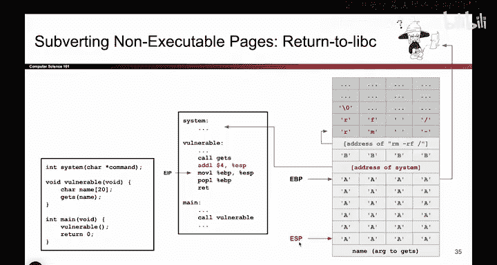

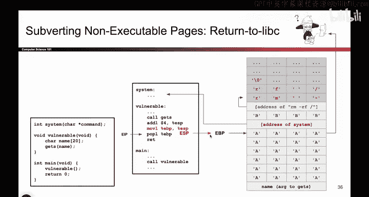

以下是关于参数传递的第一个细节：
*   当传递参数时，我们传递的是一个字符串的**地址**，而不是字符串字面量本身。
*   原因在于，在C语言中，字符串本质上是**指向字符数组起始位置的指针**。因此，我们不能直接传递 `rm -rf` 这些字符，而必须先将这些字符写入内存，然后传递指向该内存位置的地址。
*   在攻击载荷中，这个蓝色的地址就是 `system` 函数将要寻找的参数。

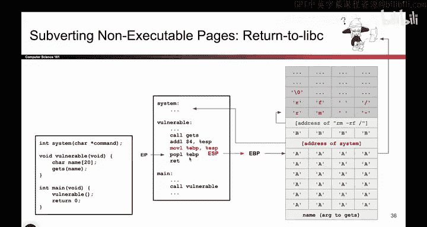

### 细节二：栈上的“4个B”

第二个细节是栈上那四个字节的占位符（通常用 `0x42424242` 或 `BBBB` 表示）。虽然它们不是攻击的核心，但经常被问到，因此我们在此解释。

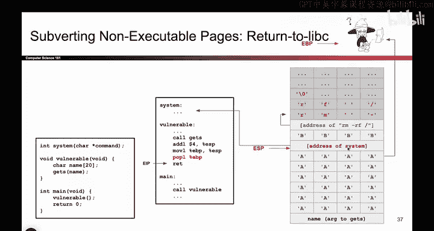

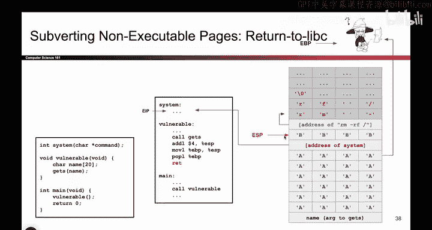

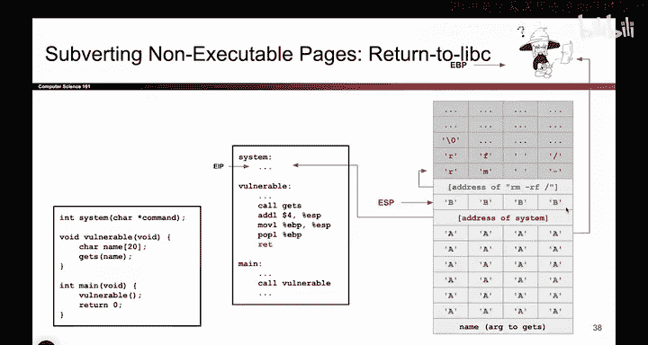

为了理解其作用，我们需要回顾函数调用约定和栈帧变化。上一节我们介绍了参数传递，本节中我们来看看函数尾声（epilogue）和 `system` 函数的预期栈布局。

#### 函数尾声与执行流劫持

首先，程序完成对 `gets` 的调用，`ESP` 上移，清理参数。接着进入被攻击函数的尾声，它包含三个标准指令：

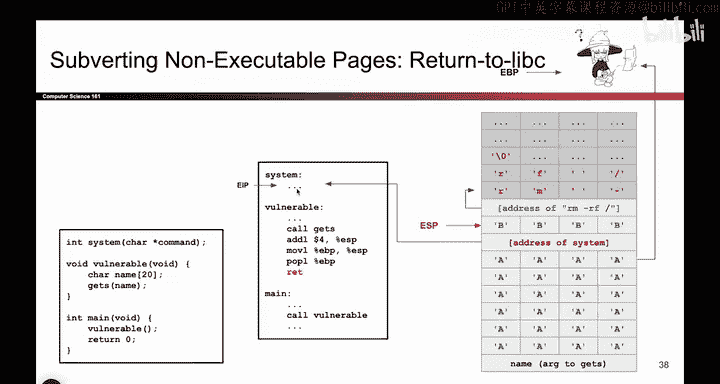

1.  `mov esp, ebp`：将 `ESP` 上移到 `EBP` 的位置，**销毁当前栈帧**。
2.  `pop ebp`：将栈顶的下一个值（保存的帧指针SFP）弹出到 `EBP` 中，`ESP` 随之再上移4字节。
3.  `ret`：这条指令的行为类似于 `pop eip`。它将栈顶的下一个值弹出，并**将其作为地址开始执行代码**。

在我们的攻击中，`ret` 指令弹出的正是我们覆盖的返回地址——`system` 函数的地址。于是，`EIP` 指向 `system`，我们开始执行 `system` 的代码。

#### `system` 函数的预期

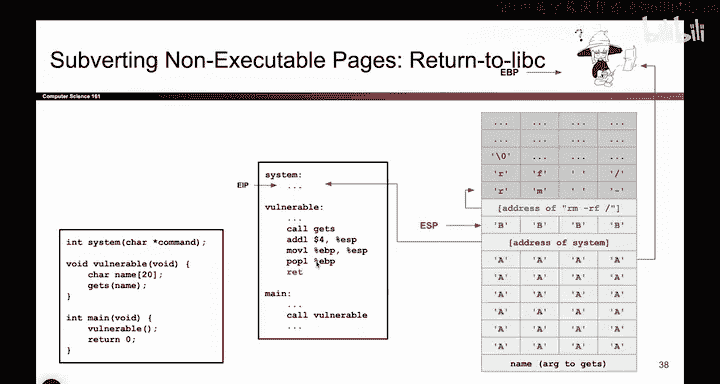

现在，我们站在 `system` 函数的角度思考。它认为自己是被正常调用的。根据函数调用约定，一个合法的 `call system` 指令会依次完成以下步骤：

以下是调用 `system` 函数时栈的预期布局：
1.  调用者将参数压入栈中。
2.  执行 `call system` 指令，该指令会将**返回地址（RP）** 压入栈中，然后跳转到 `system` 执行。

因此，`system` 函数期望在开始执行时，栈的布局是：**先有参数，紧接着是返回地址（RP）**。

#### 攻击造成的差异与“4个B”的作用

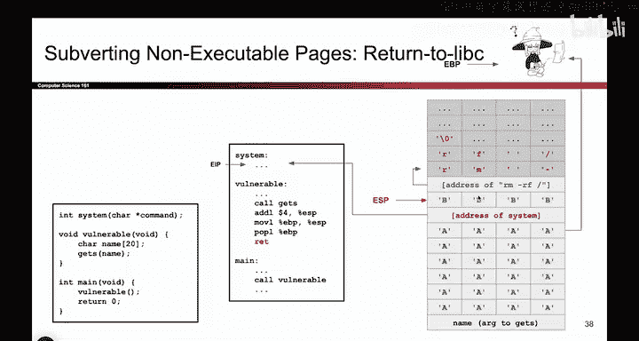

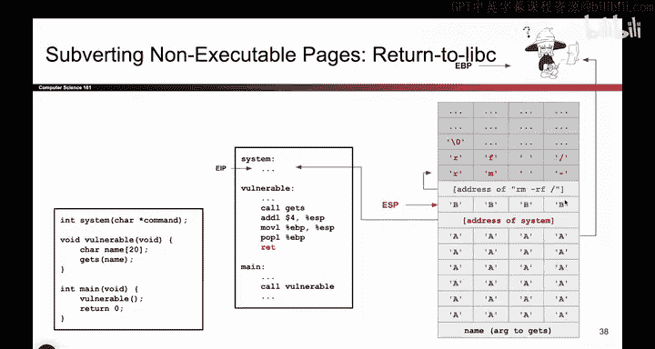

然而，我们的攻击并没有使用 `call` 指令。我们是通过覆盖返回地址直接跳转到 `system` 的。这导致栈的布局与 `system` 的预期不符：我们只提供了参数，却没有对应的返回地址。

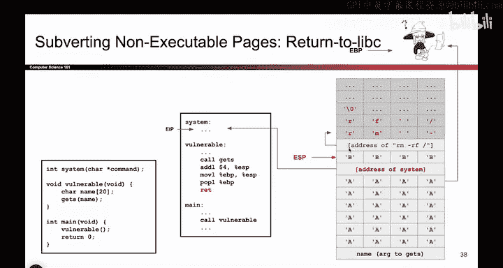

为了让 `system` 函数能正确工作（即在其栈帧中找到正确位置的参数），我们需要“伪造”一个栈布局，使其符合它的预期。

这就是那“4个B”的作用：
*   我们通过写入蓝色地址来“提供”参数。
*   我们通过写入这四个字节（`BBBB`）来“伪造”一个返回地址（RP），从而**欺骗 `system` 函数，让它以为栈上确实存在一个返回地址**。

这样，当 `system` 函数开始执行并建立自己的栈帧时，它就能在预期的位置（即“伪造的返回地址”之后）找到我们提供的参数地址。

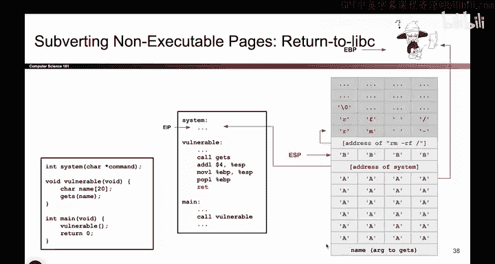

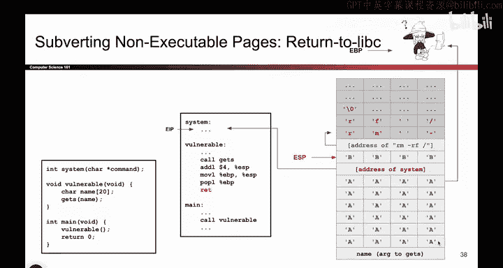

## 总结 📝

本节课中我们一起学习了Return-to-libc攻击的构造细节。
*   攻击的核心是**覆盖返回地址使其指向库函数（如 `system`）**，并**在栈上布置好对应的参数**。
*   参数必须是**指向字符串的指针地址**。
*   栈上额外的“4个B”是为了**满足被调用函数（`system`）对栈布局的预期**，它伪造了一个不存在的返回地址，以确保函数能定位到我们提供的恶意参数。虽然这是一个重要细节，但请记住，攻击最本质的部分仍然是控制执行流和传递恶意参数。