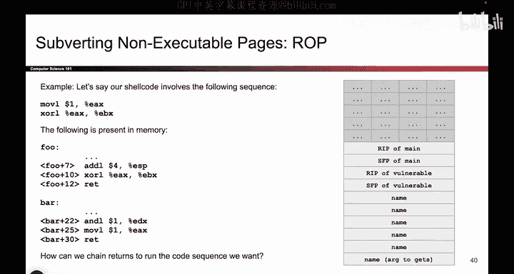
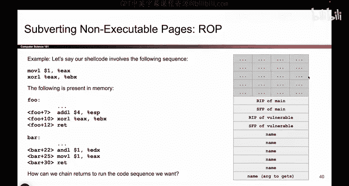
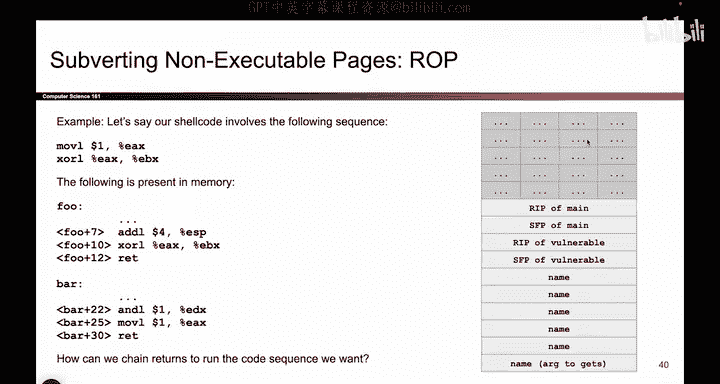
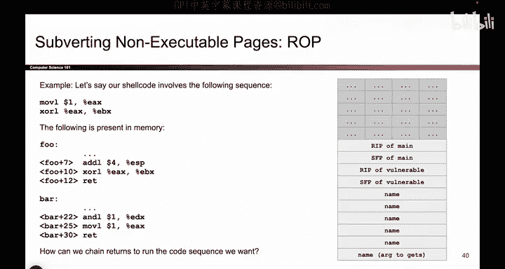
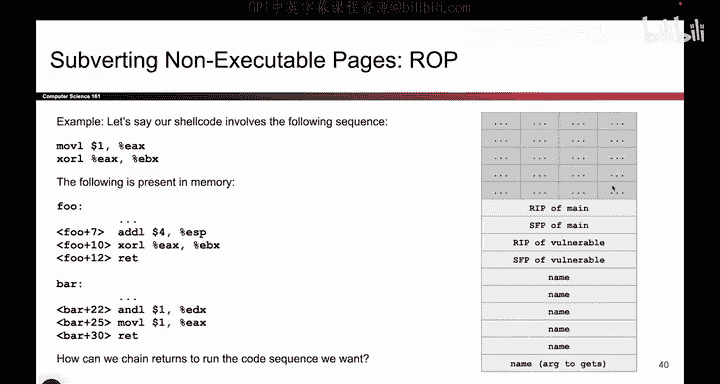
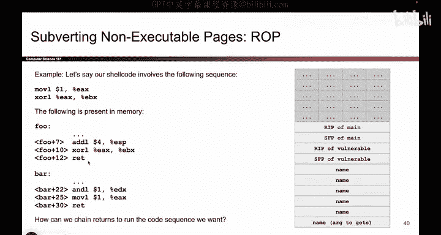
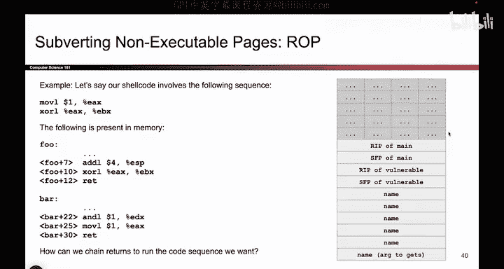

# 068：ROP攻击概述 🧩

在本节课中，我们将要学习一种名为“面向返回的编程”的高级攻击技术。这是一种在存在不可执行内存页保护的情况下，通过复用程序中已有的代码片段来执行任意操作的方法。

## 从“返回到Libc”到ROP

上一节我们介绍了“返回到Libc”攻击，这是一种利用已存在于内存中的库函数（如 `system`）来绕过不可执行页保护的有效方法。因为它执行的是现成的代码，所以不受“不可写且不可执行”规则的限制。

然而，有时我们想要执行的恶意代码（shellcode）并非标准的C库函数。虽然像 `system` 或 `execve` 这样的函数本身就很危险，但攻击者可能需要执行更复杂的、定制化的操作序列。这时，“返回到Libc”就显得能力有限了。

那么，如果我们想执行的代码不是任何现成的库函数，该怎么办呢？本节中我们来看看“面向返回的编程”。

## 什么是ROP？🔗

ROP可以看作是“返回到Libc”的升级版。其核心思想依然是跳转到库中并执行其中的指令，但不再是跳转到整个函数的开头（例如 `system` 函数的入口）并执行其全部逻辑。

相反，ROP攻击会跳转到库函数**内部**的许多不同位置，每次只执行一小段我们需要的指令序列，然后将这些片段像链条一样连接起来，最终组合成我们想要的完整shellcode。

换句话说，攻击者不需要自己向内存写入shellcode，而是从C库（或其他已加载的库）中“搜刮”出许多有用的小指令片段，并将它们组合起来。

## 核心概念：Gadget（代码片段）

这些从现有函数中“搜刮”出来的、有用的小指令片段，被称为 **Gadget**。

*   **定义**：一个Gadget就是一小段x86机器指令，通常只包含几条指令。
*   **关键特性**：它们已经存在于内存中，因此攻击者无需写入，只需跳转到其地址即可执行。
*   **位置**：Gadget通常位于某个函数的中间部分，而不是函数的开始。例如，你可能跳转到 `system` 函数中间的几条指令，执行完后再跳走。
*   **重要特征**：Gadget通常以一条 **`ret`** 指令结尾。我们马上会看到 `ret` 指令为何如此关键。

简单来说，Gadget就是攻击者从程序现有代码中“淘”出来的、能完成特定微操作（如给寄存器赋值、进行算术运算、内存读写等）的代码块。

## ROP的链条：`ret`指令的关键作用 🗝️

ROP攻击能够将多个Gadget串联起来执行，其核心机制依赖于 `ret` 指令的行为。在深入细节之前，我们先回顾一下 `ret` 指令的功能。


`ret` 指令的行为类似于 `pop EIP`。它的作用是：
1.  从栈顶弹出一个值。
2.  将这个值加载到指令指针寄存器（EIP）中。
3.  CPU随后开始从新的EIP地址处执行代码。

用公式描述其行为就是：
```
ret 等价于 pop EIP
```
执行后，`ESP`（栈指针）会增加，指向栈中的下一个位置。

## ROP攻击链的工作原理

理解了 `ret` 之后，ROP的攻击链就清晰了：

1.  攻击者通过缓冲区溢出等技术，完全控制栈的内容。
2.  他们在栈上精心布置一系列数据，其中**交替存放着Gadget的地址和一些供Gadget使用的参数**。
3.  当程序执行到被覆盖的返回地址时，会第一次跳转到第一个Gadget的地址。
4.  第一个Gadget执行其几条指令（例如，`pop eax; ret`），可能会从栈上“消费”掉一些数据作为参数。
5.  Gadget执行到最后，遇到 `ret` 指令。
6.  `ret` 指令会从当前栈顶弹出下一个值，而这个值正是攻击者预先放置的**第二个Gadget的地址**。于是，CPU跳转到第二个Gadget继续执行。
7.  这个过程像“按按钮”一样重复：每个Gadget执行完毕时，都会通过 `ret` 指令自动从栈上取出并跳转到下一个Gadget的地址。


通过这种方式，攻击者就像编写了一个程序，但这个程序的“指令”是分散在内存各处的Gadget地址，“指令指针”的移动则由一连串的 `ret` 指令驱动。最终，这一连串Gadget的执行效果，就等同于攻击者想要的恶意shellcode。




## 总结










本节课中我们一起学习了面向返回编程（ROP）的基本概念。ROP是一种强大的代码复用攻击技术，它通过以下方式绕过现代操作系统的内存保护机制：

*   **核心**：利用程序中已有的、以 `ret` 结尾的小段代码（Gadget）。
*   **机制**：通过完全控制调用栈，将多个Gadget的地址像“返回地址”一样顺序排列在栈上。
*   **驱动**：利用 `ret` 指令（`pop EIP`）的行为，自动、顺序地跳转到每一个Gadget并执行，从而将零散的代码片段串联成有逻辑的完整攻击载荷。







ROP攻击之所以有效，正是因为它巧妙地利用了程序自身的代码和正常的控制流指令（`ret`），完全避免了向内存注入任何新代码，从而绕过了数据执行保护（DEP/NX）。