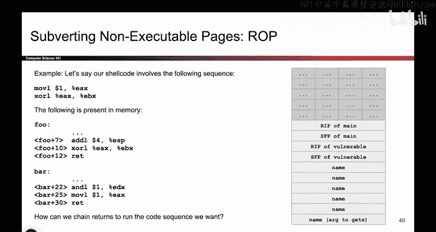
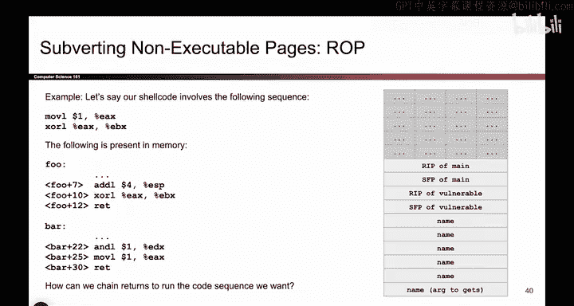
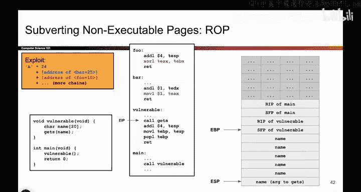
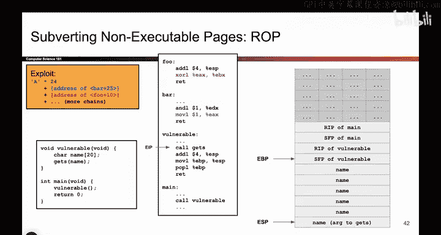
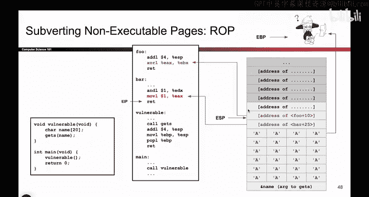
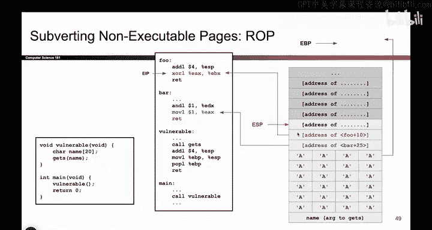
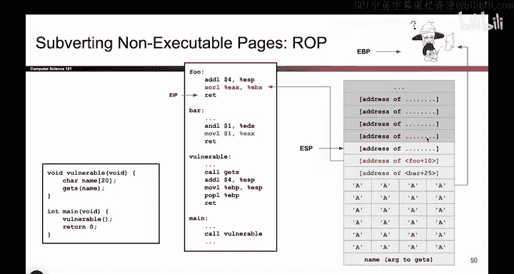

# 069：面向返回编程示例 🧩

在本节课中，我们将学习面向返回编程的一个具体示例。我们将看到攻击者如何利用内存中已有的代码片段，在不可执行内存的保护机制下，组合执行他们想要的操作。

## 概述

当内存页被标记为不可执行时，攻击者无法直接写入并执行自己的恶意代码。面向返回编程是一种绕过此限制的技术。其核心思想是，攻击者不注入新代码，而是寻找内存中已存在的、以`ret`指令结尾的短代码序列，并将这些序列的地址按顺序排列在栈上，通过连续的`ret`指令跳转来“拼接”出预期的功能。

## 攻击目标与限制

假设我们的目标是执行一段由两条指令组成的“Shellcode”：
1.  `mov` 指令
2.  `xor` 指令

在不存在不可执行页保护的情况下，我们只需将这两条指令写入内存并跳转执行即可。但由于启用了不可执行页，我们无法同时将内存区域设置为可写和可执行。因此，我们不能直接写入并执行这些指令。

## 寻找可用的代码片段

为了解决这个问题，我们必须转向现有的代码库，例如C标准库函数。我们需要在其中找到已经存在于内存中的、我们需要的指令。

幸运的是，经过搜索，我们发现了以下情况：
*   在函数`F`中，存在一个`xor`指令。
*   在C库的`bar`函数中，存在一个`mov`指令。

这两个指令已经存在于内存中，因此它们所在的页面是可执行的。我们的目标就变成了：如何让程序先跳转到`mov`指令处执行，执行完毕后，再跳转到`xor`指令处执行。

## 构建ROP链

实现这一目标的方法是，在栈上构建一个地址链。关键在于，我们找到的每一个有用的小代码片段都必须以`ret`指令结尾。

`ret`指令的作用是：从栈顶弹出一个地址，并跳转到该地址执行。因此，如果每个代码片段都以`ret`结尾，那么当一个片段执行完`ret`时，它会自动从栈上取出下一个地址并跳转过去。

最终，我们的攻击载荷结构如下所示：

以下是攻击载荷在栈上的布局：
*   `name`字符数组（被溢出数据填充）
*   旧的栈帧指针（被覆盖）
*   返回地址：被覆盖为**第一个**想要执行的指令地址（即`mov`指令的地址）
*   栈上更高地址处：存放**第二个**想要执行的指令地址（即`xor`指令的地址）
*   （以此类推，可以存放更多地址）

通过这种方式，我们不是跳转到自己写入的Shellcode，而是跳转到内存中已有的指令。在返回地址之上，我们按顺序写入后续想要执行的指令地址。

## 攻击过程演示

现在，让我们一步步跟踪程序的执行流程。

1.  **函数返回**：`vulnerable`函数执行完毕，开始执行其尾声代码。
2.  **恢复栈帧**：`pop ebp`指令执行，旧的`ebp`被恢复（实际上被我们覆盖的值填充）。
3.  **首次`ret`**：执行`ret`指令。此时，由于我们覆盖了返回地址，栈顶的值是我们写入的`mov`指令的地址。`ret`指令会将该地址弹出并放入`EIP`，程序随即跳转到`mov`指令处执行。
4.  **执行第一个Gadget**：`mov`指令执行，完成我们“Shellcode”的第一部分。紧接着，这个代码片段以`ret`指令结尾。
5.  **链式跳转**：当`ret`指令执行时，它再次从栈顶取出下一个地址，这个地址正是我们预先放置的`xor`指令的地址。程序于是跳转到`xor`指令处。
6.  **执行第二个Gadget**：`xor`指令执行，完成我们“Shellcode”的第二部分。

至此，我们成功地利用内存中已有的两个代码片段，按顺序执行了预期的操作。

## 扩展与注意事项

如果我们的目标“Shellcode”包含更多指令，原理完全一样。只需在栈上按顺序放置更多代码片段的地址即可。每个片段执行完毕后，其结尾的`ret`指令会自动将控制权传递给栈上下一个地址所指向的片段。

一个常见的问题是：如果找到的代码片段不以`ret`结尾怎么办？或者我们需要的指令本身不在一个以`ret`结尾的序列里怎么办？

确实存在更复杂的技术来处理这种情况，例如通过精心构造栈上数据来模拟参数传递或调整寄存器状态，但这超出了本课程的基础范围。需要了解的是，最基本的ROP攻击形式要求所有“gadget”都以`ret`结尾，这种形式在实践中很常见且有效。更复杂的变体虽然存在，但本课程要求掌握的是这种基础的、每个gadget都以`ret`结尾的版本。

## 总结

本节课中，我们一起学习了面向返回编程的一个基础示例。我们了解到，在不可执行内存的保护下，攻击者可以通过以下步骤实施攻击：
1.  在现有可执行代码中寻找以`ret`结尾的、有用的短指令序列。
2.  通过缓冲区溢出等手段，覆盖栈上的返回地址，将其指向第一个gadget的地址。
3.  在栈上更高处，按执行顺序依次放置后续gadget的地址。
4.  利用`ret`指令的“弹出-跳转”特性，实现一个gadget到另一个gadget的链式执行，从而组合出复杂的恶意功能。

这种方法的核心在于**复用**已有的代码片段，而非注入新代码，从而巧妙地绕过了不可执行内存的保护机制。