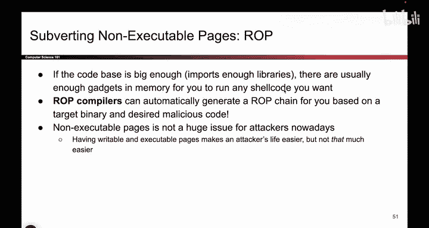

# 070：ROP攻击的影响与应对

在本节课中，我们将探讨不可执行页（NX）防御机制被绕过后的影响，特别是针对返回导向编程（ROP）攻击的讨论。我们将了解ROP攻击如何工作，以及为什么即使启用了NX保护，攻击者仍然可能执行恶意代码。

## ROP攻击的基本原理

上一节我们介绍了不可执行页（NX）作为一种防御机制。本节中我们来看看当攻击者使用ROP技术时，这种防御如何被绕过。

ROP攻击的核心思想是：攻击者不直接注入并执行自己的代码，而是利用程序中已有的代码片段（称为“gadgets”），通过精心构造的返回地址链，让程序执行攻击者期望的操作。每个gadget通常以`ret`指令结尾，这使得攻击者可以像“编程”一样，将多个gadget串联起来。

**攻击流程公式**可概括为：
```
控制栈指针 -> 指向一系列gadget地址 -> 每个gadget执行后ret到下一个 -> 最终达成恶意目标
```

## ROP攻击的可行性条件

以下是ROP攻击能够成功实施的关键条件：




1.  **存在足够多的gadgets**：目标程序或其所链接的库需要包含大量短小的、以`ret`结尾的指令序列。代码库越庞大，存在可用gadgets的可能性就越高。
2.  **能够控制程序流**：攻击者必须能够劫持控制流，例如通过缓冲区溢出覆盖返回地址。
3.  **能够操作栈内存**：攻击者需要能够向栈中写入数据，以布置gadget地址链和必要的参数。

## ROP攻击的自动化演变

最初，ROP是一种需要深入研究和手动构造的高级攻击技术。然而，安全社区的研究使其逐渐变得自动化。


如今，攻击者甚至可以在网上找到“ROP编译器”。这些工具的工作流程如下：

1.  输入期望的恶意代码逻辑（shellcode）。
2.  工具自动在目标程序的二进制文件中搜索可用的gadgets。
3.  工具生成一个ROP链，即一串gadget的地址序列。
4.  攻击者只需将这个地址链布置到栈上，即可实现自动化攻击。

## 对NX防御的评估与总结

综合以上讨论，我们可以对不可执行页（NX）防御机制做出如下评估：

*   **有效性**：NX能成功阻止最常见的攻击形式，即攻击者直接将shellcode写入栈或堆并跳转执行。对于“懒惰的”攻击者，这是一道有效的屏障。
*   **局限性**：NX无法阻止像ROP这样巧妙的攻击。攻击者通过复用程序已有的可执行代码，完全绕过了“页面不可执行”的限制。
*   **成本与收益**：启用NX的代价很低（通常只需编译器或操作系统的一个标志位），并能阻挡一大批基础攻击，提升了攻击门槛。
*   **定位**：因此，NX不能被视为完美的终极防御方案。它是一层有效的缓解措施，使得某些常见漏洞利用变得更为困难，但不能单独依赖它来保证绝对安全。

本节课中我们一起学习了ROP攻击如何绕过NX保护。我们了解到，当程序代码库庞大时，攻击者可以利用其中现成的代码片段（gadgets）组合出任意功能。尽管NX防御能阻止简单的代码注入攻击，但对于ROP这类高级技术，它只能增加攻击难度，而无法完全杜绝。这体现了深度防御思想的重要性，即需要组合多种安全机制来应对不同层次的威胁。